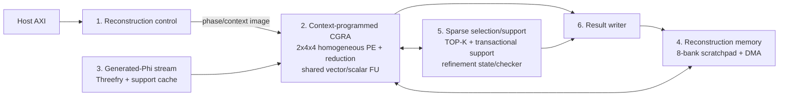

# v3 system overview

Trạng thái: **M0-M7 đã hoàn thành tại milestone boundary**. M1 control, M2
DMA/run-configuration, M3 context/control, M4 stream transport, M5 shared
arithmetic, M6 homogeneous CGRA và M7 generated Phi đã qua Vivado
XSim/property-elaboration/OOC synthesis riêng.
M3.5-M3.6 là compiler gate; chưa phải full-design sign-off. V3 có development
config riêng được consistency checker kiểm tra nhưng chưa thay v2 làm completed
release baseline.

## 1. Những điểm đã khóa

- Target đầu tiên: ZCU106, `XCZU7EV-2`; backend ASIC phải giữ nguyên contract
  cycle/handshake nhưng được thay SRAM/DSP wrapper.
- Build duy nhất hiện tại: `N_MAX=1024`, `M_MAX=128`, `K_MAX=32`,
  `LS_WORK_MAX=96`. K64 không phải runtime/build profile v3; chỉ giữ width và
  handshake seam rẻ cho một build tương lai.
- Numeric: `D18F14/S27F19/A62`.
- Hai cluster vật lý `4x4`, tổng 32 PE, nhưng chỉ có **một**
  `array_context_pc` và một context stream đồng bộ. Không còn hai kernel hoặc
  hai PC độc lập.
- OMP, CoSaMP, IHT, HTP, SP, GP, gOMP và MP khác nhau bằng phase program; PE
  không nhận `algorithm_id`.
- LS dùng unified restricted refinement trên matrix-free `A/A^T`: warm-start,
  support-aware restart và strict/bounded profile. Hardware golden đã dùng
  restricted CGLS; không tạo Gram/LDLT và state tăng
  tuyến tính tới 3K.
- Phi tách thành `Phi=alpha*S`. Dense signed Rademacher `S` được sinh theo tọa
  độ bằng Threefry2x32-20; `alpha` lấy từ active run register, không hard-code
  `1/8`. Không có Phi DMA/full-matrix store. Mỗi LS dùng active-support symbol
  cache để replay `A/A^T` mà không chạy lại Threefry mỗi iteration.
- AXI4-Lite có 14 address; tham số chạy nằm trong run-configuration block ở DDR. Target
  run-configuration revision 4 giữ matrix kind/weight/runtime scale và explicit
  refinement profile; program selector bị loại bỏ, các bit `[27:24]` là reserved.

## 2. Flow hệ thống



Đây là hierarchy dùng trong paper. Các tên fetcher, sequencer, PE, router và
checker là leaf implementation bên trong sáu macroblock, không phải accelerator
độc lập.

`reconstruction_phase_controller` là một protocol FSM nhỏ: nhận START/ABORT,
giữ ownership của active run configuration, chọn entry PC và đi qua CFG phase
của paper. Thứ tự thuật toán vẫn nằm trong phase context do compiler sinh;
module không phát PE opcode và không hard-code case theo thuật toán.
`array_context_sequencer` mới là khối phát context theo từng cycle.

## 3. Context model sau khi bỏ hai stream độc lập

Một array cycle gồm:

- 16 tile word x 36 bit, mỗi word broadcast tới hai tile cùng tọa độ;
- một array-control word 36 bit;
- một stream word 36 bit điều khiển đồng thời vector ports và Phi stream;
- một resource word 36 bit cho reduction/TOP-K/support/SFU.

Tổng logical width là `16*36 + 36 + 36 + 36 = 684 bit`. Đây không phải bus
decode tập trung. Các word nằm trong RAM plane đặt sát consumer.

Physical context store dùng đúng 10 RAMB36:

- 8 plane `72x512`: mỗi plane chứa hai tile word và hai image bank 256 entry;
- 1 plane `72x512`: array-control + stream;
- 1 plane `36x1024` true-dual-port: resource và phase program 36 bit ở hai
  nửa address space.

Một phase instruction 36 bit chứa entry PC, condition, branch target, terminal
code và trace/abort marker. Object ordering được đảm bảo bởi static phase CFG;
không giữ live-in/live-out version mask trong mỗi instruction nữa.

## 4. Compute và bandwidth map

- Tất cả 32 PE hoàn toàn đồng nhất, có ALU, predicate,
  `PHI_APPLY_SYMBOL`, accumulator và route switchbox.
- General S27 multiply/dot/AXPY nằm trong `shared_vector_arithmetic_unit` gồm 16
  logical lane đồng nhất, đúng một S27 scratchpad stripe. Không có capability
  hoặc illegal opcode phụ thuộc tọa độ PE.
- D18 packing cho 32 value/cycle; S27 packing cho 16 value/cycle.
- Phi vẫn phát 32 symbol/cycle. Mask/sign chỉ gate/negate, không dùng DSP.
- Hai cluster reducer nhận 16 lane/cluster; global merge trả một A62 result.
- Correlation chỉ giữ Top-2K records và gradient tại active support; không lưu
  full proxy hoặc full `Phi^T*y` RHS cache.
- Một runtime normalizer II=1 scale trước scalar broadcast cho `A*p`, hoặc sau
  global reduction cho correlation/`A^T*u`; không tạo 32 scale multiplier.
- TOP-K baseline giữ đúng depth 64 với 32 comparator lane, quét tối đa hai
  group. Depth 128 chỉ xuất hiện nếu sau này tạo build K64 riêng.

## 5. Ownership rõ ràng

| Khối | Sở hữu | Không sở hữu |
| --- | --- | --- |
| `axilite_slave` | AW/W/B/AR/R protocol | CSR address semantics |
| `reconstruction_csr` | compact decode, run-configuration address, sticky IRQ/error | run parameters, algorithm counters |
| `configuration_fetch_unit` | bốn AXI read beat 128 bit | run-configuration policy |
| `configuration_check_unit` | magic/range/alignment/paper-policy checks | phase sequencing |
| `reconstruction_phase_controller` | START/ABORT, active-configuration lifetime, paper CFG, phase PC và terminal result | PE opcode/route |
| `array_context_sequencer` | shared context PC, loop counters, atomic stall | algorithm identity |
| `context_image_store` | context bits và active bank | decode/execute |
| `stream_context_router` | vector/Phi valid-ready join | arithmetic |
| `array_resource_router` | sidecar request/result handshake | algorithm FSM |

Không dùng tên chung kiểu `job_controller`, `job_state` hoặc `kernel_0/1`.

## 6. Golden và verification boundary

Mathematical authority vẫn là:

```text
paper -> models/v3/paper.py -> models/v3/hardware.py
      -> phase golden -> compiler context image -> RTL phase/context trace
```

Refactor kiến trúc không được sửa paper/hardware golden để làm RTL pass. Các
test/report cũ không phải bằng chứng cho target context revision mới; chúng chỉ được chạy
lại sau khi module/interface freeze.

Chi tiết normative:

1. [01_BLOCK_DESIGN_SPEC.md](01_BLOCK_DESIGN_SPEC.md)
2. [04_MEMORY_AND_INTERFACES.md](04_MEMORY_AND_INTERFACES.md)
3. [05_RECONSTRUCTION_REGISTER_MAP.md](05_RECONSTRUCTION_REGISTER_MAP.md)
4. [06_CGRA_MICROARCHITECTURE.md](06_CGRA_MICROARCHITECTURE.md)
5. [08_CONTEXT_ISA.md](08_CONTEXT_ISA.md)
6. [10_DETAILED_IMPLEMENTATION_BLUEPRINT.md](10_DETAILED_IMPLEMENTATION_BLUEPRINT.md)
7. [11_LS_SOLVER_ARRAY_BLUEPRINT.md](11_LS_SOLVER_ARRAY_BLUEPRINT.md)
8. [12_RIP_AWARE_PHI_GENERATOR.md](12_RIP_AWARE_PHI_GENERATOR.md)
