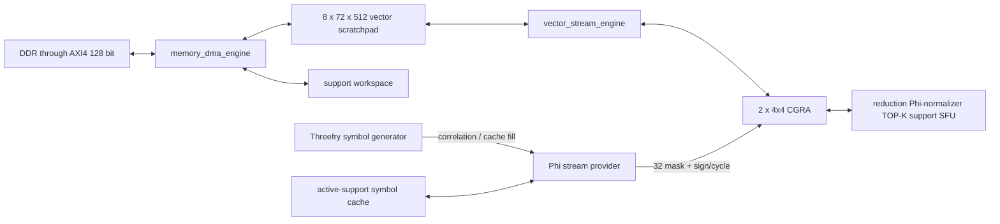

# v3 memory and interface contract

Trạng thái: **M2 AXI DMA spine, M3 memory-configuration store, M4 scratchpad /
stream transport và M4.1 preload-residency seam đã có RTL/XSim/OOC evidence**.

## 1. Ba miền traffic tách biệt



Phi, vector data và auxiliary result không đi qua một central crossbar. AXI chỉ
preload/drain ở phase boundary; inner loop chạy từ scratchpad/Phi nội bộ.

## 2. AXI4-Lite control

AXI4-Lite 32 bit map đúng 14 address trong
[05_RECONSTRUCTION_REGISTER_MAP.md](05_RECONSTRUCTION_REGISTER_MAP.md). CSR
không expose M/N/K/seed/vector address riêng. START mang duy nhất
run-configuration address và không chạm compute memory port.

## 3. AXI4 full DMA master

Baseline dùng một AXI4 master 128 bit, INCR burst, address 64 bit. Internal
client protocol:

| Signal | Width | Ý nghĩa |
| --- | ---: | --- |
| `dma_request_valid/ready` | 1/1 | nhận đúng một command |
| `dma_request_write` | 1 | 0 read, 1 write |
| `dma_request_address` | 64 | byte address |
| `dma_request_bytes` | 16 | tổng byte, khác 0 |
| `dma_request_tag` | 8 | owner + transaction ID |
| `dma_write_valid/ready` | 1/1 | write beat handshake |
| `dma_write_data/keep/last` | 128/16/1 | payload |
| `dma_read_valid/ready` | 1/1 | read beat handshake |
| `dma_read_data/last/response` | 128/1/2 | payload + AXI status |
| `dma_completion_valid/ready` | 1/1 | terminal token |
| `dma_completion_tag/error` | 8/1 | request correlation |

`dma_request_arbiter` có fixed ownership, không round-robin mơ hồ:

1. run-configuration fetch khi controller ở `FETCH_RUN_CONFIGURATION`;
2. result/error drain để bảo đảm terminal progress;
3. input preload;
4. optional trace drain trong debug build.

Mỗi client chỉ có tối đa một outstanding request baseline. AXI engine có thể
có nhiều beat outstanding trong một burst nhưng không reorder giữa client tag.

## 4. External data format

DDR dùng format software-friendly, không bit-pack 18/27 bit qua AXI:

- dense D18/S27 vector: mỗi element là signed 32-bit, high bits phải là sign
  extension hợp lệ;
- dense output: signed D18 raw sign-extended lên 32 bit;
- sparse output record 64 bit: low 32 bit coefficient raw sign-extended, high
  32 bit index;
- run-configuration block: 64 byte aligned;
- vector/result base: ít nhất 16 byte aligned.

`dma_element_normalizer` kiểm tra high-bit sign extension trước khi narrow. Một D18
stripe gồm 32 element: tám AXI beat -> tám bank word 72 bit. Một S27 stripe gồm
16 element: bốn AXI beat -> tám bank word; mỗi word giữ hai S27 và bỏ 18 bit.

M4.1 hiện thực `scratchpad_preload_engine` cho hai dense format này. D18 ghi một
bank word/cycle; S27 ghi hai bank word/cycle qua hai RAM port, nên không mất
throughput so với bốn phần tử 32-bit trên mỗi AXI beat. Payload/address được
broadcast, `bank_mask` chọn bank để tránh wide demux. `scratchpad_residency_tracker`
chỉ set resident sau terminal completion sạch và clear ngay khi bắt đầu ghi đè.
Result drain qua AXI write vẫn thuộc M12.

## 5. Vector scratchpad

Physical organization:

```text
bank_id = cluster_id * 4 + row_id
8 banks x 512 addresses x 72 bits, true dual port
```

Packing:

| Format | Element/bank word | Element/8-bank stripe |
| --- | ---: | ---: |
| D18 | 4 | 32 |
| S27 | 2 | 16 |
| index10 | 7 | 56 |
| raw72 | 1 | 8 |

Một D18 bank word được row gateway phân phối tới bốn PE cùng row. Một S27 word
chứa hai element; tám bank tạo một stripe 16 element cho
`shared_vector_arithmetic_unit`. S27 packing không còn ràng buộc capability theo
tọa độ PE.

Hai RAM port được compiler/MRRG reservation sử dụng như sau:

- read A + read B;
- read A + write;
- read B + write;
- DMA + compute trên các bank disjoint;
- read A + read B + write chỉ hợp lệ nếu write đi qua output FIFO và commit ở
  cycle sau hoặc configuration chứng minh bank disjoint.

Runtime conflict không drop/reorder. `vector_stream_engine` deassert ready và
stall toàn array context; conflict không dự kiến đồng thời phát context fault.

## 6. Memory configuration table

`memory_configuration_store` có 64 entry x 64 bit và bốn cổng đọc độc lập với
latency cố định một cycle. RTL dùng hai bản sao true-dual-port; mỗi word 64 bit
chiếm hai primitive slice 36 bit, nên mapping ZCU106 thực tế là bốn RAMB36.
Programming chỉ xảy ra khi idle và broadcast cùng dữ liệu vào cả hai copy;
đường chạy không có central arbiter hoặc throughput stall do bảng configuration.

Cycle context chỉ mang ba configuration ID 6 bit cho vector A/B/write và một ID
cho Phi. Base/count/stride/packing không lặp lại trong mỗi cycle.

Configuration `memory_space` chọn:

- vector scratchpad;
- support workspace;
- external DMA window;
- Phi coordinate stream.

Phi configuration là overlay cùng word 64 bit và mô tả sequential column hoặc
support-list column, row-pair range và count. Seed không nằm trong configuration
table; nó đến từ active run parameters.

## 7. Vector/Phi stream interface

`stream_context_router` nhận một 36-bit stream word cùng array context. Logical
lane interface tới PE:

| Signal | Width | Contract |
| --- | ---: | --- |
| `routed_vector_a/b_data` | `2x32x27` | hai source bus tới row/tile boundary |
| `external_a/b_select` | `2x2` | mux select broadcast; mux nằm phân tán tại tile |
| `routed_scalar_broadcast_data` | `27` | scalar source dùng chung |
| `phi_nonzero` | 32 | zero/nonzero mask theo lane |
| `phi_sign` | 32 | lane `cluster*16 + row*4 + column` |
| `stream_input_valid` | 1 | toàn bộ input bắt buộc đã sẵn sàng |
| `stream_output_ready` | 1 | write/output FIFO có chỗ |
| `stream_cycle_commit` | 1 | advance configuration, Phi và array cùng cycle |

Không consumer nào được advance riêng. `stream_cycle_commit` là điều kiện duy
nhất cho vector address increment, Phi gearbox pop, PE/RF write và context PC
increment.

Router không chứa mux `4:1 x 864 bit` tập trung. Hai selector 2 bit đi cùng các
source bus tới row/tile boundary; operand mux được phân tán theo PE để tránh một
crossbar rộng, giảm fanout và giữ floorplan hai cluster rõ ràng.

`Phi stream provider` có hai backend cùng contract: Threefry cho correlation
hoặc cache fill, và active-support cache replay cho LS. Backend select nằm
trong memory/Phi configuration; PE không biết symbol đến từ nguồn nào. Dense mode
đặt `phi_nonzero=all_ones` trên valid lanes.

## 8. Phi request/response

Phi coordinate engine phát request nội bộ:

| Signal | Width | Ý nghĩa |
| --- | ---: | --- |
| `phi_request_valid/ready` | 1/1 | accept coordinate pair |
| `phi_request_column` | 10 | 0..1023 |
| `phi_request_row_pair` | 3 | mỗi pair chứa hai block 32 row |
| `phi_request_tag` | 8 | stream transaction |
| `phi_symbol_valid/ready` | 1/1 | one 32-symbol word |
| `phi_nonzero_bits` | 32 | nonzero mask for one row block |
| `phi_sign_bits` | 32 | signs for one row block |
| `phi_symbol_column` | 10 | coordinate echo |
| `phi_symbol_row_block` | 3 | coordinate echo |
| `phi_symbol_tag` | 8 | transaction echo |

Một accepted coordinate pair tạo đúng hai response word liên tiếp. Queue target
là bốn request; folded generator nhận một request/2 cycle và gearbox phát một
word/cycle sau fill. Backpressure giữ data/tag/coordinate ổn định.

Active-support cache interface:

| Signal | Width | Ý nghĩa |
| --- | ---: | --- |
| `support_phi_fill_valid/ready` | 1/1 | ghi đúng một 32-symbol word |
| `support_phi_fill_slot` | 8 | support slot 0..95 |
| `support_phi_fill_row_block` | 3 | row block 0..3 baseline |
| `support_phi_replay_valid/ready` | 1/1 | đọc đúng một cached word |
| `support_phi_replay_nonzero` | 32 | lane nonzero payload |
| `support_phi_replay_signs` | 32 | lane sign payload |
| `support_phi_cache_valid` | 1 | chỉ lên sau đủ active_count x row_blocks |

Cache logical depth dense baseline là `384x32`, target một RAMB18. Wrapper có
payload seam 64 bit cho fixed-weight extension; build sparse có thể dùng
`384x64` trong một RAMB36. Cache invalidate ở LS prepare, abort, support
mutation và LS terminal; không dùng tag/version để giữ nhiều support đồng thời.

## 9. Phi operator normalizer

`phi_operator_normalizer` là scalar pipeline II=1 dùng chung theo phase, không
nằm trên 32-lane path:

| Signal | Width | Contract |
| --- | ---: | --- |
| `normalizer_input_valid/ready` | 1/1 | tagged scalar transaction |
| `normalizer_input_data` | implementation-bound wide | signed F19 sum hoặc S27 scalar |
| `normalizer_placement` | 1 | pre-broadcast forward / post-reduction transpose |
| `normalizer_output_valid/ready` | 1/1 | one S27 result |
| `normalizer_output_data` | 27 | rounded/saturated F19 |
| `normalizer_tag` | 8 | coordinate/routine destination |
| `normalizer_saturation` | 1 | sticky numeric event source |

Mantissa/exponent đến từ active run parameters và giữ ổn định suốt run. Forward
scale một support scalar trước fanout; transpose/correlation scale full-dot sau
global reduction. Hai phase không issue đồng thời nên không cần dynamic arbiter.

## 10. Resource gateway

PE boundary, cluster reducer và vector sidecar đi vào `array_resource_router`.
Request token:

```text
valid, ready, operation[4:0], input_select[2:0], output_select[2:0],
configuration_id[5:0], lane_mask[3:0], boundary[1:0], flags[4:0], event_id[3:0]
```

Result token:

```text
valid, ready, event_id[3:0], result_type[2:0], value[61:0], index[9:0], fault
```

Resource latency/II nằm trong architecture manifest. Context chỉ stall nếu
`wait_for_ready` hoặc `wait_for_result` được set; nếu không, request phải đi vào
bounded FIFO đã được mapper reserve.

## 11. Abort/error semantics

- Abort chỉ được nhận tại context có `safe_abort_point=1`.
- Không commit partial support, result vector hoặc active run configuration khi abort.
- AXI error dừng client, drain response bắt buộc rồi phát một terminal token.
- Numeric/resource fault được tag với phase PC và configuration ID; first error
  đi CSR, chi tiết dài hơn có thể ghi result header.
- Mọi valid payload giữ ổn định khi `valid && !ready`.
