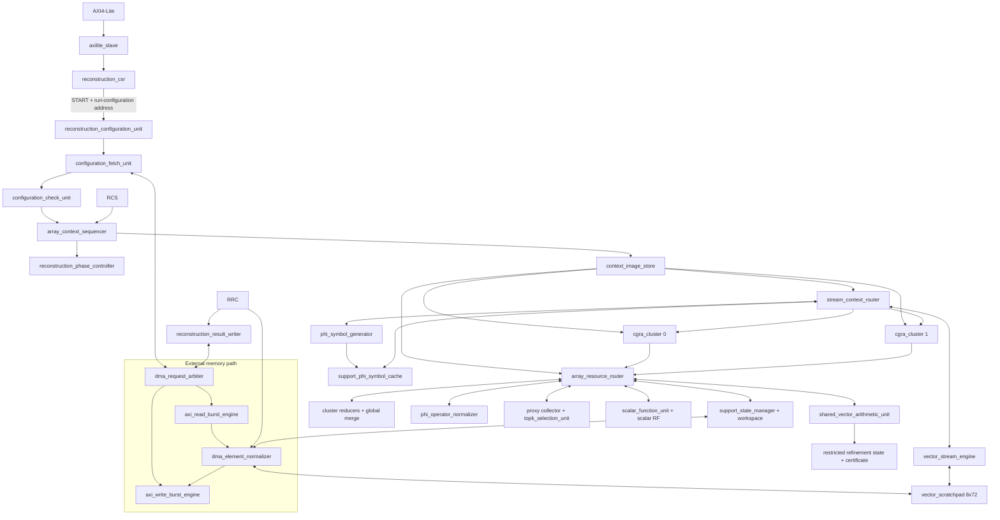

# v3 detailed implementation blueprint

Trạng thái: **M0-M12 đã triển khai; context revision 8; M13 là gate kế tiếp**.
Tài liệu này chỉ claim simulation/synthesis/timing cho module có status report;
mọi claim chỉ hợp lệ khi có status report và evidence tương ứng.

## 1. RTL source layout

```text
rtl/v3/
|- include/           generated constants và ISA definitions
|- host_interface/    AXI4-Lite transport và compact CSR
|- reconstruction_control/  reconstruction configuration và phase CFG
|- context_control/   context/configuration stores và array sequencer
|- data_movement/     AXI DMA, preload, scratchpad và vector stream
|- cgra/              stream router và homogeneous PE/switchbox/cluster fabric
`- top/               chỉ module top-level integration
```

Source hierarchy tối ưu cho debug và ownership; paper hierarchy vẫn gộp các
source folder này thành sáu macroblock ở sơ đồ kiến trúc.

Không tạo folder `shell`, `job`, `misc`, `common_controller` hoặc module tên
không nói rõ ownership. Wrapper FPGA/ASIC về sau đặt trong `technology/`, không
trộn primitive vào core RTL.

## 2. Full architecture map



## 3. State inventory: giữ cái cần, bỏ cái thừa

### 3.1. Software-visible state

| State | Bit | Lý do giữ |
| --- | ---: | --- |
| run-configuration address | 64 | duy nhất để START một run |
| IRQ enable/pending | 4 | interrupt ownership |
| completion summary | 11 | stop reason + support count sau terminal |
| first-error record | 57 | debug failure mà không cần trace |

`PROGRESS` và `TOTAL_CYCLES` là projection từ engine-owned state, không có bản
copy trong CSR. Không có M/N/K/seed/address shadow bank, sequence bank, per-phase
performance counter hoặc software reset register.

### 3.2. Internal architectural state

| Owner | State tối thiểu |
| --- | --- |
| active run configuration | một validated run configuration, không shadow |
| reconstruction control sequencer | protocol state, phase PC 8 bit, terminal pulse |
| array sequencer | array PC 8 bit, bốn loop counter, predicates |
| context store | active image bank bit; bank 0 initialized |
| vector stream | three configuration cursors A/B/W |
| Phi stream | configuration cursor, four-entry request queue, response gearbox |
| resources | operation-specific state only while transaction active |
| telemetry | total cycle, outer iteration, solver iteration, phase ID |

Không thêm counter chỉ vì dễ debug. Debug chi tiết đi qua optional trace build;
production giữ đúng ba progress field và total cycle.

## 4. Top-level interface plan

Final `top` có bốn interface group:

1. AXI4-Lite slave 32 bit;
2. AXI4 full master 128 bit;
3. `irq`;
4. clock/reset.

Engine lifecycle/error ports hiện đang expose trong control-only `top.v` chỉ là
integration seam. M3 đã có `reconstruction_phase_controller`; các port này chỉ
biến mất khỏi final external top khi M4/M5 có consumer thật để nối kín lifecycle.

Baseline dùng một clock domain. `aresetn` đi qua reset synchronizer thành
synchronous `core_reset`. BRAM/scratchpad không reset data array; chỉ reset
valid, pointer và ownership state. Nếu PS AXI và core clock khác nhau về sau,
CDC wrapper đặt ngoài core và không đổi internal contracts.

## 5. Interface ledger

| Producer -> consumer | Request payload | Response payload | Backpressure effect |
| --- | --- | --- | --- |
| CSR -> run-configuration fetcher | `start,address64` | accepted/busy | START pulse capture |
| fetcher -> DMA arbiter | read `address64,bytes16,tag8` | 128-bit beats + response | fetch state waits |
| fetcher -> validator | configuration512 + AXI status | valid/invalid + field index | no partial commit |
| validator -> active run configuration | canonical parameter bundle | commit ack | lifecycle waits |
| CSR/configuration -> control sequencer | START/ABORT + active program view | completion/error telemetry | protocol/phase FSM waits |
| control -> array sequencer | entry PC + launch event ID | routine done/fault | phase PC waits |
| context store -> consumers | 16 tile + array + stream + resource | context valid | pair-wide stall |
| stream router -> scratchpad | A/B/W configuration IDs | lane vectors/write ready | pair-wide stall |
| stream router -> Phi | command + configuration ID | 32 mask/sign + coordinate tag | pair-wide stall on consume |
| PE/vector sidecar -> resource router | lane/reduction/vector request | scalar/index/event result | context-controlled stall |
| result writer -> DMA | dense/sparse/result header stream | completion/error | terminal drain waits |

Mọi interface dùng valid/ready. Payload phải ổn định khi valid và not-ready.
Không dùng pulse không có acceptance ngoại trừ local CSR START/ABORT, nơi
receiver capture cùng edge.

## 6. Run-configuration flow

### 6.1. Fetch

- START chỉ hợp lệ khi idle và pointer aligned 64 byte.
- Fetcher gửi một 64-byte read; burst engine trả bốn beat 128 bit.
- Beat buffer là `4x128`, không tạo 16 register module riêng.
- AXI response lỗi bỏ toàn run configuration và báo beat index.

### 6.2. Validate order

First-failure priority cố định:

1. magic/revision/reserved;
2. dimensions/build capacity;
3. 2K/3K/workspace/paper policy;
4. iteration/scalar fields;
5. address/result mode/alignment;
6. program/context revision compatibility.

Validator chỉ phát one-cycle `parameter_commit` sau word 15. Error code và word
index không phụ thuộc implementation ordering khác nhau.

### 6.3. Active parameters

Không broadcast 512 bit toàn chip. `active_configuration_store` tạo registered views
gần consumer:

```text
dimension_view  -> sequencers/support
numeric_view    -> scalar RF/stop comparator
phi_view        -> phi generator
dma_view        -> preload/result writer
program_view    -> reconstruction control sequencer
```

## 7. Resident program/image plan

Baseline bitstream chứa một reconstruction image package, không load context
mỗi run. Package gồm:

- 256 array-cycle entries;
- 256 phase entries;
- 64 memory/Phi configurations;
- one fixed phase entry PC0 contract;
- architecture hash, context revision và CRC.

Compiler phải emit:

```text
build/v3/context/tile_plane_0.mem ... tile_plane_7.mem
build/v3/context/array_stream_plane.mem
build/v3/context/resource_phase_plane.mem
build/v3/context/memory_configurations.mem
build/v3/context/program_manifest.json
build/v3/context/disassembly.md
```

M3 đã triển khai hai bank có cùng physical layout. Transaction
`0..7 -> 9 -> 8` commit nguyên tử một context và tăng high-water mark, nhưng
chưa cho phép execute cả bank. Loader phải phát explicit finalize; phần cứng
scan mọi target/fallthrough và chỉ certify khi CFG đóng. Entry PC được check một
lần khi launch. Bank active không được ghi/finalize và chỉ được switch khi
lifecycle idle. Bitstream cuối có thể initialize bank 0 từ package M11; bank 1
cho controlled update/rollback, không phải tám bank theo tám thuật toán.

Hiện M3 phát một verification context image để chứng minh control contract.
Không có production/test ID namespace trong RTL. Software có thể thay image bằng
context được compile cho bất kỳ algorithm nào; package đầy đủ và CRC thuộc M11,
không được suy diễn từ M3 rằng compute kernel đã tồn tại.

## 8. Array routine library cần map trước PE RTL

| Routine | Tile/stream/resource use | Output |
| --- | --- | --- |
| `clear_dense_vector` | vector write + zero ALU | initialized object |
| `correlation` | vector A + Phi symbol + reduction + post-scale | proxy/gradient score |
| `argmax_or_topk` | PE abs/compare + TOP-K resource | index list |
| `phi_support_forward` | support scalar + Phi consume + lane accumulator | M-vector |
| `phi_support_transpose` | M-vector + Phi consume + reduction | S-vector |
| `support_phi_cache_fill` | support index + generated Phi stream | transaction-local symbol cache |
| `solver_dot` | vector A/B + vector sidecar + reduction | scalar A62 |
| `solver_axpy` | vector A/B + scalar + vector sidecar | solver vector |
| `scalar_ratio` | SFU request/wait | S27 scalar |
| `residual_update` | Phi forward + y subtraction | residual |
| `support_union` | tiles NOP + support resource | work list/bitmap |
| `support_commit_or_rollback` | tiles NOP + support resource | atomic support state |
| `result_pack` | vector/support stream | DMA output stream |

Mapper gate phải chứng minh 256 array entries đủ cho library. Nếu vượt, tối ưu
loop reuse/entry sharing trước khi tăng context depth; không tự tăng BRAM.

## 9. Critical routine schedules

### 9.1. Correlation `Phi^T*r`

```text
for column in 0..N-1:
    start/continue Phi stream for column
    clear global score accumulator
    for row_block in 0..ceil(M/32)-1:
        read 32 residual D18
        consume 32 Phi mask/sign symbols
        PHI_APPLY_SYMBOL/ALIGN in 32 PE
        cluster reduce 16+16 and global accumulate A62
    runtime-scale and narrow score once
    push {abs(score),column} to TOP-K or write proxy
```

Baseline tạo một score/4 cycle sau fill. TOP-K scan depth64 mất tối đa2 cycle
nên không stall steady state.

### 9.2. Normal operator

Forward:

```text
for row_block:
    clear 32 lane accumulators
    for support entry j:
        p_scaled = alpha*p[j] before broadcast
        consume cached Phi symbol(support_slot=j,row_block)
        zero/sign-gate p_scaled and accumulate lane-local
    write 32 t values
```

Transpose:

```text
for support entry j:
    clear global collector
    for row_block:
        read 32 t values
        consume cached Phi symbol(support_slot=j,row_block)
        zero/sign-gate raw S27, cluster reduce, global accumulate
    runtime-scale once at complete column dot
    write q[j]
```

Forward + transpose đạt operation lower bound `ceil(2*M*S/32)` ngoài fill,
route và tail.

### 9.3. Unified restricted refinement

Phase sequence:

```text
CACHE_SUPPORT_PHI
REMAP_WARM_START_COEFFICIENT_AND_RESIDUAL
CAPTURE_OR_COMPUTE_INITIAL_SUPPORT_GRADIENT
repeat q hoặc tới certificate:
    PHI_SUPPORT_FORWARD_AND_DIRECTION_NORM
    DIVIDE_ALPHA
    UPDATE_COEFFICIENT_AND_RESIDUAL
    PHI_SUPPORT_TRANSPOSE_AND_NORMAL_NORM
    CHECK_CHEAP_GAMMA
    if full-certificate trigger:
        POST_D18_RESIDUAL_REPLACEMENT_AND_CERTIFICATE
        CERTIFICATE_PASS_OR_RESTART
    else:
        DIVIDE_BETA
        UPDATE_DIRECTION
STRICT_POST_D18_CERTIFICATE before commit
REFINEMENT_COMMIT or REFINEMENT_ROLLBACK
```

Initial gradient ưu tiên lấy từ correlation proxy. Full certificate trigger bởi
cheap gamma, reliable interval tám step, profile boundary hoặc strict final
step. Strict profile vẫn recompute residual và normal residual trên coefficient
D18 trước commit. Hardware golden restricted refinement chỉ được thay sau numerical gate trong
[11_LS_SOLVER_ARRAY_BLUEPRINT.md](11_LS_SOLVER_ARRAY_BLUEPRINT.md).

## 10. Scratchpad allocation policy

Compiler cấp base word, không hardcode địa chỉ trong RTL. Configuration ID ranges:

| IDs | Owner |
| --- | --- |
| 0..15 | measurement/residual state và algorithm streams |
| 16..31 | matrix-free Krylov/work vectors |
| 32..39 | support/list/bitmap/coefficient streams |
| 40..47 | Phi coordinate streams |
| 48..55 | DMA preload/drain windows |
| 56..63 | compiler temporaries |

Allocation phải được tạo từ liveness sau M0. Baseline không giữ full
`proxy[N]`, `rhs_cache[N]` hoặc dense `x[N]` trong inner loop; dense result được
expand từ support/value khi drain. Physical capacity vẫn là 512 word/bank nhưng
không được dùng công thức cũ `4N + ...` để claim utilization.

Khoảng còn lại là physical headroom của K32 build; configuration không expose nó
như một K64 runtime mode.

Support workspace trước hết là logical object set:

```text
current support/coefficient: depth K=32
candidate list/state       : depth 2K=64
proposed work support/x    : depth 3K=96
current/proposed bitmap    : N=1024 bit each
```

Không khóa cứng bốn RAMB36 cho các object nhỏ này. Liveness/port analysis quyết
định object nào nằm trong vector scratchpad, RAMB18 hoặc distributed RAM.
`support_state_manager` vẫn là owner duy nhất của write; PE/DMA request qua
resource router, không write trực tiếp.

## 11. Phi implementation detail

Coordinate flattening:

```text
row_block = row >> 5
row_pair  = row_block >> 1
word_sel  = row_block[0]
lane      = row[4:0]
```

Folded pipeline:

```text
cycle even: accept external counter/key token into round stage 1
cycle odd : recirculate token after round 10 into round stage 11
after round 20: push {word1,word0,column,row_pair,tag}
gearbox: emit word0 then word1, skip lanes >= M only at commit mask
```

Request queue depth4 và response depth4 là starting target. Queue sizes chỉ được
đổi sau schedule/backpressure analysis; không dùng unbounded FIFO để che bug.

`support_phi_symbol_cache` nhận gearbox output trong `LS_PREPARE`, chứa tối đa
`96*4=384` word. Dense build lưu 32 sign bit/word; sparse-capable build dùng
64-bit `{nonzero,sign}` word. Cache chỉ valid sau full fill. Trong solver, stream
configuration chọn cache replay thay vì gọi Threefry. Abort/support mutation/LS
terminal invalidate toàn cache; không giữ versioned multi-support state.

## 12. Formal property matrix

| Module | Properties phải viết cùng RTL |
| --- | --- |
| `axilite_slave` | AW/W independence; stable B/R; one response/transaction |
| `reconstruction_csr` | exact decode; WSTRB; event-over-clear; aligned START; no START+ABORT |
| run-configuration fetcher | exactly 4 beat or one error; no overrun; tag conservation |
| validator | invalid never commits; valid commits once; priority deterministic |
| reconstruction control sequencer | legal protocol state; one terminal event; safe abort; phase-PC bound; branch and LAUNCH/WAIT conservation |
| array sequencer | pair-wide PC/counter stability on stall; loop progress |
| context store | corresponding tiles same PC/context; bank changes only idle |
| stream router | atomic consume; configuration/Phi positions advance iff cycle commit |
| scratchpad | address/bank bounds; no double write; response conservation |
| PE | homogeneous decode; predicate gating; saturation/rounding exact |
| Phi symbol generator | two responses/request; KAT; stable mask/sign/tag; deterministic coordinates |
| Phi normalizer | immutable scale; II=1; one-round result; forward/transpose equivalence |
| support Phi cache | no read before full fill; exact word count/order; invalidate on every LS boundary/fault |
| reduction | mathematical associativity order fixed; no A62 overflow silently |
| TOP-K | exact total order; capacity; no duplicate commit; stable on stall |
| proxy collector | Top-2K exact order; active-support gradient capture; no full-proxy dependency |
| support state | no duplicate list; bitmap/list/slot consistency; atomic commit/rollback |
| vector sidecar | tagged dot/norm/AXPY; signed product; stable result on stall |
| SFU | divide-by-zero/breakdown fault; request/result tag conservation |
| refinement certificate | strict commit only after post-D18 recompute; support change forces restart |
| result writer | no partial success header; correct byte count/address |

Formal harness nằm cạnh module trong `verification/v3/formal/`; assertion local
nằm trong ``ifdef FORMAL``. Không đánh dấu PASS cho tới khi Vivado formal flow
thực sự được chạy và log lưu theo revision/hash.

## 13. Golden/checkpoint plan

Sau khi compiler/image freeze, mỗi test case phải có bốn tầng:

```text
paper phase golden
hardware fixed-point phase golden
array-routine transaction golden
cycle/context trace golden
```

RTL checker so:

- phase name/order/support/candidate;
- every LS commit/abort certificate;
- stream configuration IDs và counts;
- resource event IDs;
- final dense/sparse output.

Generated golden là immutable trong RTL debug. Khi architecture revision đổi,
regenerate bằng model/compiler authority rồi review diff riêng; RTL không được
tự ghi golden.

## 14. Timing/cycle risks cần đo sau

| Risk | Architectural mitigation | Report cần đọc |
| --- | --- | --- |
| context fanout tới hai clusters | distributed planes + row register replication | post-route timing/fanout |
| 32-lane reduction | registered tree levels | OOC + route WNS |
| TOP-K compare tree | 32 lane, registered scan | LUT/FF/cycle/WNS |
| S27xS27 sidecar | 16 equivalent folded lanes | DSP/LUT/latency/II |
| Phi rotate/add | 10-stage folded pipeline | Phi OOC LUT/FF/WNS |
| scratchpad banking | fixed cluster-row wiring | BRAM placement/routing |
| pair-wide stall | local ready tree + registered global commit | control-set/fanout timing |

Không chọn phương án chỉ dựa vào cycle. Mỗi optimization candidate phải báo
cùng lúc regression, cycles, LUT, FF, DSP, BRAM và final routed WNS/TNS/DRC.

## 15. Definition of done cho từng milestone

Một block chỉ được coi là xong khi có:

1. interface/latency/side-effect contract;
2. RTL source và local assertions;
3. directed Vivado/XSim test khi milestone cho phép chạy;
4. formal result cho protocol/state block;
5. architecture/compiler manifest cập nhật;
6. không có stale source/filelist/document reference;
7. với datapath: bit-exact hardware golden comparison;
8. với release candidate: OOC rồi full final-route report.

M0-M12 hiện đáp ứng các gate contract, RTL, directed/property XSim, manifest,
bit-exact datapath và OOC tương ứng. M13 chưa đáp ứng ZCU106 shell,
full place/route và board release gate.
