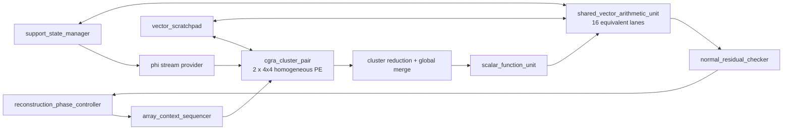

# v3 unified restricted-refinement blueprint

Trạng thái: **M0 authority đã chuyển sang restricted refinement; chưa có RTL
datapath**. Tài liệu này là contract kiến trúc cho LS và các phép cập nhật
restricted của cả tám thuật toán.

## 1. Phạm vi và quyết định đã khóa

```text
N_MAX       = 1024
M_MAX       = 128
K_MAX       = 32
CAND_MAX    = 2K = 64
LS_WORK_MAX = 3K = 96
numeric     = D18F14 / S27F19 / A62
```

Các quyết định chính:

| Hạng mục | Quyết định v3 |
| --- | --- |
| Paper contract | Ordinary LS; base algorithm luôn có strict profile |
| Common primitive | Warm-start support-restricted refinement |
| Iterative method | Restarted CGLS với reliable residual replacement |
| Fast modes | `q=0`, one-step gradient, bounded CGLS/Richardson |
| Storage | Matrix-free; không Gram, LDLT, Cholesky hoặc QR basis |
| PE organization | 32 PE hoàn toàn đồng nhất, không capability theo vị trí |
| General multiply | `shared_vector_arithmetic_unit`, 16 logical lane đồng nhất |
| Phi operators | `A*p` và `A^T*u` dùng CGRA sign/gate + reduction |
| Phi reuse | Cache symbol của active support, không lưu full matrix |
| Commit | Strict chỉ commit sau certificate trên coefficient D18 |

`K=64` không phải runtime profile. Interface giữ count/address width rẻ để một
build tương lai tăng M và support capacity mà không đổi primitive.

## 2. Một primitive cho cả tám thuật toán

Với support `T`, nghiệm warm-start `x0` và residual tương ứng
`r0 = y - Phi_T*x0`, primitive giải xấp xỉ hoặc chính xác:

```text
g0 = Phi_T^T * r0
p0 = g0

repeat q hoặc tới certificate:
    d     = Phi_T * p
    alpha = dot(g,g) / (dot(d,d) + lambda*dot(p,p))
    x     = x + alpha*p
    r     = r - alpha*d
    g_new = Phi_T^T*r                    # bỏ ở bước cuối fast mode
    beta  = dot(g_new,g_new) / dot(g,g)
    p     = g_new + beta*p
```

Các mode dùng cùng datapath:

- `q=0`: không refinement, dùng cho IHT path;
- `q=1`: restricted gradient với exact line search, dùng cho GP và fast path;
- `q=2..5`: approximate LS cho OMP/gOMP/HTP/SP/CoSaMP;
- `until_certificate`: ordinary LS strict;
- `beta=0`: Richardson/steepest-descent mode, không thêm phần cứng;
- `lambda=0`: paper LS; optional power-of-two `lambda` chỉ thuộc variant profile.

Khi support thay đổi, direction bắt buộc restart `p=g`. Không giữ conjugacy
qua một support khác trong baseline.

## 3. Mapping thuật toán

| Thuật toán | Strict paper path | Candidate bounded path để sweep |
| --- | --- | --- |
| OMP | certificate trước mỗi atom mới | `q=1`, tăng tới 3 theo orthogonality debt |
| gOMP | certificate sau mỗi block append | `q=1..2`, tăng tới 4 khi cần |
| CoSaMP | LS trên union tối đa 3K | warm-start `q=3`, tăng khi certificate fail |
| SP | LS trên union 2K và LS sau prune K | union `q=2`; post-prune reuse hoặc `q=1` |
| HTP | LS trên support K | restarted `q=1..3`, strict khi support ổn định |
| IHT | không full LS | `q=0` |
| GP | restricted gradient + line search | `q=1` |
| MP | rank-one coefficient/residual update | không full LS |

Bounded path là algorithm variant riêng. OMP approximate ở iteration giữa rồi
strict ở cuối không được gọi là paper-equivalent vì support có thể đã khác.

## 4. Phân chia CGRA và sidecar



CGRA chịu trách nhiệm:

- Phi sign/nonzero apply;
- `Phi_T*p` và `Phi_T^T*u`;
- routing, local accumulation và collective reduction;
- correlation toàn N.

`shared_vector_arithmetic_unit` chịu trách nhiệm:

- vector dot/norm;
- scale, copy, AXPY và direction update;
- coefficient/residual vector update;
- phát scalar numerator/denominator tới một shared ratio unit.

Sidecar có 16 logical lane vì một S27 scratchpad stripe chứa 16 element. Mọi
lane giống nhau; FPGA synthesis hoặc technology wrapper quyết định cách map
DSP. Không có `HAS_MUL` theo tọa độ PE và compiler không phụ thuộc placement
của primitive Xilinx.

## 5. Proxy reuse và không lưu full proxy

Correlation đã tạo `proxy = Phi^T*r`. Trong cùng stream:

- `top_candidate_buffer` giữ tối đa 2K `{index,value,score}`;
- `active_support_gradient_ram` giữ proxy tại active support;
- `support_slot_map[N]` ánh xạ column index sang support slot.

Sau support merge, `g0` được tạo từ candidate record và active-support
gradient. Không cần `proxy[N]` hoặc `rhs_cache[N]` trong baseline.

Khi `T_old` là tập con của `T_new`, dùng ngay:

```text
x0[new support] = old coefficient tại atom cũ, 0 tại atom mới
r0              = current residual
g0              = gathered current proxy
```

Ở bước refinement cuối, fast mode không tính restricted transpose lần nữa.
Correlation phase tiếp theo sẽ tạo full proxy và đồng thời cung cấp certificate
heuristic cho support hiện tại.

Nếu support bỏ atom, `support_coefficient_remapper` tạo delta list. Residual
warm-start được sửa bằng contribution của dropped atom trước khi refinement;
strict path vẫn tính lại true residual và normal residual trước commit.

## 6. State và ownership

Không duy trì dense coefficient N phần tử trong inner loop. Tất cả tám thuật
toán giữ coefficient dạng support/value; `reconstruction_result_writer` mới expand zero khi
software yêu cầu dense output.

Persistent state:

| Owner | State |
| --- | --- |
| measurement memory | `y[M]` |
| residual state | committed/proposed `r[M]` ping-pong |
| support manager | current/proposed list, bitmap và slot map |
| coefficient state | current/work coefficient tối đa 3K |
| candidate collector | Top-2K records + active-support gradients |
| Phi cache | `S*ceil(M/32)` sign words |

Refinement live vectors:

```text
measurement domain: d[M]
support domain    : x[S], g[S], p[S]
scalar A62        : gamma, gamma_new, delta, residual_norm
scalar S27        : alpha, beta
```

`r[M]` là residual state đang có, không tạo thêm zero-start `u[M]`. Proposed
state dùng ping-pong/atomic pointer commit; abort không copy dữ liệu dở sang
committed state.

## 7. Cycle model với cross-phase fusion

Với 32 Phi symbol/cycle:

```text
C_phi(S) = ceil(M*S/32)
C_fast(q,S) ~= (2*q-1)*C_phi(S) + q*C_vector(S)
```

Tại `M=128`, dùng vector schedule 16 lane folded hiện tại:

| S | `C_phi` | q=1 | q=2 | q=3 |
| ---: | ---: | ---: | ---: | ---: |
| 32 | 128 | khoảng 212 | khoảng 552 | khoảng 892 |
| 64 | 256 | khoảng 348 | khoảng 952 | khoảng 1,556 |
| 96 | 384 | khoảng 484 | khoảng 1,352 | khoảng 2,220 |

Các số này là architecture estimate, không phải Vivado measurement. Nếu không
có residual/proxy warm-start hợp lệ, cộng pass residual repair và/hoặc một
restricted transpose. Strict post-D18 certificate cũng cộng true residual và
normal-residual passes.

## 8. Stop, restart và certificate

Cheap adaptive indicators lấy từ dữ liệu đã có:

```text
orthogonality_debt = max_abs(proxy on support)
                   / max(max_abs(proxy outside support), epsilon)
residual_drop      = norm_old - norm_new
```

Policy:

1. chạy `q_min`;
2. mỗi step tính recurrence `g=A_T^T*r_solver`, `gamma=g^T*g`; đây là cheap
   convergence check, không narrow coefficient về D18;
3. chỉ chạy full residual replacement khi `gamma` chạm threshold, đủ interval
   tám step, tới profile boundary, hoặc tới strict final step;
4. full check recompute `y-Phi_T*x_D18` và `Phi_T^T*r_D18`; nếu fail thì thay
   `r/g/p` bằng trạng thái recompute rồi restart recurrence;
5. tăng q khi support correlation còn lớn hoặc candidate margin thấp;
6. restart nếu support đổi, fixed-point drift hoặc residual không giảm;
7. breakdown/saturation/denominator không dương không được commit;
8. strict profile chỉ commit sau khi recompute `y-Phi_T*x_D18` và
   `Phi_T^T*r_D18` pass threshold.

M0 khóa phép so sánh integer của strict profile:

```text
relative_limit   = ceil(gamma_reference / 2^(2*normal_residual_shift))
quant_floor      = max(2^14, active_support_count * 2^11)
certificate_pass = normal_residual_sq <= max(relative_limit, quant_floor)
```

Cheap trigger mặc định dùng cùng energy threshold trên `gamma_solver`; tham số
`cheap_certificate_guard_bits=0`. `reliable_recompute_interval=8` là hard upper
bound giữa hai full check trong một refinement transaction. Do đó giảm số pass
ma trận nhưng không nới điều kiện strict commit.

`normal_residual_shift=14`; `2^11` raw F38 tương ứng energy `2^-27` trên mỗi
atom. Floor tuyệt đối tránh yêu cầu dưới nhiễu narrow D18 ở support rất nhỏ.
Thay threshold này là numerical-contract revision, bắt buộc rerun sweep và
regenerate hardware golden.

`normal_residual_checker` xuất tagged result gồm:

```text
pass, need_more_refinement, restart_required, breakdown,
saturation, iterations_used, stop_reason
```

Nó không tự sửa support hay coefficient.

## 9. Interface module LS

| Producer -> consumer | Payload chính |
| --- | --- |
| control sequencer -> refinement state | begin, profile, support count, q limits, event ID |
| candidate collector -> support remapper | candidates + captured gradients |
| support manager -> Phi cache | support index stream + snapshot count |
| scratchpad -> vector unit | two S27 stripes + destination configuration |
| array reduction -> scalar unit | tagged A62 dot/norm |
| scalar unit -> vector unit | tagged S27 alpha/beta |
| checker -> control sequencer | pass/restart/fault event |
| support/residual owner -> commit | one atomic commit/rollback token |

Mọi interface dùng valid/ready; payload giữ ổn định khi stalled. Không thêm một
solver PC độc lập: paper CFG vẫn do `reconstruction_phase_controller` điều
khiển, array cycle vẫn do `array_context_sequencer` điều khiển. LS state block
chỉ giữ recurrence/certificate state.

## 10. Golden profiles

- `STRICT_PAPER`: base program, ordinary LS ở mọi phase paper yêu cầu.
- `BALANCED_VARIANT`: adaptive q, fallback strict theo certificate.
- `FAST_VARIANT`: fixed q, optional regularization, luôn giữ numeric guards.

Run configuration phải chọn profile rõ ràng; profile không được suy ra từ timing hoặc
hidden RTL parameter. Paper/hardware/phase golden của ba profile tách biệt.
PCG golden cũ đã được thay bằng restricted-refinement golden revision 3 trong
M0; mọi thay đổi tiếp theo phải regenerate manifest và review diff.

## 11. K64 seam

State và cycle tăng tuyến tính theo active support. PE, vector-lane count,
router, Phi protocol và scalar interface không đổi khi tạo future build.

Nếu `K=64`, CoSaMP cần work support 192. Với `M=128`, LS đó underdetermined;
future profile phải tăng M, hoặc giới hạn candidate trước union. K64 không được
bật chỉ bằng cách tăng run-configuration limit.

## 12. Gate trước RTL LS/PE

Trước khi viết PE hoặc LS vector RTL:

1. hardware model có strict/balanced/fast restricted refinement;
2. sweep q/restart/threshold trên đủ tám thuật toán và production Phi seeds;
3. strict path pass post-D18 certificate;
4. optimize theo total reconstruction cycle, không chỉ LS cycle;
5. compiler graph không còn `matrix_free_pcg`, `PCG_*` hoặc capability PE theo
   vị trí;
6. context ISA chuyển general vector multiply sang resource sidecar;
7. scratchpad liveness chứng minh không cần full proxy/RHS/dense-x inner state;
8. golden và architecture hash được regenerate/review trước RTL debug.

Iteration limits và threshold cụ thể là context/profile data, không phải thay
đổi kiến trúc và chỉ được khóa sau numerical sweep.
