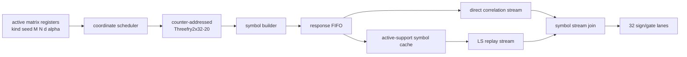

# v3 RIP-aware generated-Phi architecture

Trạng thái: **M7 RTL implementation COMPLETE 2026-08-25**. Tài liệu này thay
thế giả thiết tổng quát `Phi=+/-1/8`; matrix-quality sweep, runtime-scale model
và run-configuration revision 4 đã khóa trước RTL. M8 còn nối Phi vào operator.

## 1. Quyết định kiến trúc

V3 tách sensing matrix thành hai phần độc lập:

```text
Phi = alpha * S
```

- `S` là symbol matrix được sinh bit-exact từ seed và coordinate;
- `alpha` là hệ số dương của **một run**, lấy từ active run parameter register;
- `K` là sparsity của tín hiệu và không quyết định `alpha`;
- `d_phi` là số nonzero/cột của `S`. Dense Rademacher có `d_phi=M`.

Production backend đầu tiên là dense signed Rademacher:

```text
S[m,n] in {-1,+1}
d_phi = M
alpha_canonical = 1/sqrt(M)
```

Nó là lựa chọn baseline vì random subgaussian/Rademacher có bảo đảm RIP với xác
suất cao ở measurement complexity phù hợp, mọi cột có cùng norm chính xác, và
hardware chỉ cần sign bit. `alpha=1/8` chỉ là một encoding hợp lệ của một run;
nó không còn là architecture constant.

Fixed-column-weight sparse Phi (`d_phi=16/32/64/...`) là extension backend.
Interface chuẩn bị sẵn `nonzero_mask`, nhưng production build không được enable
backend này cho tới khi có theorem/profile justification, matrix-quality sweep
và chứng minh memory schedule thực sự giảm cycle. Gating zero mà vẫn đọc đủ M
row chỉ giảm switching, không tăng throughput.

## 2. RIP claim phải được phát biểu đúng

RIP order `s` và constant `delta_s` thỏa:

```text
(1-delta_s)||x||^2 <= ||Phi*x||^2 <= (1+delta_s)||x||^2
```

cho mọi vector có tối đa `s` phần tử khác zero. Vì vậy câu “Phi thỏa RIP” không
đủ; mỗi matrix certificate phải nêu `s`, `delta target`, `(M,N)`, generator
revision và seed policy.

Nếu mỗi cột của `S` có đúng `d_phi` symbol `+/-1`, standard unit-column scale là:

```text
alpha_canonical = 1/sqrt(d_phi)
```

Nếu software chọn `alpha` khác giá trị trên thì matrix vẫn giữ condition number,
coherence và support-ranking dưới một global scale, nhưng standard RIP interval
không còn centered tại 1. Khi đó:

```text
g2 = d_phi * alpha^2
g2*(1-delta_s)||x||^2 <= ||Phi*x||^2 <= g2*(1+delta_s)||x||^2
```

Hardware phải gắn trạng thái `unit_norm` hoặc `scaled_norm`; không được báo một
run arbitrary-scale là standard-RIP run.

Một PRNG/LFSR cũng không tự chứng minh từng matrix instance thỏa RIP. Kiểm tra
RIP chính xác cho matrix tổng quát là bài toán khó. V3 dùng ba lớp bằng chứng:

1. Chọn ensemble có theorem xác suất: dense independent signed Rademacher là
   production baseline.
2. Seed production được tạo và qualify offline; hardware chỉ replay mapping
   bit-exact. Raw/unqualified seed chỉ hợp lệ trong debug capability.
3. Manifest ghi matrix-quality metrics và recovery sweep; không đổi tên empirical
   screening thành exact RIP proof.

Với các thuật toán khác nhau, quality gate phải kiểm tra order liên quan của
paper (`K+1`, `2K`, `3K`, `4K` tùy thuật toán), không chỉ `K`. Riêng
`M=128,N=1024,K=32`, theorem-level uniform constants có thể chặt hơn nhiều so
với behavior thực nghiệm; chưa được claim trước khi sweep kết luận.

## 3. Runtime matrix register contract

Scale không phải AXI4-Lite state rời dễ bị cập nhật giữa run. Nó nằm trong run
run-configuration block và được `active_configuration_store` latch thành register bất biến từ
`parameter_commit` tới terminal event.

Run-configuration revision 4 giữ nguyên word matrix numeric:

```text
[17:0]  phi_scale_mantissa, unsigned Q1.17
[22:18] phi_scale_exponent, signed two's-complement
[29:23] phi_column_weight_minus_1
[30]    require_unit_norm
[31]    reserved = 0

alpha = phi_scale_mantissa * 2^phi_scale_exponent
        (mantissa interpreted as unsigned Q1.17)
```

Canonical mantissa nằm trong `[1,2)`:

| Scale | Mantissa | Exponent |
| --- | ---: | ---: |
| `1/8` | `1.0` | `-3` |
| `1/sqrt(128)` | `sqrt(2)` | `-4` |
| `1/sqrt(64)` | `1.0` | `-3` |
| `1/sqrt(32)` | `sqrt(2)` | `-3` |
| `1/sqrt(16)` | `1.0` | `-2` |

`matrix_kind` dùng hai bit của run-configuration header:

```text
0 = DENSE_RADEMACHER
1 = FIXED_WEIGHT_SIGNED_EXPERIMENTAL
2 = STRUCTURED_TRANSFORM_RESERVED
3 = invalid
```

Validator bắt buộc:

- mantissa khác 0 và canonical encoding không dư thừa;
- dense mode có `d_phi=M`;
- fixed-weight mode có `1<=d_phi<=M` nhưng bị reject khi capability chưa implemented;
- tính `column_norm_sq=d_phi*alpha^2` một lần ở setup;
- nếu `require_unit_norm=1`, validator số nguyên chứng minh
  `abs(d_phi*alpha^2-1)<=2^-10`, ngoài tolerance thì reject;
- seed phải thuộc production qualified-seed policy khi capability strict bật;
- scale/range combination phải nằm trong numerical certificate của build.

Chỉ host ghi `alpha`; `alpha^2`, column norm và inverse normalization cần cho
MP/GP được setup engine tính một lần bằng các primitive multiply/divide đã triển
khai. Không emit opcode `SCALAR_RECIPROCAL` reserved và không cho software ghi
nhiều derived scalar có thể mismatch nhau.

## 4. Generator datapath



Canonical response payload:

```text
valid/ready
nonzero_mask[31:0]
sign_mask[31:0]
column[9:0]
row_block[2:0]
transaction_tag[7:0]
```

Dense backend gán `nonzero_mask=all_ones`. Tách mask và sign ngay từ interface
giúp extension sparse không phải đổi PE/context protocol. PE không nhận D18 Phi
value; lane chỉ thực hiện `0`, `+operand` hoặc `-operand`.

Target generator giữ nguyên:

- 32 symbol/cycle sau pipeline fill;
- accepted coordinate pair tạo 64 symbol;
- request II=2 vẫn đủ cho response 32 symbol/cycle;
- coordinate/tag/payload giữ ổn định khi backpressure;
- counter-addressed mapping cho phép correlation, support gather và replay mà
  không cần skip-ahead một LFSR stateful.

Threefry không phải bằng chứng RIP, nhưng phù hợp hơn một LFSR stream đơn cho
random access, reproducibility và host/FPGA/ASIC known-answer vectors. Nếu một
generator rẻ hơn được đề xuất, nó phải qua cùng statistical, recovery, OOC và
post-route gate; không đổi mapping chỉ vì giảm vài LUT.

## 5. Scale placement không làm nghẽn 32 lane

Không tạo 32 runtime multipliers sau Phi generator. Một
`phi_operator_normalizer` tagged, II=1 được time-share giữa các phase theo hai
hướng toán học:

### 5.1. Forward `q = Phi_S*p`

```text
p_scaled[j] = alpha * p[j]       # một scalar/cycle
q[m] = sum_j S[m,j] * p_scaled[j]
```

Scale nằm **trước scalar broadcast**. Một kết quả scaler được fanout tới 32
sign/gate lane. Trong row block đầu, kết quả đồng thời được ghi vào temporary
scaled-support stream; các row block sau replay nó. Sau fill latency, array vẫn
nhận một support scalar/cycle và không cần 32 scaler ở output.

### 5.2. Transpose/correlation `z = Phi^T*u`

```text
sum_raw[n] = sum_m S[m,n] * u[m]
z[n]       = alpha * sum_raw[n]  # một result sau full reduction
```

Scale nằm **sau global reduction**. Với `M=128`, correlation tạo một full dot
mỗi bốn cycle; normalizer II=1 có dư throughput. `A^T` dùng cùng path.

Hai placement trên tự tạo `alpha^2` đúng khi CGLS gọi liên tiếp `A` và `A^T`;
không cần Gram hoặc một scale riêng cho normal equation.

### 5.3. Fixed-point pipeline

Input D18 được align từ F14 sang F19 bằng `<<5` trước sign/reduction. Input S27
giữ F19. Tại scale boundary:

```text
product = signed_sum_raw * phi_scale_mantissa
result  = sat_S27(round_ties_away(product * 2^exponent / 2^17))
```

Chỉ round một lần. Power-of-two scale tự động clock-gate multiplier và dùng
shift path, nhưng vẫn giữ cùng valid/tag latency. Generic scale dùng một shared
segmented multiplier pipeline; exact resource choice (`1 DSP + small fabric`
hoặc `2 DSP`) phải do Vivado OOC quyết định, không hard-code theo suy đoán.

## 6. Throughput contract

| Operation | Symbol work | Scale work | Steady-state target |
| --- | ---: | ---: | ---: |
| full correlation | 32 sign-op/cycle | 1 post-scale mỗi full dot | `ceil(M*N/32)` data cycle |
| support-cache fill | 32 symbol/cycle | none | `ceil(M*S/32)` data cycle |
| `A*p` forward | 32 sign-op/cycle | 1 pre-broadcast scale/cycle | `ceil(M*S/32)` data cycle + fixed fill |
| `A^T*u` transpose | 32 sign-op/cycle | 1 post-scale mỗi full dot | `ceil(M*S/32)` data cycle + fixed drain |

Runtime scale không được tăng RecMII. Chỉ được cộng bounded pipeline fill/drain;
FIFO depth phải che latency normalizer đã đo. Nếu OOC chứng minh II>1, candidate
đó bị loại hoặc phải duplicate normalizer trước khi PE RTL freeze.

## 7. Active-support cache

Dense production chỉ cần 32 sign bit/word:

```text
S=96, M=128 -> 384 x 32 bit
```

Interface/cache wrapper dự trù payload 64 bit `{nonzero_mask,sign_mask}`. Nếu
fixed-weight backend được enable, worst case là `384x64=24,576 bit`, vẫn vừa một
RAMB36E2 72-bit word. Baseline implementation được phép dùng RAMB18 sign-only;
đây là build-time choice, không allocate sparse payload khi capability tắt.

## 8. Offline matrix-quality gate

Mỗi candidate `(generator_revision,seed,M,N,d_phi,K_cert)` phải tạo report gồm:

1. exact column weight/norm, duplicate và negated-column check;
2. mutual coherence và Gram off-diagonal distribution;
3. sampled extremal singular values/RIC estimate ở order `K`, `2K`, `3K` và
   `4K` khi order không vượt geometry;
4. near-correlated/adversarial support sampling;
5. Monte Carlo recovery phase transition cho toàn bộ tám paper algorithms;
6. float-vs-fixed support overlap, residual, solver iteration và saturation;
7. generator bit balance, run/correlation tests và cross-seed independence;
8. manifest hash của generator, seed set, scale encoding và report.

Đây là qualification engineering; nó không thay exact RIP proof. Production
paper phải dùng wording `Rademacher ensemble with high-probability RIP` và công
bố empirical seed screening riêng.

## 9. Formal properties cho RTL sau này

- một accepted coordinate tạo đúng payload/tag và không duplicate/drop;
- stall giữ coordinate, mask, sign và normalizer payload ổn định;
- dense mode luôn có `nonzero_mask=all_ones` trên valid lanes;
- `symbol=0/+x/-x` đúng với mask/sign, kể cả signed minimum saturation policy;
- scale register bất biến trong run;
- power-of-two và generic-multiply path bit-exact cùng mathematical result;
- forward pre-scale và transpose post-scale tương đương `Phi=alpha*S`;
- normalizer II=1 không backpressure steady-state schedule hợp lệ;
- unit-norm check dùng đúng `d_phi*alpha^2` và invalid run configuration không commit;
- cache không replay trước full fill và invalidate ở mọi support mutation/fault.

## 10. Những gì chưa được khóa

- Không claim fixed-weight `d_phi=16/32/64` thỏa l2-RIP trước sweep.
- Không claim `M=128,K=32` đạt mọi sufficient RIC threshold của OMP/SP/CoSaMP/
  HTP chỉ từ công thức asymptotic.
- Không khóa số DSP của normalizer trước Vivado OOC.
- Không regenerate golden hoặc sửa Phi RTL cho tới khi run-configuration revision 4,
  scale range và production seed policy được review.
