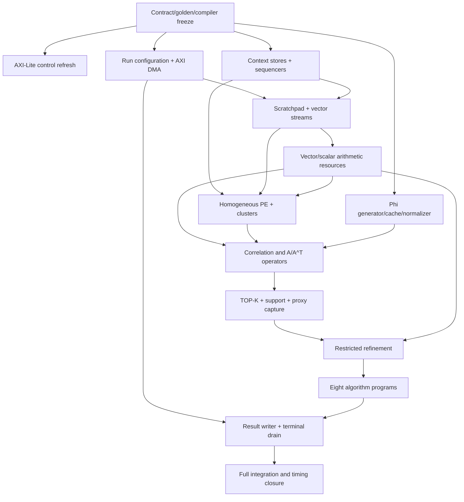

# v3 module implementation plan

Trạng thái: **M0-M4 leaf, M4.1 preload integration và M1-M4 verification
harness COMPLETE; M5 arithmetic COMPLETE; M6 homogeneous CGRA COMPLETE; M7
generated Phi COMPLETE; M9a TOP-K COMPLETE; M8 operator integration COMPLETE;
M9b support COMPLETE; M10 control/certificate slice COMPLETE; full M10 là
milestone hiện tại**.
Không có module mới nào được claim implemented chỉ vì xuất hiện trong tài liệu
này. RTL simulation dùng Vivado/XSim; không dùng Verilator hoặc Icarus.

Naming contract: cấu hình toàn bộ một lần reconstruction dùng prefix
`run_configuration_*`; `memory_configuration_*` chỉ dành cho bảng stream nội bộ.

Các cơ chế novelty N1-N6 cho paper (guaranteed-commit, reservation guard,
candidate-symbol capture, cadence controller, transactional sparse state,
speculative phase overlap) được định nghĩa trong
[15_NOVELTY_ROADMAP.md](15_NOVELTY_ROADMAP.md) và gắn vào các milestone dưới
đây; chúng không thay đổi exit gate hiện có mà bổ sung deliverable.

## 1. Baseline phải giữ xuyên suốt

- ZCU106 `XCZU7EV-2`, single clock baseline, 100 MHz bring-up rồi 150 MHz.
- `N_MAX=1024`, `M_MAX=128`, `K_MAX=32`, candidate 64, LS work 96.
- `D18F14/S27F19/A62`.
- Hai cluster 4x4, một shared phase/context machine.
- 32 PE hoàn toàn đồng nhất; không có multiply capability theo cột.
- General vector multiply/dot/AXPY nằm trong sidecar 16 lane đồng nhất.
- Phi sinh nội bộ, không DMA/full-matrix store.
- LS dùng unified restricted refinement; không Gram/LDLT/QR state.
- Base algorithm/golden luôn strict paper. Bounded refinement là variant rõ
  profile, không hidden replacement.

## 2. Sáu macroblock ở mức paper

Hierarchy trình bày trong paper và block diagram chỉ có sáu macroblock. Các
leaf RTL bên dưới là implementation detail, không được quảng bá thành accelerator
độc lập và không có algorithm controller/PC riêng.

```text
rtl/v3/
|- include/
|  |- reconstruction_control_defs.vh        # existing
|  |- architecture_parameters.vh            # generated authority
|  |- context_isa_defs.vh                    # generated from compiler
|  `- run_configuration_defs.vh              # generated from compiler
|- host_interface/                            # AXI4-Lite transport + CSR
|- reconstruction_control/                    # reconstruction configuration + phase CFG
|- context_control/                           # context/config stores + array PC
|- data_movement/                             # AXI DMA + preload + scratchpad/stream
|- cgra/                                      # router/adapter and later PE array
`- top/
   `- top.v
```

Source folders follow concrete RTL ownership. Sáu macroblock trong paper vẫn là
logical architecture view và có thể chứa nhiều source folder; không ép tên
folder trùng tên macroblock nếu làm mờ chức năng module.

Danh sách leaf-module chi tiết vẫn nằm trong từng milestone M1--M12. Compiler
MRRG coi reduction, shared vector/scalar FU, TOP-K và support/refinement checker
là resource node có reservation table; chúng không được gọi trực tiếp từ một
FSM thuật toán ẩn.

Không tạo folder `shell`, `job`, `misc` hoặc controller tên chung. Top chỉ
instantiate và nối interface; không chứa algorithm FSM hoặc datapath logic.

## 3. Ownership và ranh giới

| Owner | Được write | Không được write |
| --- | --- | --- |
| CSR | run-configuration address, IRQ/error sticky state | run parameters, phase state |
| reconstruction phase sequencer | START/ABORT, active-configuration lifetime, paper/variant CFG PC và terminal token | PE register hoặc memory address |
| array sequencer | array PC, loop counters, atomic cycle commit | algorithm support |
| vector stream engine | scratchpad cursors/ports | support semantics |
| support state manager | support/list/bitmap/slot map | residual/coefficient data path |
| refinement state | q, gamma/delta, restart/certificate flags | support commit |
| result writer | DDR result stream | reconstruction state trước terminal |

Hai cấp control duy nhất:

```text
reconstruction_phase_controller     run protocol + algorithm phase CFG
array_context_sequencer             static per-cycle schedule
```

`restricted_refinement_state` không có PC riêng và không phát PE opcode.

## 4. Dependency graph



## 5. Milestones triển khai

### M0 - Đồng bộ authority trước RTL mới — COMPLETE 2026-08-24

Milestone này khóa việc loại PCG, context revision 4 và PE multiply theo vị trí.

Deliverables:

1. run-configuration revision mới có explicit refinement profile;
2. context ISA không còn illegal multiply theo location;
3. resource ISA có vector dot/norm/scale/AXPY operations;
4. compiler graph dùng `restricted_refinement`, capacity đúng 64/96;
5. hardware model có strict/balanced/fast profile;
6. numerical sweep khóa q/restart/certificate thresholds;
7. context/routine transaction golden và architecture hash mới;
8. generated Verilog include và disassembly bit-exact.

Exit gate đã đạt: 62 model/compiler tests pass; strict/balanced/fast sweep pass;
smoke/scale golden revision 3 và hash-chain audit pass. Vivado datapath chưa tồn tại.

### M1 - Refresh control boundary hiện có — COMPLETE 2026-08-24

Modules:

- `axi4lite_slave`;
- `reconstruction_csr`;
- control-only integration trong `top`.

Work:

- cập nhật version/capability sau M0;
- transport và CSR dùng cùng synchronous reset contract;
- bỏ temporary engine-status ports khỏi final top plan, nhưng giữ mock wrapper
  riêng cho test;
- kiểm tra AW/W independent, backpressure, WSTRB, error response, START/ABORT,
  sticky event và IRQ.

Exit gate: Vivado `xvlog/xelab/xsim` directed test pass; SVA/property compile
pass. Không gọi đây là full design sign-off.

Evidence đã đạt: test kết thúc tại 1,730 ns; property elaboration PASS; OOC
synthesis trên `XCZU7EV-2` dùng 240 LUT/225 FF/0 BRAM/0 DSP, WNS `+4.530 ns`
ở 150 MHz, DRC 0 violation và không có unconstrained endpoint. Chi tiết tại
`reports/v3/M1_RECONSTRUCTION_CONTROL_STATUS.md`.

### M2 - Run configuration và AXI4 full DMA spine - COMPLETE

Modules:

- `axi_read_burst_engine` trước;
- `dma_request_arbiter`;
- `configuration_fetch_unit`;
- `configuration_check_unit`;
- `active_configuration_store`;
- sau đó `axi_write_burst_engine`, `dma_element_normalizer` và
  `memory_dma_engine` wrapper.

Exit gate:

- run configuration luôn đúng bốn beat hoặc một terminal error;
- invalid run configuration không partial commit;
- AXI backpressure/error injection pass trong XSim;
- OOC synthesis chỉ cho AXI engines sau functional pass.

Evidence đã đạt: hai self-checking Vivado/XSim testbench PASS tại 8,125 ns và
2,935 ns, assertion build `FORMAL` chạy cùng testbench PASS, property
elaboration PASS, và ba OOC top đều đạt 150 MHz trên `XCZU7EV-2`. Ingress dùng
1,185 LUT/1,314 FF, DMA spine 710 LUT/256 FF, normalizer 161 LUT/137 FF; tất cả
dùng 0 BRAM/0 DSP, DRC 0 violation. Worst post-synthesis WNS là `+2.886 ns`.
Chi tiết tại `reports/v3/M2_DMA_AND_RUN_CONFIGURATION_STATUS.md`.

### M3 - Context/control execution spine — COMPLETE 2026-08-24

Architecture gate đã đạt: tạo và validate
`compiler/v3/architecture_configuration.json`; file này sinh MRRG, RTL constants,
latency/II table và architecture hash. Quyết định chi tiết và nguồn đối chiếu
nằm tại `reports/v3/CGRA_OPEN_SOURCE_IMPLEMENTATION_REVIEW.md`.

Modules:

- `context_image_store`;
- `context_write_certifier`;
- `memory_configuration_store`;
- `context_reservation_guard` (FORMAL/test full-bundle checker);
- `array_context_sequencer`;
- `reconstruction_phase_controller`.

Đã test bằng mock array consumer trước khi có PE. Trace chứng minh PC/counter,
branch, wait-event, abort-safe-point và elastic stall không làm lệch context.

Novelty gate (doc 15): N1 `guaranteed_commit` phải được quyết định trong M3 vì
nó thêm field vào context ISA trước freeze; N2 certification sinh từ
`architecture_configuration.json` kiểm tra field tại write-time rồi scan
CFG-closure khi finalize image. Vì mọi target/fallthrough đã nằm trong image,
runtime chỉ kiểm tra entry PC một lần khi launch và không đặt legality/bounds
cone vào execution critical path.

Exit gate đã đạt: compiler-generated image 13 event chạy bit-exact trong XSim;
context trace gồm 9 commit/4 stall khớp cycle golden. Directed negative test
đã cover partial/out-of-order programming, active-bank write, hole, corrupt
context, unavailable program, out-of-image CFG edge/entry và abort ở
fetch/execute. Property compile/elab PASS; assertion-enabled XSim PASS. ZCU106
OOC critical-path harness đạt WNS `+2.976 ns` với period 6.667 ns/uncertainty
0.200 ns; gate riêng cho integrated M3 là `+1.0 ns`. Trace 9 commit/4 stall
không đổi. Chi tiết tại
`reports/v3/M3_CONTEXT_CONTROL_STATUS.md`.

### M3.5 - DFG/MMG compiler gate — COMPLETE 2026-08-25

- `reconstruction_graphs.py` dùng timing/II/physical owner từ architecture
  authority, không giữ latency riêng;
- `modulo_mapping_graph.py` sinh candidate-II MRRG, MMG, solve và validate
  mapping cho correlation, residual update, Phi forward và Phi transpose;
- corresponding tile của hai cluster là một paired-context resource bundle;
- TOP-K/support/solver vẫn là explicit resource/hierarchical transactions.

Exit gate: 95 Python tests PASS; bốn kernel map ở II lần lượt `2/2/2/2`, mọi
route reservation tồn tại trong base MRRG và không trùng capacity. Chi tiết tại
`reports/v3/M35_DFG_MMG_STATUS.md`.

### M3.6 - Typed allocation và context emission — COMPLETE 2026-08-25

- mọi DDG edge có typed SSA value và explicit producer/consumer;
- modulo lifetime allocation cấp local RF, không dùng hidden register;
- bank allocator khóa 8-bank cyclic layout và configuration ID ownership;
- correlation đi qua normalizer vào TOP-K, không lưu full `proxy[N]`;
- context emitter ban đầu sinh 15 executable context; Gate M9a hiện mở khóa
  correlation, tạo 20 context liên tục cho đủ bốn kernel và mười distributed
  `.mem` plane;
- `config/rtl-v3.json` là development authority được project checker kiểm tra.

Exit gate ban đầu: 91 Python tests PASS; current aggregate: 102 tests PASS; RF pressure 1/8 entry mỗi PE; scratchpad dùng
38/512 word mỗi bank; tối đa hai access/bank/context; context/ISA round-trip,
stale-hash, type coverage và overlap negative tests PASS. Chi tiết tại
`reports/v3/M36_TYPED_CONTEXT_STATUS.md`.

### M4 - Scratchpad và stream transport — COMPLETE 2026-08-25

Modules:

- `vector_scratchpad`;
- `vector_stream_engine`;
- `stream_context_router`;
- `scratchpad_word_codec`.

Thứ tự test: single bank -> 8 bank stripe -> two-port conflict -> simultaneous
read/write -> global stall. Không reset data array; chỉ reset valid/ownership.

Exit gate: D18/S27/index packing, memory-configuration bounds và address advance đúng
`cycle_commit`; XSim random backpressure pass.

### M4.1 - DMA preload và scratchpad residency — COMPLETE 2026-08-25

Modules:

- `scratchpad_preload_engine`;
- `scratchpad_residency_tracker`.

Integration TB đi qua `memory_dma_engine -> dma_element_normalizer ->
scratchpad_word_codec -> vector_scratchpad`, rồi đọc lại bằng
`vector_stream_engine`. D18/S27 bit-exact, AXI random backpressure, terminal
error và missing-residency stall/violation đều PASS. `top.v` chưa đổi; final
production compute arbitration vẫn thuộc milestone tích hợp sau. Harness
`verification/v3/integration/m1_m4_integration_harness.sv` hiện đã nối M1--M4
thật để kiểm chứng phase-boundary arbitration, nhưng không giả làm production
top; result drain vẫn thuộc M12. Chi tiết tại
`reports/v3/M1_M4_INTEGRATION_HARNESS_STATUS.md`.

### M5 - Arithmetic resources độc lập

Modules:

- `cluster_reduction_unit` và `global_reduction_merge`;
- `scalar_register_file`;
- `scalar_function_unit`;
- `shared_vector_arithmetic_unit`;
- `array_resource_router`.

Leaf test bit-exact cho A62 sum/norm, folded S27 multiply, AXPY và divide
(chia nguyên chính xác theo `Arithmetic.round_div`, toán hạng A62, 28 cycle cố
định). `SCALAR_RECIPROCAL`/`SCALAR_SQRT` giữ encoding reserved và không có
datapath M5 vì không có golden; SFU trả fault deterministic — quyết định và
toàn bộ numeric/interface/latency contract nằm tại
[17_M5_ARITHMETIC_CONTRACT.md](17_M5_ARITHMETIC_CONTRACT.md). Mọi
request/result có tag; variable latency không làm mất transaction.

Exit gate: transaction golden pass; Vivado OOC báo latency/II/resource/WNS cho
từng leaf (gate DSP: sidecar 16, leaf khác 0). Chưa cần full route.

### M6 - CGRA đồng nhất

Trạng thái: **COMPLETE 2026-08-25 tại leaf/cluster-pair boundary**.

Thứ tự:

1. `pe_alu`;
2. `pe_local_register_file`;
3. `registered_switchbox`;
4. `pe_tile`;
5. một row;
6. `cgra_cluster` 4x4;
7. `cgra_cluster_pair`.

Corresponding tile ở hai cluster nhận cùng context word; cả 32 PE có cùng
opcode/latency capability. Không có `HAS_MUL`, column capability hoặc Xilinx
primitive trong PE RTL.

Exit gate: opcode/rounding/predicate/router tests pass; two-cluster shared-PC
stall assertion pass; OOC one PE, one cluster và cluster pair.

Evidence: Vivado/XSim golden + assertion-enabled XSim PASS; property
compile/elaboration PASS; OOC @150 MHz PASS. Revision 7 fuse Phi sign/zero với
L48 accumulate trong một cycle. `cgra_cluster_pair` dùng 48,487 LUT/6,208
FF, 0 DSP/0 BRAM và WNS +2.126 ns. M6 không thêm PC/FSM cục bộ,
không multiplier theo cột và không packet router. Xem
`reports/v3/M6_CGRA_ARRAY_STATUS.md`.

### M7 - Generated Phi path

Trạng thái: **COMPLETE 2026-08-25 tại generator/cache/provider/normalizer
boundary**.

Thứ tự:

1. `threefry2x32_folded_pipeline`;
2. `phi_request_queue`;
3. `phi_symbol_builder`;
4. `phi_response_gearbox`;
5. `phi_symbol_generator`;
6. `support_phi_symbol_cache`;
7. `phi_stream_provider`;
8. `phi_operator_normalizer`.

Novelty gate (doc 15): N3 phần skid buffer và cache capture/promote interface
thuộc M7; phần capture theo TOP-K insert chỉ đóng được ở M9.

Exit gate: Threefry KAT, coordinate determinism, two-response conservation,
backpressure stability, cache fill/replay/invalidate và runtime scale bit-exact
pass trong XSim. OOC xác nhận word rate một/cycle sau fill và normalizer II=1.

Evidence: 99 Python tests PASS; Vivado/XSim assertion build và property
elaboration PASS. OOC @150 MHz đạt WNS thấp nhất +2.585 ns. Cache dùng đúng một
RAMB36; generator/provider 0 DSP; normalizer A62 x UQ1.17 dùng 4 DSP. N3 skid,
candidate capture, promote và invalidate đã có; TOP-K insertion owner vẫn ở M9.
Xem `reports/v3/M7_GENERATED_PHI_STATUS.md`.

### M8 - Correlation và matrix operators

Integrate:

- correlation `Phi^T*r` toàn N;
- `Phi_T*p`;
- `Phi_T^T*u`;
- residual update;
- fused dot/norm collection.

Đây là checkpoint quan trọng nhất giữa CGRA, memory, Phi và reduction.

Trạng thái: **COMPLETE 2026-08-26**. Sequencer replay compiler PC 10-29,
tail `M=33/S=3`, verification seed 23, random stalls, exact commit/cycle accounting và
normal/property XSim PASS. OOC WNS +1.029 ns.

### M9 - Selection và support ownership

M9a TOP-K leaf/capability được kéo lên trước M8 và COMPLETE 2026-08-26. M9b
support ownership vẫn giữ tại milestone này. Evidence:
`reports/v3/M9A_TOPK_SELECTION_STATUS.md`.

Thứ tự:

1. `topk_selection_unit` — M9a COMPLETE;
2. `proxy_candidate_collector`;
3. `support_workspace`;
4. `support_state_manager`;
5. `support_coefficient_remapper`.

Phải test tie-break deterministic, no duplicate, append/union/prune,
current/proposed rollback, slot-map consistency và capture active-support
gradient mà không lưu full proxy.

Novelty gate (doc 15): N5 transactional sparse state property set và rollback
cost counter; N3 candidate-symbol capture tại TOP-K insert đóng ở đây.

Exit gate: K32/2K/3K corner cases pass; mutation chỉ xảy ra bằng atomic commit.

### M10 - Unified restricted refinement

Integrate:

- `restricted_refinement_state`;
- `shared_vector_arithmetic_unit`;
- `normal_residual_checker`;
- matrix operators và support remapper.

Bring-up order:

1. `q=1` exact-line-search step;
2. two-step restarted recurrence;
3. bounded q;
4. strict certificate;
5. warm-start proxy reuse;
6. support drop/remap;
7. residual replacement và fault rollback.

Novelty gate (doc 15): N4 cadence controller với M0-locked policy và telemetry
counter; không đổi threshold nào trong milestone này.

Exit gate: phase-level hardware golden pass tại S=1..32, 64 và 96; không
silent saturation/breakdown; strict post-D18 certificate pass.

### M11 - Tám phase program

Tích hợp theo độ khó tăng dần:

1. MP;
2. IHT;
3. GP;
4. OMP;
5. gOMP;
6. HTP;
7. CoSaMP;
8. SP.

MP/IHT xác nhận correlation, Top-K và residual trước khi LS tham gia. GP xác
nhận one-step line search. OMP xác nhận strict refinement. CoSaMP/SP cuối cùng
vì dùng 2K/3K, prune và proposed-state rollback.

Exit gate mỗi thuật toán: paper phase order, hardware phase values, support,
stop reason và cycle trace pass trên smoke rồi stress suite.

Novelty gate (doc 15): N6 speculative phase overlap chỉ được bắt đầu sau khi
cả tám program sign-off; nó là numerical-contract revision với profile, sweep
và golden riêng.

### M12 - Result, abort và end-to-end DMA

Module: `reconstruction_result_writer` và full top integration.

Test dense expansion từ sparse state, sparse record format, result header,
abort/error drain, AXI failure và no partial-success semantics.

Exit gate: một START tạo đúng một terminal completion/error; DDR output khớp
golden cho cả dense, sparse và both modes.

### M13 - ZCU106 integration và tối ưu

Thứ tự report:

1. OOC các critical leaf;
2. full synthesis;
3. placement;
4. route;
5. final timing, utilization và DRC/PDRC;
6. cycle regression tám thuật toán.

Mỗi optimization candidate phải báo cùng lúc regression, total/phase cycles,
LUT, FF, BRAM, DSP, WNS/TNS và DRC. Không pipeline một đường chỉ để hết warning
nếu compiler latency/context image chưa đổi cùng revision.

## 6. Verification rule cho từng module

Một module chỉ chuyển sang `DONE` khi có:

1. interface, latency, reset và side-effect contract;
2. RTL source + local assertions;
3. directed và backpressure test bằng Vivado/XSim;
4. property compile/elaboration bằng Vivado cho formal-intent assertions;
5. bit-exact golden cho arithmetic/data modules;
6. source được thêm vào `rtl/v3/files.f` đúng dependency order;
7. README/status không claim test chưa chạy;
8. OOC report chỉ khi module thuộc timing/resource critical path.

Vivado 2018.1 không phải formal proof engine. SVA compile/XSim assertion không
được báo là mathematical proof. True formal proof là gate riêng nếu sau này có
approved formal engine.

## 7. Current status và next action

| Module | Source | Current evidence | Next action |
| --- | --- | --- | --- |
| `axi4lite_slave` | có | M1 Vivado XSim/property/OOC PASS | freeze protocol boundary |
| `reconstruction_csr` | có | M1 CSR3/context7 PASS | freeze compact map |
| `top` control wrapper | có | M1 temporary integration seam | chỉ nối final khi M8 integration và resident image M11 có owner thật |
| M2 run-configuration control | có | XSim/assertion/property/OOC PASS | freeze atomic ingress |
| M2 AXI DMA spine + packer | có | backpressure/error/4 KiB boundary PASS | preload seam đã nối ở M4.1; result drain M12 |
| M3 context/configuration stores | có | XSim/assertion/property/OOC PASS | freeze programming/read contract |
| M3 control + array sequencers | có | exact 13-event trace/abort/error PASS | nối compute consumers tại M8 |
| M3.5 DFG/MMG compiler | có | 4 modulo kernels map + negative validation PASS | superseded by M3.6 allocation gate |
| M3.6 typed/context compiler | có | 104-test suite; 30 contexts; correlation + three nested schedules executable; RF/bank validation PASS | freeze resident context compiler |
| M4 scratchpad/stream leaf | có | packing/backpressure/bounds/assertion/OOC PASS | freeze leaf contract |
| M4.1 DMA preload/residency | có | DMA-to-stream bit-exact, residency, assertion/OOC PASS | freeze preload contract; final arbitration M8 |
| M5 arithmetic resources | có | bit-exact XSim/assertion/property/OOC PASS; integrated WNS +2.009 ns, 16 DSP/0 BRAM | freeze latency/II và nối vào M8 |
| M6 homogeneous CGRA | có | fused Phi MAC + opcode/RF/router/predicate/stall XSim; property/OOC PASS; pair 48,487 LUT, WNS +2.126 ns, 0 DSP/BRAM | freeze tile/context latency; nối Phi và operators ở M8 |
| M7 generated Phi | có | KAT/latency/II/cache/provider/normalizer XSim; property/OOC PASS | freeze Phi contract; nối operator ở M8 |
| M9a TOP-K selection | có | XSim/assertion/property/OOC PASS; WNS +2.742 ns; 0 BRAM/DSP; compiler correlation enabled | nối dispatch owner tại M8; giữ M9b support riêng |
| M8 operator integration | có | sequencer replay/tail/random-stall/property/OOC PASS; WNS +1.029 ns | freeze operator ABI; mở M9b |
| M9b support management | có | transaction/cache normal/property/OOC PASS; WNS +1.239 ns | freeze support ownership |
| M10 refinement control slice | có | checker/state/recompute seam/dispatcher normal-property PASS; production remap/drop PASS; S=1..32,64,96; worst WNS +1.512 ns | full matrix-value transaction |
| M11 eight-program package | có | software IDs 0-7 READY; RTL algorithm-ID decode absent; phase/replay/property/OOC PASS | freeze program ABI and context images |
| M12 result writer/top | complete | production `top.v`, lifecycle normal/property DDR golden PASS; config/writeback abort and BRESP error PASS; OOC WNS +3.620 ns, 7,562 LUT/4,971 FF | freeze lifecycle ABI; mở M13 board/full-route |

M12 đã đóng gate với production lifecycle `top.v`, end-to-end DMA result và
one-terminal semantics. Hành động kế tiếp là M13 ZCU106 shell, full route,
final timing/DRC và board regression tám software-owned program images.
