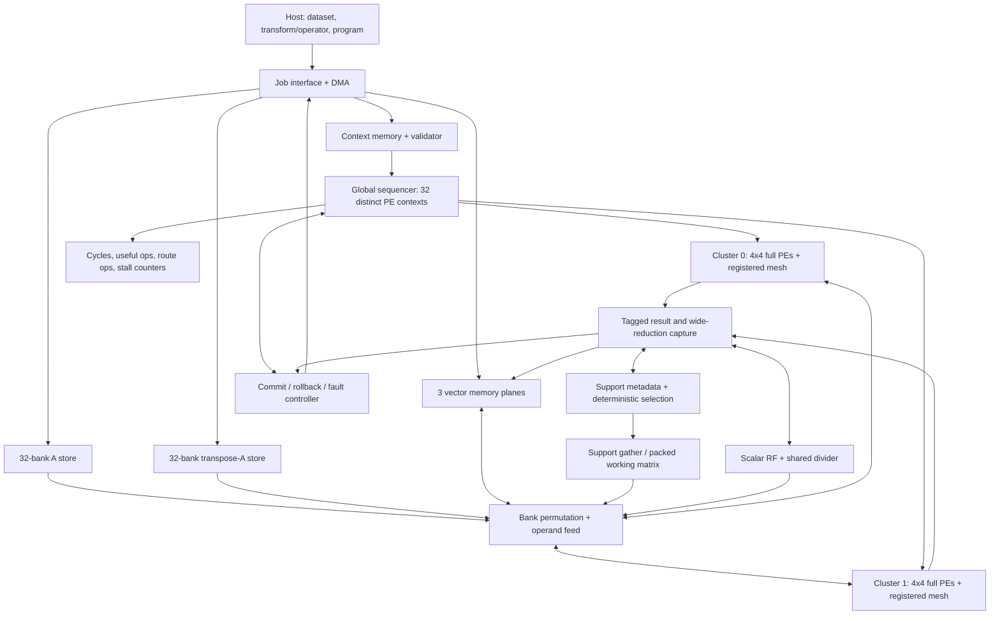

# CSR v4 — kiến trúc dự kiến và hợp đồng triển khai

**Quyết định hiện hành:** [shared streaming system](architecture/STREAM_SYSTEM_CONTRACT.md)
dùng LFSR Phi + sign cache + paired B cache + **QR cho support LS** trên đúng
32 PE. [Thiết kế QR](architecture/QR_SOLVER.md) và [hierarchy](diagrams/recovery.mmd)
là hướng triển khai mới. QR vẫn cần qualification riêng.

Nội dung khảo sát ngày 2026-09-08 dưới đây là reference; các lựa chọn
hai-copy/CGLS/LSQR không còn chọn solver cho top đích. `v4_design.json` giữ
tham số baseline để tái lập nghiên cứu cũ; catalog hiện hành là
[v4_modules.json](../../config/v4_modules.json).

Ngày 2026-09-08. Đây là **đặc tả kiến trúc để triển khai**, không phải báo cáo một
accelerator đã hoàn thành. Cấu hình máy đọc được: [v4_design.json](../../config/v4_design.json).
V4 nằm riêng; source v3 và các thử nghiệm đang dở không bị chuyển thành baseline v4.

**Quyết định mở trước RTL:** hệ memory hai orientation và solver CGLS trong
spec là reference để đối chứng. [Generated operator](architecture/GENERATED_OPERATOR.md)
ưu tiên sinh dấu khi mô hình đo cho phép; Phi/Psi cần composition đúng.
[Matrix tradeoff](architecture/MATRIX_TRADEOFF.md) đề xuất một-copy diagonal
layout cho dense operator; [LS decision](architecture/LS_SOLVER_DECISION.md)
ưu tiên so LSQR theo tổng cost ở cùng quality. Code/config ghi rõ reference và
candidate, không dùng kết quả pipeline của reference để chứng nhận candidate.

## 1. Quyết định kiến trúc

Thiết kế một CGRA chuyên miền sparse recovery với **32 PE đầy đủ, chia thành hai
mảng 4×4**, một bộ phát lệnh và **32 context PE riêng biệt mỗi bước**. PE thực hiện
MAC, vector arithmetic và reduction. Tám thuật toán gốc cùng ba chương trình mới
FISTA, ADMM-LASSO và PDHG-LASSO là chương trình kết hợp
kernel; RTL không có state machine riêng cho OMP, SP hoặc CoSaMP.

Mục tiêu đầu: ZCU106/xczu7ev, 100 MHz; `M≤128, N≤1024, K≤32`, support làm việc
`S≤96`. Đây là giới hạn của một tile/job resident; vượt giới hạn phải có tiling
được kiểm chứng, không âm thầm cắt dữ liệu. `S_MAX=96` chứa union CoSaMP tối đa
`3K`; SP cần `2K`; gOMP `L=2` có thể tới `2K`. Kiểm tra capacity trước job.

ZCU106 là target triển khai bắt buộc. [Board contract và giải thích luồng tính](architecture/ZCU106.md)
định nghĩa PS DDR/AXI/clock, budget BRAM theo geometry và tiêu chí xác nhận trên
board. Phần resource đã ước tính chưa đại diện cho toàn core + shell hoặc timing.

Các lựa chọn cụ thể cho bản đầu:

| Quyết định | Bản v4 dự kiến | Lý do / giá phải trả |
|---|---|---|
| PE | 32 PE có cùng tập lệnh, RF 8 word/PE, accumulator rộng | Mapping không bị giới hạn bởi PE chỉ làm Phi |
| Điều khiển | 1 global PC, 32 tile slot khác nhau, enable mask 32 bit | Atomic issue dễ kiểm chứng; không giả vờ hai cluster chạy hai vòng lặp độc lập |
| Routing | Neighbor N/E/S/W có thanh ghi bên trong từng 4x4; không có link mesh giữa hai array | Latency từng hop thể hiện trong schedule; reduction liên array phải qua shared capture/service |
| Hai mode GEMV | R1: 32 đầu ra độc lập; R4: 8 đầu ra × 4 lane reduction | Lựa chọn theo chiều output/reduction và toàn bộ chi phí, không theo tên thuật toán |
| Matrix | General real matrix resident, lưu hai hướng A và Aᵀ | Hỗ trợ `A=Phi*Psi`; trả chi phí BRAM và preload |
| Memory | 32 bank mỗi hướng matrix; 3 plane vector để đọc 2 nguồn/ghi 1 đích | Không cấp 32 MAC bằng một cổng scalar hoặc giả định RAM 3 port |
| Solver | CGLS unregularized cho pursuit; shifted-CG cho ADMM, microprogram trên cùng PE | Không lập Gram; ADMM có rho theo công thức riêng, không sửa LS của pursuit |
| Scalar | Một divider dùng chung, có request/response và tag | Không đặt 32 divider; thời gian chờ phải được tính |
| Support | Magnitude TopK dùng32 PE local maxima/pass rồi scalar merge32 winners; exact normalized comparator là fallback riêng | Baseline tối đa96 ranks; score arithmetic ở PE, metadata ở support module; không tạo vector/LS sidecar riêng |
| Precision | D/C/S/ACC là compile-time profile sinh từ khảo sát | Chưa khóa 18/27/62 hoặc 24 bit theo v3/paper cũ |
| Host | Nạp operator, program và dữ liệu; nhận kết quả/counters | Host chưa được tính là FFT/DCT phần cứng |

Không có independent cluster PC, arbitrary packet NoC, hardware FFT, runtime
đổi Q-format, hay LS accelerator riêng trong baseline này. Những phần đó chỉ
được đưa vào revision sau với nhu cầu và ablation riêng. Đây là giới hạn phạm vi
thực hiện, không phải tính năng được báo là hoàn thành.

## 2. Sơ đồ và đường đi dữ liệu



Một job: validate descriptor → preload và hash operator/program → snapshot run
config → chạy program → kiểm tra điều kiện commit → ghi x/result → báo done.
Numeric fault/timeout/abort chỉ đi tới trạng thái fault hoặc rollback, không đi
qua success. Output cũ và output chưa commit phải phân biệt bằng epoch/job tag.

## 3. Module và context: một nguồn tên/encoding

Danh sách module, instance count, state owner và đường dẫn RTL dự kiến nằm ở
[module catalog](architecture/MODULES.md), sinh từ
[v4_modules.json](../../config/v4_modules.json). Đây là hierarchy dự kiến,
không phải danh sách module RTL đã hiện thực. Không giữ thêm bảng tên module
thủ công trong system spec để tránh lệch tên giữa tài liệu và source.

Các contract chuyên đề là authority cho phần tương ứng:

| Contract | Nội dung |
|---|---|
| [MATRIX.md](architecture/MATRIX.md) | Phi/A/Psi, quantize-once, resident layouts, matrix manifest |
| [SOLVER.md](architecture/SOLVER.md) | Pursuit CGLS, ADMM shifted-CG, certificate và failure policy |
| [CONTEXT.md](architecture/CONTEXT.md) | Candidate ISA revision1, binary fields, HEX images, validator và giới hạn |

Software context packer đã có; chưa có decoder/loader RTL. Candidate ISA thay
thế bảng field proposal cũ của tài liệu này. Một issue vẫn gồm32 tile words64 bit
và control256 bit; depth256, một image active: **72 KiB payload**. Chưa chứng minh
cả11 algorithm programs fit. Không đồng nhất pack/unpack thành công với execution
equivalence, hoặc dùng template serialized read/MAC để suy ra MAC II=1.

Bank tổ chức mỗi PE256×64 có thể dùng32 BRAM36; control256×256 thêm khoảng4
BRAM36. Payload lower bound16 BRAM36 không phải số sử dụng thực tế. DMA128-bit
cần ít nhất4.608 data beats cho full72 KiB; AXI-Lite32-bit cần18.432 data writes,
chưa tính handshake/validation. Nạp chỉ khi idle, không đổi image giữa job.

`context_sequencer` sở hữu PC/loops/issue-retire. `context_store` sở hữu image;
`context_loader` sở hữu load/validate/publish. Phần kiểm chứng program đầy đủ nằm
ở compiler/verifier; hardware loader vẫn phải chặn revision/range/invalid opcodes.
`support_gather` sở hữu transfer schedule; `support_matrix_cache` sở hữu dữ liệu
packed và cache key. `result_writeback` sở hữu rounding/tagged capture;
`commit_controller` sở hữu publish/rollback x/support/residual.

Stream: `valid`, `ready`, `payload`, `job_tag`, `op_tag`, `format_tag`,
`lane_mask`, `last`. Chỉ nhận ở `valid && ready`; giữ payload và tags khi stall.
Numeric/width contract vẫn chưa freeze. Xem [diagram gallery](diagrams/README.md)
và [project guide](PROJECT_GUIDE.md) cho đường đi dữ liệu và quy tắc tổ chức.

## 4. PE, precision và hạn chế vật lý

Ba miền lưu trữ tách bạch: `D` cho measurement/output đã normalize, `C` cho matrix,
`S` cho state/proxy/LS. RF PE rộng S. Vector D được sign-extend/align khi load;
store về D mới narrow. Top-k không narrow score về D trước ranking.

Tập lệnh tối thiểu: HOLD, MOV, ADD, SUB, ABS, signed/unsigned CMP, SELECT, MUL, MAC,
ACC_CLEAR, ACC_READ và chuyển route. Soft-threshold xây bằng ABS/SUB/
MAX/sign cho FISTA/ADMM/PDHG; opcode mới phải có model/RTL/test.
Không dùng opcode `OMP_STEP` hay `COSAMP_LS`.
PE có predicate bits local và thao tác boolean trên predicate để lập lịch
`eligible && (!best_valid || greater)`; không dùng global predicate chung cho
32 kết quả compare khác nhau. Domain unsigned score cho ABS/CMP giữ đúng abs(MIN).

Ứng viên `S≤27,C≤18` khớp kích thước multiplier DSP48E2, nhưng accumulator
DSP48E2 chỉ 48 bit. ACC lớn hơn cần logic/cascade; **32 PE không đồng nghĩa toàn
design đúng 32 DSP**. `S×S` (dot, alpha*p, beta*d) không được tính như một phép
27×18: khi S=27, tách một operand thành low17 unsigned và high10 signed,
`u=u_lo+2^17*u_hi`, hai product và merge rộng trước narrow. Compiler tính ít nhất
hai product issue cho mỗi S×S nếu dùng một multiplier/PE.
Nguồn phần cứng: [AMD UG579](https://docs.amd.com/api/khub/documents/pTysoma4TYgNH95BrY1Sbw/content).

Độ rộng accumulator phải tính cả số âm nhỏ nhất. Với reduction L phần tử,
operand signed Wa/Wb, bound magnitude an toàn là
`B=L*2^(Wa-1)*2^(Wb-1)` và `Wacc=B.bit_length()+1`.
Ví dụ S27×S27 dot dài 1024 cần 64 bit nếu chứng nhận toàn miền;
C18×S27 dài 1024 cần 55 bit. ACC62 v3 không tự bao phủ dot S27 dài 1024.
Có thể giảm bằng declared operand bounds hoặc phân tầng local/global, nhưng phải
chứng minh bound cả intermediate, không dựa vào vài mẫu chưa overflow.

Latency multiply/add/route/round/divide là trường của machine description.
Model mapping ban đầu dùng latency đơn giản để so sánh topology; latency pipeline
RTL được đưa ngược vào compiler trước bất kỳ kết luận cycle nào. Nếu feedback
ACC không đạt II=1 tại 100 MHz, thử interleaved accumulators và đo lại cost/RF,
không giữ con số 32 MAC/cycle như một kết quả đo.

## 5. Mapping thật lên hai mảng 4×4

Viết operator thành `z[o]=sum_k B[o,k]*v[k]` với O output, K reduction.
GEMV thuận dùng B=A; transpose dùng B=Aᵀ. Restricted GEMV dùng support slot
đã pack, không để atom index ngẫu nhiên trực tiếp tạo bank conflicts.

### R1 — 32 output độc lập

Mỗi PE giữ một output, tất cả PE nhận cùng `v[k]`, đọc 32 B[o,k]. Khi O≥32,
mode này giảm overhead reduction. Neighbor link có thể không dùng ở kernel này;
đó không phải lý do chèn route vô ích. Mọi PE vẫn thực hiện MAC hữu ích.

### R4 — 8 output, mỗi output trải một hàng 4 PE

Cluster0 giữ output0..3, cluster1 output4..7. Bốn cột nhận reduction index
`4t+0..3`. Mỗi PE tích lũy các term riêng. Sau tile, partial sums đi qua các
neighbor đã register và ADD để trả về đầu hàng. `c2→c0` cần hai hop;
không coi đường dài này là một cycle. Tail mask loại term ngoài K/O.

Ví dụ quan trọng trong CGLS, M=128 và support S=8:

| Kernel | O | K | Hướng hợp lý để thử |
|---|---:|---:|---|
| A_S p | 128 | 8 | R1, 32 output cùng lúc |
| A_Sᵀ r | 8 | 128 | R4, 4 PE/output để tránh 24 PE idle |
| Dense proxy Aᵀr | 1024 | 128 | So sánh R1/R4 với memory/pipeline cost |
| Residual y−A_Sx | 128 | S | R1 GEMV rồi vector SUB, có thể fuse writeback sau chứng minh equivalence |

Compiler đích phải chọn theo predicted **total** cost, gồm clear/drain/route/store,
bank availability và layout preparation; không gắn R1 cố định cho một thuật toán.
Model hiện tại chỉ chọn theo compute schedule resident `C1=ceil(O/32)*(K+2)` và
`C4=ceil(O/8)*(ceil(K/4)+7)`: explicit synchronous matrix read1 cycle được prefetch
trong CLEAR, accumulator feedback/MAC II=1, route1 cycle, STORE1 cycle. Chưa cộng
DMA/pack, context load/branch, backpressure hay numeric normalization. Đây là
candidate timing contract; nếu RTL MAC feedback/ADD/narrow có latency khác, cần
regenerate schedule. Không cộng hidden pipeline stages rồi vẫn giữ các C1/C4 này.
R2 chưa nằm trong bản đầu để tránh thêm port/routing contract chưa cần thiết.

## 6. Memory phải đủ cấp PE

Layout dùng chung cho R1/R4 ở mỗi orientation:

```
bank(o,k) = (o + 8*k) mod 32
address(o,k) = floor(o/32)*K + k
bank_depth = ceil(O/32)*K
```

Ở R1, 32 output liên tiếp đọc 32 bank khác nhau; bank group xoay theo `k mod4`.
Ở R4, 8 output×4 reduction cũng phủ đúng 32 bank. Feeder dùng wiring chuyển
8×4 và rotation giữa bốn group8; không mặc định một crossbar 32×32.
Layout Aᵀ riêng vì đổi chiều trên cùng layout không tự bảo toàn conflict-free.
Loader tạo cả hai từ **cùng matrix đã quantize**, kiểm tra đảo transpose bit-exact.

Với C18 và 100 MHz, 32 word/cycle cần **576 bit/cycle = 7,2 GB/s nội bộ**.
Đây là yêu cầu băng thông, chưa là throughput đo được. DMA không cung cấp luồng
này liên tục; operator resident, được reuse qua các iteration/job cùng operator.
Báo cáo tách latency cold-load, warm operator và steady-state batch.

Memory payload tại M128,N1024,C18:

| Vùng | Kích thước payload / hạn chế |
|---|---|
| A + Aᵀ | 2×128×1024×18 = 4.718.592 bit = 576 KiB |
| Support A_S và A_Sᵀ, S96 | 54 KiB hữu ích; swizzle padding phải cộng riêng |
| Support S8 | Packed hữu ích 4,5 KiB; hướng O=8 phải pad tới32, tổng allocated lớn hơn payload |
| 3 vector planes, mỗi plane4096 word S27 | 40,5 KiB payload, bank granularity có thể lớn hơn nhiều |
| Context | 64KiB tile +8KiB control ở depth256; validity/organization overhead cộng riêng |
| Selection tại S27/C18 | Score numerator max2S×1024 =6,75KiB; norm width43×1024 =5,375KiB; bitmap/index/buffers cộng riêng |
| PE RF8×S27×32 | 864 byte payload, chưa gồm mux/pipeline/ACC |

576 KiB tương đương 128 BRAM36 theo bit capacity lý tưởng; đây **không phải
utilization sau synthesis**. Cấu hình width/depth/banking, support cache, vector
planes, contexts và shell đều phải cộng vào footprint thực. Small bank nên so
BRAM với distributed RAM; không cấp mỗi mảng rất nông một BRAM lớn mà bỏ qua lãng phí.

Chọn implementation target ban đầu: matrix dùng block RAM, vector planes dùng
distributed RAM vì mỗi bank chỉ128 word. Với S27, 96 vector banks chứa
`96*128*27` bit, tương đương khoảng5.184 LUT6 nếu tính mỗi LUT chứa64 RAM bits,
chưa gồm addressing/output/control; đây là capacity estimate, không utilization
synthesis. Context32 bank256×64 có thể tốn32 BRAM36 dù payload chỉ64 KiB;
control256×256 thêm khoảng4 BRAM36 ở cách tổ chức wide đơn giản. Những con số
granularity này phải nằm trong budget, không chỉ tổng byte payload. Cả behavioral
và FPGA memory implementations cần cùng read-latency/collision contract.

Vector kernel cần đọc hai vector và ghi một vector: 3 plane vật lý cho phép
2 read+1 write đồng thời, mỗi plane32 bank. Descriptor/compiler cấp vector ở plane
khác nhau hoặc thêm copy/pass khi alias. Ba phép truy cập không tự xuất hiện từ
RAM true-dual-port hai cổng. GEMV chỉ cần broadcast 1 hoặc4 vector word mỗi cycle.

Support gather đọc column/row theo atom ID từ operator resident và ghi support
slot liên tiếp. Cache key gồm matrix_generation + ordered support + orientation
+ numeric_profile. Support đổi phải invalidate/repack hoặc cập nhật delta có
equivalence test. Cost pack ghi đầy đủ; chỉ lợi khi reuse qua nhiều CGLS step.

### Support gather baseline: hai copy passes với bandwidth khác nhau

Full rebuild là baseline; incremental cache update chưa được implement hay tính
miễn phí. Với ordered support `j[s]`, s=0..S−1, source operator và destination
cache là các bank stores vật lý riêng. Gather chiếm độc quyền các ports liên
quan; chưa overlap với compute kernel đang đọc cùng stores.

1. **Tạo A_S:** giữ nguyên selected column j, đọc32 rows m liên tiếp từ A và ghi
   cùng32 rows vào packed column s. Source bank `(m+8*j)%32` và destination bank
   `(m+8*s)%32` đều unique; chuyển giữa chúng là rotation của group8. Payload
   issue cost là `P_forward=S*ceil(M/32)` cycles. Cache write có byte/word enables
   theo tail row, một write mỗi active bank/cycle.
2. **Tạo A_Sᵀ:** giữ nguyên output row j của resident Aᵀ và copy **bốn** reduction
   rows m liên tiếp/cycle tới output slot s. Các bank `(j+8*m)%32` và
   `(s+8*m)%32` mỗi bên có bốn bank khác nhau. Payload issue cost là
   `P_transpose=S*ceil(M/4)` cycles. Feeder cần chọn row index trong mỗi group8
   và rotate bốn groups; đây là một4-lane gather/write path phải có RTL riêng.

Đọc32 reduction entries ở một fixed output j của Aᵀ chỉ chạm **bốn banks**,
mỗi bank tám entries. Vì vậy không được mô tả transpose pack32 words/cycle từ
các bank single-read hiện có; cũng không coi transpose destination32 writes
đều conflict-free. Baseline bốn words/cycle tránh cần8read/write ports/bank.

Tại M128/S8, payload counts là32+256=**288 cycles** cho hai passes, chưa cộng
synchronous startup/drain, support-index reads, context/control bubbles và
arbitration. Đó là số predicted payload issues, chưa là full packing latency
đã đo. Source-read response tới sau1 cycle; output phải buffer trước cache write
theo SRAM semantics, không dùng dữ liệu vừa request trong cùng cycle. Các cost
này chưa có trong `mapping.py` và phải được đưa vào full-job simulator.

Direct restricted forward có thể đọc cột j đã chọn trực tiếp từ A ở32 rows/cycle
với cùng bank rotation; không bắt buộc copy A_S để chạy. Do đó ablation phải có
**direct forward + packed transpose**, cạnh tranh với pack cả hai views, và một
direct transpose schedule hợp lệ tính đủ conflicts. Không mặc định cache luôn
nhanh hơn direct gather. Nếu P là full preparation cost và mỗi lần reuse tiết
kiệm `delta=C_direct-C_packed`, cache chỉ hòa vốn khi `reuse_count*delta>=P` với
delta>0; delta≤0 không có điểm hòa vốn. S hoặc ordered support đổi làm key đổi,
chi phí rebuild phải được tính lại.

## 7. Tám chương trình dùng cùng kernel như thế nào

| Program | Thứ tự kernel normative |
|---|---|
| MP | proxy → normalized argmax (cho reselect) → projection coefficient → x update → residual |
| OMP | proxy → argmax ngoài support → append → LS full support → residual |
| gOMP | proxy → L atom mới → union → LS full support → residual; không trim ngầm về K |
| CoSaMP | proxy → Top2K → union ≤3K → LS union → prune K → residual; không LS sau prune |
| SP | init TopK(Aᵀy)+LS; vòng: proxy→union→LS→prune→LS→residual; không giảm thì rollback |
| IHT | proxy → x+mu*g → TopK/zero → residual; mu theo operator/policy |
| HTP | proxy → x+mu*g → TopK support → LS support → residual |
| GP | proxy → select/reselect → restricted gradient → forward direction → dot/ratio → update |

CGLS được gọi như một subprogram GEMV + GEMVᵀ + dot + ratio + AXPY;
normal certificate kiểm tra **coefficient sau narrow về D**, so với bài toán
quantized đang giải. Chất lượng so với float64/tín hiệu gốc vẫn là gate riêng.
Certificate fail, breakdown, overflow hoặc hết inner budget đều làm job fail/
rollback; không lấy nghiệm hỏng làm golden thành công.

### Selection baseline:32 PE local maxima mỗi pass, merge32 winners

Gọi 1≤L≤1024 là length của ranking vector, 0≤Q≤96 là số rank yêu cầu và E là số
eligible trước call. Tie break theo **logical index tăng dần của đúng vector đang
rank**, rồi mới remap ra atom. L có thể N hoặc S; không đổi tie ordering khi pack.
Preparation snapshot exclusion mask, clear selected bitmap và đếm E. Q=0 trả
danh sách rỗng ngay. Score0 vẫn eligible nếu không bị exclude; E<Q trả min(E,Q)
ranks cùng shortage status, không pad/duplicate. Union support S96 kiểm tra riêng.

**Magnitude mode được chọn:**32 PE tự scan `i=32*t+pe_id` tăng dần. Mỗi PE giữ
best score/index trong2 RF words, current score trong1 RF word, cùng local
`best_valid`/comparison/update predicates. Source score và selected/excluded bits
được bank theo `i%32`, address=`i//32`; mỗi stripe một read/bank, tail i≥L invalid.
`selection_support` cấp index/mask sideband đã latch qua operand feeder; input
index dùng cùng external operand port đang rảnh, không yêu cầu RF có hai writes.

Mỗi pass, PE thay best khi `eligible && (!best_valid || candidate>best)`.
Equality giữ candidate xuất hiện trước vì index từng PE tăng dần. Cuối scan,
capture32 local winners rồi scalar merge chọn score lớn nhất, tie index nhỏ nhất.
Đó là exact global maximum vì32 nhóm là partition của eligible set. Ghi winner,
set đúng selected bit, reset local best và lặp tới min(E,Q): suy ra exact stable
TopK bằng induction trên từng pass. Không có32 local top-k lists hay sorter riêng.

Baseline microprogram không overlap các stripe và chỉ có một RF write/PE/cycle:

| Action của một stripe | Predicted issue cycles |
|---|---:|
| Request score + bitmap reads, synchronous latency1 | 1 |
| Capture current score; giữ index/eligible trong input latch | 1 |
| Unsigned CMP current/best → local greater predicate | 1 |
| Predicate boolean update: eligible && (!best_valid || greater) | 1 |
| Predicated SELECT/write best score | 1 |
| Predicated SELECT/write best index | 1 |
| Commit best_valid predicate, release input stripe | 1 |

Mỗi pass có3 initialization cycles cho score/index/predicate; sau scan có4 cycles
để MOV/capture score frame rồi MOV/capture index frame qua existing result bus.
Local predicates đi cùng capture mask. Winner buffer chứa32×(S+10+1) bits hữu ích;
read/capture wiring và mux phải được budget, không coi capture hai RF words là
một dual-write primitive. Scalar merge đọc buffer và compare/update1 winner/cycle
trong32 cycles, gồm invalid local lanes; merge state clear trong capture phase.
Thêm1 cycle commit global winner/selected bit trước pass mới. No-stall contract:

```text
T = ceil(L/32)
Cprepare_mag = 4*T        # READ, CAPTURE, unsigned ABS, STORE; chạy một lần/call
Cpass_mag = 3 + 7*T + 4 + 32 + 1 = 40 + 7*T
Cselect_mag = Cprepare_mag + min(E,Q)*Cpass_mag
```

Với L1024/Q64/E1024: **17.024 predicted cycles**, gồm preparation, thay cho
194.656 scan cycles của ablation scalar từng element (chưa gồm preparation).
Đây là hai schedule proposals để kiểm chứng, không speedup đo được. Plain compare/
SELECT chạy trên cả32 PE; route/MAC counts không được tăng để đếm selection work.
Nếu RF/CMP/predicate/capture latency khác hoặc control có bubble, compiler phải
regenerate chi phí trên; chưa có selection cycle model hay RTL v4 cho schedule này.

**Normalized mode giữ fallback exact riêng:** OMP/MP/GP có thể cần so
`g_i²*norm_best` với `g_best²*norm_i`; không chia/round score trước compare hoặc
bỏ norms sau quantize. Norms exact từ cùng quantized A được chuẩn bị/kiểm chứng
lúc load; zero norm reject. PE chuẩn bị `g²` bằng exact multiply decomposition.
Một scalar unsigned shift-add engine thực hiện hai cross-products nối tiếp:
Wnum=2S, Wnorm=2C+ceil(log2(M)), product registers/adder rộng Wnum+Wnorm và
`Tcmp_norm=2*Wnorm+1`. Fallback scan L entries nối tiếp mỗi pass, không tuyên bố
normalized scalar multiplier có II1 hay dùng cùng Cpass_mag:

```text
Cpass_norm(p) = 2 + 2*L + max(E-p-1,0)*Tcmp_norm
Cselect_norm = Cprepare_norm + sum(Cpass_norm(p), p=0..min(E,Q)-1)
```

Hai terms2 là initialize và winner commit; mỗi entry có1 read-issue +1 response/
mask cycle. Cprepare_norm phụ thuộc profile. Score SRAM cấp tối đa2S bits/entry
để chứa numerator; magnitude dùng unsigned S, giữ abs(MIN)=2^(S−1). Shared exact
fallback vẫn có thể dominate OMP/MP/GP; báo riêng phase/cost và chỉ đổi nó khi có
bit-exact comparator mapping tốt hơn. Không giảm precision ranking để che stall.

### Ba chương trình bổ sung thực sự khác họ greedy

Cùng objective để so công bằng: `0.5||Ax-y||² + lambda||x||1`, lambda>0 được chọn
trên calibration. Đây là bài toán khác K-sparse constrained pursuit; không được
ép chung một K rồi tuyên bố các solver đang giải đúng cùng objective.

| Program | Phương pháp / kernel tái dùng | State và điều kiện bổ sung |
|---|---|---|
| FISTA | Proximal gradient tăng tốc: GEMV, Aᵀr, AXPY, soft-threshold, momentum | x, extrapolated x; tau≤1/||A||²; momentum table chuẩn bị ở host |
| ADMM-LASSO | Tách x=z: shifted-CG `(AᵀA+rho I)x=Aᵀy+rho(z-u)`, shrink, dual update | x/z/u và inner-CG state; rho>0 thuộc ADMM, inner solve phải kiểm tra residual |
| PDHG-LASSO | Primal–dual: dual affine prox, transpose, shrink, extrapolation | Dual length M, primal length N; tau*sigma*||A||²<1 |

Không thêm OMP variant để tăng con số. ISTA là baseline bỏ acceleration của FISTA,
không tính thêm một họ. AMP để nghiên cứu có điều kiện: phải có Onsager correction,
protocol matrix phù hợp và thống kê divergence; không ưu tiên hơn ba solver trên.

**Hệ quả kiến trúc:** x/z/u dài N có thể dày. Những chương trình này bypass
selection/support LS, dùng cả N phần tử và result DMA dense. `K_MAX=32` và
`S_MAX=96` chỉ ràng buộc support workspace của pursuit, không được làm truncate
LASSO output. Full-length S×S dot là lý do phải xét accumulator tới N=1024.
RF/plane allocator phải biểu diễn lifespan/spill của ADMM và FISTA, không chỉ
buffer của OMP. Chưa chứng minh đủ context capacity cho11 program cho tới khi
compiler sinh context images.

Nếu normalize cột `A=A0*C^-1`, biến `z=Cx`: penalty trên z phải weighted
`lambda*sum(|z_j|/c_j)` để giữ objective gốc, hoặc công bố rõ standardized-coordinate
LASSO. Không normalize rồi bỏ weights và gọi đó là cùng bài toán. Model proximal
hiện giải objective trên A/y được truyền vào; adapter chịu trách nhiệm định nghĩa
coordinate/objective, và các benchmark phải lưu lựa chọn này.

PDHG application target tiếp theo là **anisotropic-TV trên ảnh**, trong cùng một
họ PDHG: thêm gradient/divergence forward-difference2D bằng ADD/SUB và dual clamp
bằng CMP/SELECT. Chúng tạo công việc thật cho cả hướng ngang/dọc của mesh4×4.
Model PDHG-LASSO đã có là baseline kiểm chứng; PDHG-TV và halo schedule chưa có.
Boundary giữa PE tiles/arrays đi qua SPM/halo transfer, không được đặt Neumann
giả ở mép tile hoặc dùng inter-array edge không tồn tại. Spec công thức và
correctness riêng nằm trong [ALGORITHM_EXPANSION.md](ALGORITHM_EXPANSION.md).

## 8. Bottleneck, giải pháp và phép kiểm

| Bottleneck dự kiến | Nguyên nhân | Giải pháp cụ thể trong thiết kế / thử nghiệm | Đo gì để bác bỏ giả thuyết |
|---|---|---|---|
| PE đói dữ liệu | Dense A cần32 coefficient/cycle; transpose/gather bank conflict | Hai orientation, swizzle R1/R4, vector broadcast | bank stalls, words/cycle, DMA/load time, total BRAM |
| Restricted LS sử dụng PE thấp | Output dimension đổi M↔S; S nhỏ | Chọn R1/R4 theo shape, packed support | Useful MAC/(32×elapsed cycle), routes, packing cycles |
| LS nhiều vòng | Conditioning và precision, phụ thuộc scalar recurrence | CGLS không Gram; wide ratios; support cache; early certificate | Inner iteration p50/p95/max, fail rate, same-quality total cycles |
| Scalar divider làm global stall | alpha/beta có dependency thật | Buffered response, schedule việc độc lập hợp lệ khi chờ | divider wait vs overlappable cycles; không hứa giấu toàn bộ stall |
| Top-k/union/remap | Repeated scans, normalized exact compare và truy cập irregular | Magnitude dùng32 PE local maxima+merge32; exact normalized scalar fallback có cost riêng | PE compare/SELECT cycles, scalar merge/fallback waits, bitmap traffic, duplicate/tie/overflow tests |
| Context/capture quá lớn | 32 tile word, global mux và narrow path | Local registered decode, bounded RF, separate format-tagged writeback | context footprint, stall/fanout paths khi đủ điều kiện synth |
| Packing làm mất speedup | Support liên tục đổi, LS ít iteration | Cache reuse threshold, bypass pack khi không amortize | Cold and warm cycles cùng bài toán; số reuse hòa vốn |
| Độ rộng quá lớn | Dot full-range, S×S vượt27×18 | D/C/S riêng, exact bounds, multi-limb S×S | Quality Pareto + actual DSP/LUT/BRAM sau correctness |
| Chất lượng ứng dụng thấp dù fixed≈float | Sai sparsifying basis, K/M thiếu, model mismatch | Benchmark raw signal, transform phù hợp, tune calibration | Absolute SNR/NMSE của float và fixed; không đổ lỗi cho bit width |

Sử dụng PE thấp trong scalar hoặc support phase là điều có thể đúng; target không
phải 100% mọi cycle. Cần báo cáo phần việc theo phase và thời gian toàn job, không
lấy 32 PE được instantiate làm tỷ lệ utilization.

## 9. Novelty có thể kiểm chứng

**Giả thuyết chính:** co-design mapping theo chiều support với memory layout hai
hướng và cache A_S giúp cùng hai mảng4×4 phục vụ dense proxy lẫn restricted LS,
giảm cycle toàn job ở cùng chất lượng mà không cần datapath LS riêng.

32 PE, CGRA context, banked SPM, CGLS, fixed point, nhiều thuật toán và nearest
neighbor routing riêng lẻ đều không được tuyên bố là mới. Morpher đã nghiên cứu
mapping/routing/memory trong CGRA; BandMap xét phân bổ băng thông; kiến trúc
multi-task CGRA đã nghiên cứu partition tài nguyên. Cần định vị **tổ hợp cụ thể
cho support động và sparse recovery**, không dùng ngôn ngữ “đầu tiên” khi chưa có
literature review đủ sâu.

Đặc biệt [Bai et al., ICECS2012](https://linbaiwpi.github.io/docs/icecs_2012.pdf)
đã dùng hai chế độ parallel reduction và serial MAC trong CS OMP/AMP. R1/R4
tự nó **không đủ là novelty**. Cần so với baseline dual-mode theo hướng matrix
của prior work, rồi chứng minh lợi ích thêm của quyết định theo support-size,
swizzle và reuse với chi phí pack thực. Đọc [NOVELTY_POSITIONING.md](NOVELTY_POSITIONING.md)
trước khi viết claim cho paper.

Nguồn đối chiếu: [Morpher](https://www.comp.nus.edu.sg/~tulika/WOSET_MORPHER_2022.pdf),
[BandMap](https://arxiv.org/abs/2310.06613),
[CGRA resource partitioning](https://arxiv.org/abs/2301.00861).
Xem thêm [NOVELTY_POSITIONING.md](NOVELTY_POSITIONING.md) khi đánh giá các prior work
CS cụ thể và tiêu chí go/no-go.

Ablation bắt buộc:

1. Cùng32 PE/precision/solver/policy: fixed R4 vs shape-selected R1/R4.
2. Cùng mapping: pack mỗi call vs support-cache reuse, tính cả pack cost.
3. Một orientation/repack vs hai orientation resident: latency, BRAM, energy.
4. Magnitude scalar từng element vs baseline32 PE local maxima+merge32, cùng ordering;
   normalized fallback báo riêng, không gộp giả định II1 của magnitude comparator.
5. D/C/S candidates ở cùng chất lượng; so S×S issue và actual resource cost.
6. Cùng workload: v3 snapshot có source hash vs v4 đã correctness, báo đầy đủ
   setup/iterations/stopping. Không lấy số paper24-bit làm baseline v3 hiện tại.

Nếu speedup chỉ có ở kernel nhưng biến mất khi cộng packing/selection/divider/DMA,
giả thuyết chưa đạt. Nếu chất lượng khác nhau, so time-to-quality, không so số
iteration bằng nhau rồi kết luận nhanh hơn.

## 10. Gate và thứ tự triển khai

| Gate | Artifact phải có | Điều kiện sang bước tiếp |
|---|---|---|
| G0 Architecture | Spec này, config, ownership, memory budget, schedule replay | Không còn interface/bandwidth được mặc định vô hạn |
| G1 Float correctness | 11 reference + oracle/analytic solutions độc lập + corner cases + frozen policies | Công thức/phases đúng; lỗi thuật toán không được “sửa” bằng precision |
| G2 Numeric | Dataset manifests/splits, all candidate metrics, exact arithmetic tests | Chọn profile nhỏ nhất trong search space thỏa held-out và app floors; không claim global optimal |
| G3 Kernel RTL | PE/router/memory/selection/scalar + exact traces, stalls/tails/faults | Output và event khớp model, latencies cập nhật compiler |
| G4 End-to-end RTL | 11 program, same source hash, random/backpressure/abort/reset tests | Cả exactness và quality pass, không mismatch/skip che capacity |
| G5 Synthesis | Resource/timing trên source đã qua G4 | Chỉ tối ưu với regression; không phát số LUT/DSP từ dự đoán |
| G6 Implementation | Route timing, DRC, constrained paths, board/host nếu có | Báo actual frequency/latency/power với provenance |

Hiện mới có đặc tả và model nghiên cứu độc lập được chạy ở những phạm vi nêu
trong [STATUS.md](STATUS.md). G2 chưa khóa precision; G3/G4 chưa có full v4 RTL.
Không chạy synth/impl để thay thế correctness.
