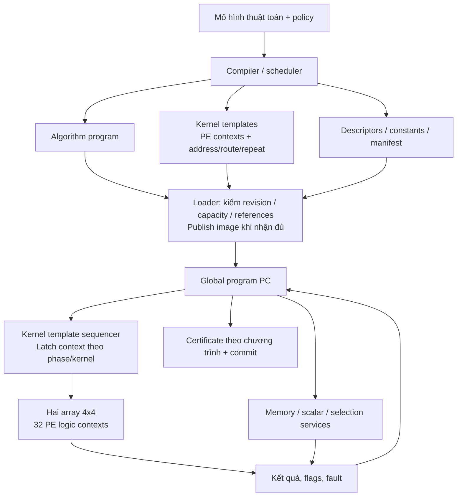

# Nạp chương trình và context để chạy thuật toán

Ngày 2026-09-09. Làm rõ mô hình lập trình của
[kiến trúc streaming](STREAMING_REDESIGN.md) và [phương án PPA](PPA_OPTIMIZATION.md).
Thiết kế đầy đủ vẫn là đích tiếp theo. Lát streaming đầu tiên đã có
[ABI revision 1 và RTL riêng](STREAM_RTL_CONTRACT.md), với CALL/HALT và
32 context PE nạp độc lập; phạm vi này chưa bao gồm full recovery.
Solver đích hiện hành là [QR](QR_SOLVER.md). Bảng LSQR bên dưới mô tả
reference đã có, không phải lựa chọn solver của program mới. Phần mở rộng
dùng `program_sequencer` và `stream_kernel` theo [system contract](STREAM_SYSTEM_CONTRACT.md).

## 1. Kết luận về trạng thái hiện tại

**Đã có chương trình LSQR nạp được; chưa có đường tích hợp nạp cả chương trình
thuật toán và context/lịch PE cho toàn bộ 11 thuật toán.**

| Tầng | Hiện trạng có thể kiểm trong source |
|---|---|
| Lát streaming mới | `stream_program_control` nạp program128 và template/context64; `stream_engine` gọi trên đúng hai `stream_array`; template có 32 context độc lập, chưa có branch/RF/routes đầy đủ |
| Chương trình điều khiển | `solver_sequencer` nạp 256 word ×128 bit, fetch theo PC, gọi kernel/scalar và thực hiện branch. Recurrence LSQR do image quyết định |
| Context bên trong kernel LSQR | `kernel_engine` tự tạo tile word và các bước thực thi bằng logic/FSM cố định; chưa có cổng nạp kernel-template RAM |
| Phân phối context | `kernel_fabric` phát cùng một tile word cho cả 32 PE; các PE nhận dữ liệu/mask khác nhau |
| Reference context CGRA | `resident_engine` có đường tile64/control256 và 32 PE slots, nhưng là backend riêng, không nằm trong đường LSQR hiện tại |
| Recovery đầy đủ | Chưa có đủ 11 image/chương trình RTL tích hợp, operator/selection/workspace và host AXI tương ứng |

Source kiểm chứng: `rtl/v4/control/solver_sequencer.sv:164–198`,
`rtl/v4/compute/kernel_engine.sv:163–177`,
`rtl/v4/compute/kernel_fabric.sv:24–28` và
`rtl/v4/control/resident_engine.sv:6–24`.
Các số dòng để tra source hiện tại, không phải evidence của regression mới.

Ba ABI riêng biệt: [stream revision 1](STREAM_RTL_CONTRACT.md),
[service128](SOLVER_RTL_CONTRACT.md) và [tile64/control256 reference](CONTEXT.md).
Không cộng dung lượng của các backend để tuyên bố đó là một context store đã
được tích hợp. Không dùng file của ABI này để nạp vào loader ABI kia.

## 2. Đích thiết kế: một gói thực thi có hai tầng

| Nội dung nạp | Vai trò |
|---|---|
| **Algorithm program** | Quyết định thứ tự kernel, vòng lặp ngoài/solver, branch theo kết quả, điều kiện dừng và yêu cầu commit |
| **Kernel contexts/templates** | Microsequence cấu hình PE: ALU, nguồn/đích RF, predicate, route, repeat và address schedule; R1/R4/vector và điểm round/check |
| **Descriptors/constants** | M/N/S, operator/support identity, base/length vector, numeric profile, ngưỡng và budget của policy |
| **Manifest** | Revision, capability requirements, entry points, kích thước và định danh các phần image; host kiểm hash trước khi nạp |

Đổi từ OMP sang FISTA là đổi program và các template/descriptor cần dùng, trong
phạm vi ISA/capability mà bitstream hỗ trợ. Không synth lại, không thêm FSM
`if algorithm == OMP/FISTA/...` vào datapath. Tên thuật toán có thể có trong
metadata để log, nhưng không thay thế program điều khiển.

Hardware cố định thực hiện các primitive và protocol chung: đọc/ghi memory,
loop/address counters, PE ALU/router, scalar, tag/fault và publish. Program
quyết định thuật toán; kernel microsequence quyết định cách dùng primitive.
Thuật toán cần một primitive chưa được ISA hỗ trợ vẫn cần mở rộng/kiểm lại
capability; không tuyên bố mọi thuật toán tùy ý đều chỉ cần một image mới.

## 3. Context nạp được và PPA phải cùng tồn tại

- Giữ **32 context PE logic**: mỗi PE có thể có operation/source/route riêng
  khi mapping cần. Broadcast một context chung chỉ là trường hợp tối ưu.
- Có thể lưu group default + per-PE overrides rồi expand/validate lúc dispatch,
  thay vì luôn lưu 32 word lặp. Encoding và dung lượng cuối chưa khóa.
- Kernel là một microsequence ngắn có loop/repeat theo descriptor; không bung
  hàng nghìn MAC thành hàng nghìn context, không nhờ host phát từng frame.
- Context đã decode giữ trong register cục bộ qua các frame dùng cùng phase;
  đổi context tại phase boundary đã drain hoặc được schedule/tag đúng.
- R1/R4, loop bounds và memory ports phải do image/descriptor điều khiển trong
  tập schedule hợp lệ. FSM generic thực hiện handshake, không giấu lại toàn
  bộ kernel schedule trong một `case(kernel)` bất biến rồi gọi là context RAM.

Target không mặc định dùng lại context store 72 KiB của reference hoặc program
RAM 4 KiB của LSQR làm tổng chi phí. Cần đếm algorithm instructions, kernel
templates/overrides, descriptors và decoder/buffer theo chương trình lớn nhất.
Một thư viện template có thể reuse khi đổi algorithm program cùng revision.

## 4. Hợp đồng nạp và thực thi cần khóa

1. Một gói active, nạp khi idle. Khi bắt đầu nạp phải chặn START và các tham
   chiếu tới generation cũ; chỉ đánh dấu image hợp lệ sau khi đủ mọi phần.
   Không mặc định cần dual-bank context hay nạp chồng với compute.
2. Kiểm revision/capability, số word và thứ tự, bounds entry/branch/template,
   opcode/route hợp lệ, operand format, descriptor và memory-port schedule.
   `load_verified` hiện là xác nhận trusted-host, không phải SHA256 trong RTL.
3. START snapshot program/template generation, job descriptor và input identity.
   Program tự chạy loop/branch sau START; host không quyết định từng LS iteration.
4. Context không cho phép bỏ range check, đọc sai vùng hoặc bypass publication
   rules. Certificate thuộc policy nào thì phải chạy đúng trên kết quả đã lưu;
   hardware checks không chứng minh mọi image host nạp đều đúng thuật toán.
5. Có trace program PC, template/phase ID và service issue/retire để đối chiếu
   image. Overflow, malformed image, stale tag, timeout/cancel phải có trạng
   thái xác định; không publish candidate dở dang.

Revision 1 cho lát streaming đầu tiên đã có
[ABI và contract riêng](STREAM_RTL_CONTRACT.md): program128 CALL/HALT,
16 template và 32 context64 độc lập/template. Bản này chưa có branch,
RF/routes đầy đủ hoặc nén template; các capability đó vẫn cần thiết kế/đo.

## 5. Cách chứng minh đúng là chạy thuật toán bằng context

Giữ cùng source/bitstream-capability, lần lượt nạp hai program khác nhau dùng
chung kernel templates; thứ tự lệnh/loop và kết quả phải đổi theo image. Sau
đó thay template hợp lệ tương đương (ví dụ R1/R4) và kiểm PE trace theo template,
raw output/rounding/certificate vẫn đúng. Không sửa RTL hoặc dựng logic riêng
cho thuật toán giữa hai lần nạp.

Test malformed/reference mismatch, load chưa đủ, START lúc loading/running,
stall tại context/operand boundary, cancel/reset và đổi generation. Dùng
Vivado xvlog/xelab/xsim và integer oracle; ảnh `.hex` hợp lệ chưa phải bằng
chứng đã execute. Full recovery quality và timing/resource vẫn là các gate riêng.

Lát streaming đầu tiên dùng `stream_program_control` và `stream_engine` để
nạp program/template rồi chạy trên `stream_fabric`. Phạm vi kiểm chứng nằm
trong [contract streaming](STREAM_RTL_CONTRACT.md); chưa hợp nhất với LSQR
reference hoặc có đủ 11 recovery programs. Ví dụ image dễ đọc nằm tại
[ADD → DOT → HALT](../../../reports/v4/stream_program_example/README.md).
