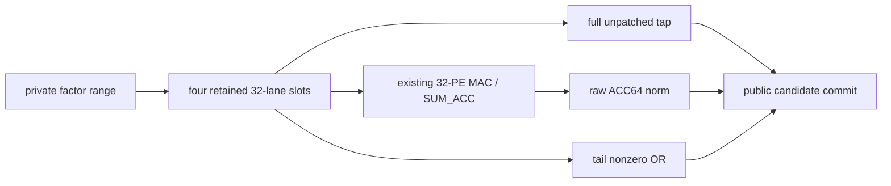

# FACTOR_ENERGY_TAP

`FACTOR_ENERGY_TAP` is the proposed feature-10 generic factor-store command.
It removes only the two public-vector `ENERGY` passes used while constructing a
Householder reflector. It is an explicit opt-in used by the QR `view` profile;
program ABI revision remains 2.

## Command

The command selects a factor column or row of length `L` (`1 <= L <= 128`).
`index` is the fixed factor axis, `aux_length` is the start offset, and flags
bit 0 selects a row. It validates the same dense factor identity, format,
generation, shape and range contract as `FACTOR_READ` before feeding data.

The loaded image is descriptor 23 with 32 direct `MAC297` contexts and terminal
`SUM_ACC` mode 2. `src_a` and `src_b` are literal zero and are not public pool
operands. Scalar inputs, binding masks, support and auxiliary bases, shift,
`k` and matrix transport controls are zero. `dst_s` (raw energy) and `flag_s`
(tail predicate) are distinct nonzero scalar registers. `target` is exactly one
(bits 9:1 are zero), selecting `rsp_count` delivery for `flag_s`.

The candidate output is the **unpatched full** factor range of length `L`.
`dst_s` receives the raw signed-ACC64 sum of the squares of all selected factor
lanes. `flag_s` receives one when any lane after the first is nonzero, otherwise
zero. Candidate length remains `L`; the boolean count does not shorten the
candidate. No lane is rounded or rescaled before `SQRT` in the QR program.

For legal S27 values, `128 * (2^26)^2 = 2^59`, so the raw square sum fits signed
ACC64. Therefore a zero tail square sum is equivalent to every raw tail lane
being zero. The compiler still reads and validates the stored head and all tail
lanes before it branches. It preserves the signed head, beta/tau construction,
normalization, factor write, trailing update, QTy, backsolve, stored-X
certificate and refinement sequences.

## Transaction

The panel retains at most four 32-lane factor slots until raw terminal DONE is
validated. Candidate tap, raw scalar and tail flag commit together. A malformed
completion, metadata/fabric fault or cancellation commits none of these values
and follows the existing factor identity invalidation rules. There is no
QR-specific controller, extra PE, public source read or factor copy.

The three returned values commit only after the terminal response and factor
identity have been jointly validated. The retained slots reuse existing command
state; the command adds no RAM or PE.

## Compiler selection

`--factor-energy-tap` is false by default. It requires `--qr-profile view` and
kernel revision 10. When true, fresh QR construction and the appended suffix of
the OMP/GOMP reuse path use opcode 25. The command deposits raw norm in RF11,
tail predicate in RF10, head in RF5 and tail length in RF12; QR branches on RF10
before slicing the tail. Existing reciprocal use of RF10 begins only after that
branch. Non-QR packages and all false-opt-in packages retain their prior image.

Software checks must compare primary and reference VM control results, while
separate integer checks calculate raw factor-square sums and tail predicates.
Neither VM is an independent arithmetic oracle because they share `Arithmetic`.
RTL and whole-program qualification are recorded separately.
