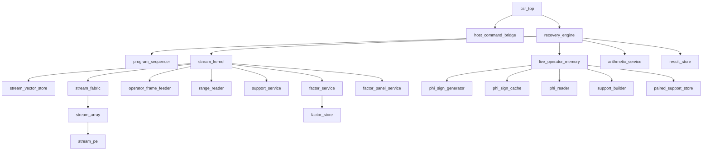
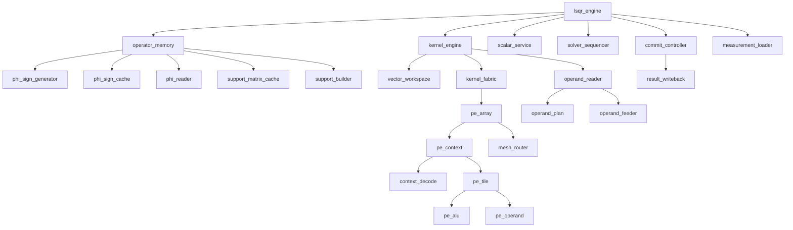
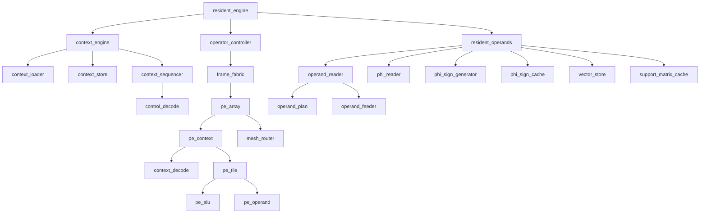
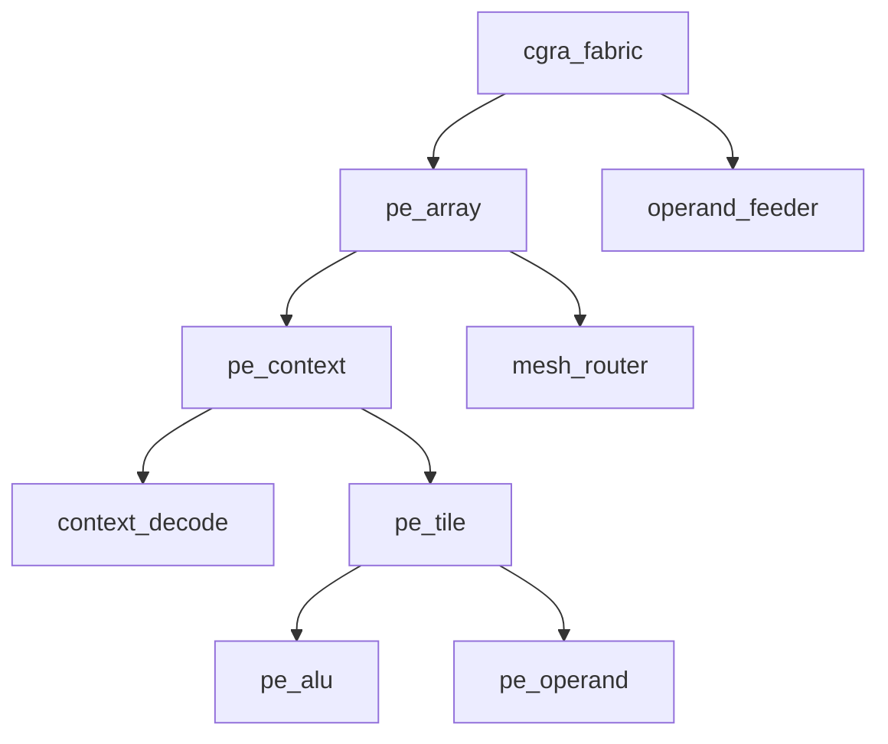
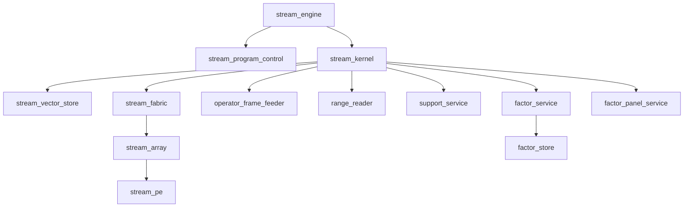
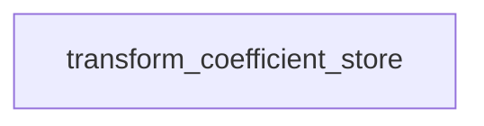

# Module catalog v4

Generated from [v4_modules.json](../../../config/v4_modules.json).
Edit that JSON, then run `py -3 scripts/v4/project.py generate`.

**Recovery RTL: the source-qualified five-step closure has matched active10 fixed-eight gates at M32/N64/K8 and M64/N256/K8; [five-step evidence](../../../reports/v4/five_optimizations_20260910/README.md), [A/B/C comparison](../../../reports/v4/resident_chain_comparison_20260910/resident_chain_comparison_vi.md), [scalar RTL gate](../../../reports/v4/scalar_insert_rtl_20260910/qualification.json), [numerical archive](../../../reports/v4/scalar_insert_numerical_20260910/archive_manifest.json), and [promotion manifest](../../../reports/v4/scalar_insert_promotion_20260910/before_after_manifest.json) are separate. PPA, timing, board and production bits remain unqualified. ADMM is historical reference-only.**

The implemented host path is csr_top -> host_command_bridge -> recovery_engine -> stream_kernel, with QR for support least squares.
A loaded program PC drives generic kernels on exactly two 4x4 streaming PE arrays and one shared DIV/SQRT/RESCALE service.
Live operator memory owns one Phi sign cache, one paired dense B cache and the Psi=I support builder.
Native whole-result publication, factor storage, panel project update and scalar insertion have source-bound Vivado XSim evidence. The five final evidence links above separate matched whole-program, focused RTL, numerical, and installation scope. Held-out application workloads, synthesis, timing, PPA, board deployment and production bits remain unqualified; see current status for evidence boundaries.
The bounded LSQR, tile64/control256 resident and revision-one stream wrappers are separate references. They add no arrays to the target.
The host/AXI boundary is implemented by csr_top and host_command_bridge; see [AXI register map](AXI_REGISTER_MAP.md) and [CPU interface status](CPU_INTERFACE_STATUS.md). AXI protocol, real-core smoke, packaging, board, timing and PPA qualification remain separate or unqualified.

Current RTL acceptance uses Vivado xsim only. Earlier tool reports are historical evidence for their recorded source snapshots.
See [current system contract](STREAM_SYSTEM_CONTRACT.md), [QR target](QR_SOLVER.md),
[historical baseline](BASELINE.md), [resident contract](RESIDENT_RTL_CONTRACT.md),
[LSQR integration](LSQR_INTEGRATION.md), [kernel contract](KERNEL_RTL_CONTRACT.md),
[operator memory](OPERATOR_MEMORY_RTL_CONTRACT.md), [commit contract](COMMIT_RTL_CONTRACT.md),
and [stream first-slice contract](STREAM_RTL_CONTRACT.md).

Native recovery_engine connects loaded program control, one shared 32-PE kernel, live Phi/B and atomic result publication. The installed five-step resident QR closure has source-bound Vivado XSim evidence: 17 kernel tests, 14 sequencer tests/166 cases, 2 factor leaf gates, 11 support groups/156 records, and 40 matched active10 fixed-eight cases at M32/N64 and M64/N256. Exactly two 4x4 arrays and one vector pool remain; PPA, timing, board and production-bit qualification are not claimed. Historical references are separate.

The planned physical target owns one stream_kernel and one stream_fabric with exactly two 4x4 arrays. LSQR, resident and revision-one stream wrappers are independently elaborated references, never extra arrays inside csr_top.

## State ownership and interfaces

| Module | Target instances | Source | RTL scope/status | State ownership | Interface |
|---|---:|---|---|---|---|
| `stream_engine` | 0 | `rtl/v4/control/stream_engine.sv` | Revision-one program interface; live operator pins tied off in this independently elaborated wrapper | Compatible revision-one CALL/HALT loader and host wrapper over the shared external-command kernel. | Loadable CALL/HALT program and 32-context templates; idle host blocks; tagged start/done; counters |
| `stream_program_control` | 0 | `rtl/v4/control/stream_program_control.sv` | CALL/HALT and independently loadable contexts; no algorithm-specific FSM or branches | Revision-one immutable program/template image, ordered loader, generic PC and one outstanding CALL. | Verified image stream; start/done; descriptor/context CALL and identity-qualified response |
| `stream_vector_store` | 1 | `rtl/v4/memory/stream_vector_store.sv` | First stream memory slice; leaf xsim tested; physical BRAM use awaits synthesis | Sixteen paired TDP banks, 512 logical blocks of 32 S27 lanes, synchronous reads and two reserved read credits. | One masked 32-lane read OR write grant per clock; tagged held read responses |
| `stream_fabric` | 1 | `rtl/v4/compute/stream_fabric.sv` | Exactly two existing 4x4 arrays (32 PEs) with terminal ACC and generic cascade16 flow for factor operations. The installed five-step closure has source-bound fixed8 evidence; PPA, timing, board and production-bit qualification are not claimed. | Exactly two 4x4 streaming arrays with atomic configuration/command issue, shared retirement, and terminal ACC through existing PEACC and fixed registered reduction links. | 32 independent context words; operand frames; speculative data/raw ACC; tagged completion |
| `stream_array` | 2 | `rtl/v4/compute/stream_array.sv` | 4x4 logical grouping; first slice has no RF/mesh routes | Sixteen streaming PEs and aligned frame issue/response barriers. | 16 context words and masked operand lanes; aligned held results |
| `stream_pe` | 32 | `rtl/v4/compute/stream_pe.sv` | MOV/ADD/SUB/MUL/MAC; C18 and exact two-phase S27 multiplication | Local context, selected operands, one27x18 multiplier, elastic product/result pipeline and checked signed64 accumulator. | Context configuration; frame operands/mask/last; S27/raw ACC and sticky fault |
| `resident_engine` | 0 | `rtl/v4/control/resident_engine.sv` | Bounded real-PC resident GEMV integration; candidate sink only | Separately elaborated tile64/control256 resident GEMV reference; not an additional solver PE array. | image/config and memory preload; start/done; backpressured indexed candidate results |
| `resident_operands` | 0 | `rtl/v4/dataflow/resident_operands.sv` | Live Phi/B/vector integration; idle preload and read ownership | Live Phi/B/vector storage, captured publication shape/identity and split response routing to one operand_reader. | idle preload; descriptor/coordinates to expanded 32-tile frame; faults and cancellation |
| `phi_reader` | 1 | `rtl/v4/dataflow/phi_reader.sv` | Captured Phi owner envelope and direct-cache adapter | Captured owner envelope for the Phi-cache read channel and validation of cache generation/tag/mask. | key/job/format-qualified uniform request to direct Phi read and tagged uniform response |
| `frame_fabric` | 0 | `rtl/v4/compute/frame_fabric.sv` | Two arrays, expanded frame, shared retirement; no feeder | Expanded-frame entry into exactly two arrays, with shared atomic retirement and no additional feeder. | 32 expanded operand lanes and tile words to candidate values/store mask/fault |
| `operand_reader` | 0 | `rtl/v4/dataflow/operand_reader.sv` | Resident split-response joiner; owns the single target feeder | Single-outstanding matrix/vector response joiner and one feeder, connected through resident_operands to live stores and PC execution. | descriptor to bank requests and expanded tile frame |
| `operand_plan` | 0 | `rtl/v4/dataflow/operand_plan.sv` | Aligned Phi/B/vector address and lane planning | Aligned Phi/B R1/R4 bank/address and vector lane planning. | shape/coordinates to masked bank addresses or fault |
| `context_engine` | 0 | `rtl/v4/control/context_engine.sv` | Verified-stream loader/store/PC execution composition | Idle load/start arbitration and composition of loader/store/global sequencer. | verified image stream; start/done; tagged execution and address backends |
| `control_decode` | 0 | `rtl/v4/control/control_decode.sv` | Candidate control256 decode | Generated control256 field validation and candidate execution subset. | packed control/revision to fields and fault |
| `csr_top` | 1 | `rtl/v4/top/csr_top.sv` | Source implemented; AXI protocol, real-core smoke and IP packaging qualification are separate gates. No board or timing claim. | AXI4-Lite MMIO wrapper over one existing recovery_engine; program, Phi, vector and result transfers use staged register commands. No DMA or added compute resources. | S_AXI 32-bit data/12-bit address, s_axi_aclk, active-low reset, sticky irq; 4KB register aperture |
| `host_command_bridge` | 1 | `rtl/v4/host/host_command_bridge.sv` | RTL; see current evidence | Snapshot native command payloads, retain ready-valid transactions and sticky loader/host/result/DONE mailboxes. Reuses native job cycle counter; no DMA engine. | Captured command/native handshakes and explicit mailbox acknowledgements |
| `context_loader` | 0 | `rtl/v4/control/context_loader.sv` | Host-verified image stream; no SHA256 RTL | Nạp image khi idle, kiểm tra header/revision/range và đóng image trước start. | host image writes; context-store writes; image_ready/error |
| `context_store` | 0 | `rtl/v4/control/context_store.sv` | Banked image publication and tagged fetch | 32 bank PE context và control bank; read latency được công bố. | PC/read request; 32 tile slots và control response |
| `context_sequencer` | 0 | `rtl/v4/control/context_sequencer.sv` | Global PC/loop/ADDRESS execution; no LSQR program qualification | PC, loop counters, accepted/retired operation tags và resource waits. | context fetch; issue/commit handshake; predicates/completions |
| `cgra_fabric` | 0 | `rtl/v4/compute/cgra_fabric.sv` | Auxiliary raw-bundle reference wrapper; separately elaborated | Standalone raw-bundle reference wrapper: own feeder and two arrays; not a child or additional resource of the resident physical target. | 32 tile contexts; operand frames; tagged results |
| `pe_array` | 0 | `rtl/v4/compute/pe_array.sv` | Two 4x4 arrays; atomic routed execution | 16 PE và topology mesh 4x4 nội bộ; không có link trực tiếp sang array kia. | 16 contexts; operand/result frames; array enable/stall |
| `pe_context` | 0 | `rtl/v4/compute/pe_context.sv` | Packed scalar default; array routing enabled | Packed tile scalar execution boundary, decoder fault isolation and STORE/HALT response events. | tile64 word and local operands to scalar/routed execution; arrays enable routing |
| `context_decode` | 0 | `rtl/v4/control/context_decode.sv` | Packed tile64 validation and scalar/routing subset | Combinational 64-bit compiler ABI validation and documented scalar subset translation. | word/revision/mode to decoded tile controls, routes and fault |
| `pe_tile` | 0 | `rtl/v4/compute/pe_tile.sv` | Decoded RF8/predicate/ACC retirement | RF8, predicates, arithmetic pipeline, local wide accumulator và numeric event. | tile context; local/neighbor operands; RF/ACC/neighbor output |
| `pe_operand` | 0 | `rtl/v4/compute/pe_operand.sv` | Validated RF/predicate/ACC/external operand selection | One validated S-width operand mux: RF, predicates, external operands and rounded committed ACC. | kind/index; committed sources and validity; raw operand/fault |
| `pe_alu` | 0 | `rtl/v4/compute/pe_alu.sv` | Candidate fixed arithmetic; commit at response retirement | Decoded arithmetic, shared split multiplier and transactional wide accumulator; no RF or context decoder. | tagged decoded req/rsp; mask/predicate; numerical fault; candidate profile |
| `mesh_router` | 0 | `rtl/v4/compute/mesh_router.sv` | Independent directional ready/valid routing | Registered N/E/S/W transfers; giữ data/tag khi stall. | route selects; four neighbor links; local source |
| `operand_feeder` | 0 | `rtl/v4/dataflow/operand_feeder.sv` | Aligned Phi/dense R1/R4 expansion; one target instance | Unpack sign words cho R1/R4, permutation cho B diagonal, vector broadcast, alignment và tails. | sign/B/transform/vector responses; 32 PE operand frames |
| `operator_controller` | 0 | `rtl/v4/control/operator_controller.sv` | ADDRESS/frame cursor subset; candidate STORE retirement | Descriptor table, per-descriptor frame cursors, ADDRESS/read ownership and atomic execution/candidate STORE handshakes; no separate algorithm PC. | descriptor configuration; ADDRESS and execution completions; resident reader frames; indexed candidate result stream |
| `phi_sign_generator` | 1 | `rtl/v4/operator/phi_sign_generator.sv` | Selected LFSR32 sign stream; tail excludes padding | Generator LFSR32 Galois right-shift v2 được chọn cho build; Threefry chỉ là reference/ablation; stream nạp đủ cache theo contract seed32/LSB-then-step/column-major col*M+row; reject family/revision không khớp. | start_fill family/revision/seed/shape; tagged column/row-block/sign/mask ready-valid; done/fault |
| `phi_sign_cache` | 1 | `rtl/v4/memory/phi_sign_cache.sv` | Eight-bank sign RAM; atomic full publication | Một bản Phi signs: 8 bank512x32 tại M128/N1024, fill progress và valid generation. | generator fill writes; synchronous sign-word reads; invalidate/publish |
| `transform_coefficient_store` | 0 | `rtl/v4/memory/transform_coefficient_store.sv` | Planned | Coefficients/metadata của transform profile đã qualification; kích thước/ports chốt theo kernel, omit cho Psi=I. | idle profile load; tagged coefficient reads cho PE contexts |
| `vector_store` | 0 | `rtl/v4/memory/vector_store.sv` | Full-fill resident planes; no candidate writeback/commit | Three 4096-element planes, two registered read ports and full-plane fill/publish; no candidate-region scatter/commit. | begin/fill; two tagged bank read bundles; invalidate/publish |
| `support_matrix_cache` | 0 | `rtl/v4/memory/support_matrix_cache.sv` | One-copy dense B; full-fill publication | Một bản dense B tối đa128x96, 32 diagonal banks phục vụ B/B-transpose; ordered-support key và valid/generation. | builder writes; operator reads; invalidate/publish |
| `support_builder` | 1 | `rtl/v4/dataflow/support_builder.sv` | Psi=I full rebuild; integrated through exclusive operator_memory ownership | Ordered-support validation and full live-Phi gather/expansion into one-copy B, owned by operator_memory. | captured ordered support/Phi descriptor; dedicated Phi reads and B fill; held completion/status |
| `result_writeback` | 0 | `rtl/v4/dataflow/result_writeback.sv` | Implemented bounded solver component; acceptance tied to current source-bound Vivado evidence | Two 96-entry X24/support banks and metadata; atomic bank publication and stable read snapshots. | Trusted candidate writes/publish; held committed reads |
| `scalar_service` | 0 | `rtl/v4/services/scalar_service.sv` | Arithmetic leaf; scalar RF and program control belong to solver_sequencer | One tagged signed DIV/SQRT service with exact rounding, stalls, cancellation and numeric faults. | tagged scalar requests/responses; denominator/range faults |
| `selection_support` | 0 | `rtl/v4/services/selection_support.sv` | Planned | Bitmap/index/union/remap, local-winner merge và exact normalized comparator fallback. | score/index streams; selected/excluded masks; support transaction |
| `commit_controller` | 0 | `rtl/v4/control/commit_controller.sv` | Implemented bounded solver component; acceptance tied to current source-bound Vivado evidence | Sequential support validation, ordered X candidate fill, explicit publication decision and fault/cancel status. | begin/fill/decision/status; committed support/X/exponent reads |
| `performance_counters` | 0 | `rtl/v4/debug/performance_counters.sv` | Planned | Accepted/retired useful operations, routes, stalls theo nguyên nhân, DMA/pack bytes. | event taps; read-only snapshot counters |
| `lsqr_engine` | 0 | `rtl/v4/control/lsqr_engine.sv` | Implemented bounded solver component; acceptance tied to current source-bound Vivado evidence | Bounded job lifetime; matrix/build ownership, normalized Y, solver execution and certificate-gated X publication. | Program/matrix/Y preload; start/done; committed support/X reads |
| `operator_memory` | 0 | `rtl/v4/memory/operator_memory.sv` | Implemented bounded solver component; acceptance tied to current source-bound Vivado evidence | Exclusive owner of one Phi generator/cache and one B cache; build/load/read arbitration. | Tagged preload/build/matrix request-response |
| `kernel_engine` | 0 | `rtl/v4/compute/kernel_engine.sv` | Implemented bounded solver component; acceptance tied to current source-bound Vivado evidence | Generic bounded vector kernels, transactional destination publication and one matrix reader. | Kernel request/response; idle vector preload/debug; matrix reads |
| `kernel_fabric` | 0 | `rtl/v4/compute/kernel_fabric.sv` | Implemented bounded solver component; acceptance tied to current source-bound Vivado evidence | Exactly two 4x4 PE arrays; shared issue and raw ACC retirement. | Broadcast tile command with per-lane operands and mask |
| `vector_workspace` | 0 | `rtl/v4/memory/vector_workspace.sv` | Implemented bounded solver component; acceptance tied to current source-bound Vivado evidence | 16 vectors x 128 S27 values; 32 banks, two registered reads and one write. | Block reads/writes; vector validity/length publication |
| `solver_sequencer` | 0 | `rtl/v4/control/solver_sequencer.sv` | Implemented bounded solver component; acceptance tied to current source-bound Vivado evidence | One generic service-program PC, 256x128 image and 32x64 scalar RF. | Program load/start/done; kernel/scalar operations; retired instruction trace |
| `measurement_loader` | 0 | `rtl/v4/dataflow/measurement_loader.sv` | Implemented bounded solver component; acceptance tied to current source-bound Vivado evidence | Ordered normalized D18 input validation and exact S27 embedding for Y slot. | Begin/fill; kernel host preload; valid/fault/identity |
| `paired_support_store` | 1 | `rtl/v4/memory/paired_support_store.sv` | Planned extension after first streaming slice | Exact B-cache protocol; sixteen paired TDP18 banks and two read credits | See docs/v4/architecture/STREAM_SYSTEM_CONTRACT.md |
| `live_operator_memory` | 1 | `rtl/v4/memory/live_operator_memory.sv` | Planned extension after first streaming slice | Exclusive owner of one livePhi and paired B; same generator and builder semantics | See docs/v4/architecture/STREAM_SYSTEM_CONTRACT.md |
| `operator_frame_feeder` | 1 | `rtl/v4/dataflow/operator_frame_feeder.sv` | Both directions and R1/R4; per-command cache invalidation; exact frame order, tails, stalls, cancel and source faults | Four ordered frame slots, two cached vector blocks, two matrix credits and held request ownership; joins live Phi/B and vector responses. | See docs/v4/architecture/STREAM_SYSTEM_CONTRACT.md |
| `range_reader` | 1 | `rtl/v4/dataflow/range_reader.sv` | At most two providers per selected source and two transient validated response cache entries per active frame; no vector RAM, persistent view or alias state. | Command-local RANGE_TEMPLATE unaligned A/B provider requests, exact response validation and packed-frame assembly. | One held provider request at a time; logical public address/mask/tag response; assembled A/B S27 frame completion. |
| `stream_kernel` | 1 | `rtl/v4/compute/stream_kernel.sv` | Generic ops0..25 on one vector pool and exactly32PE; RANGE_TEMPLATE offset validation, ROUNDED_AFFINE cascade publication, FACTOR_RANGE_TEMPLATE raw factor/public tap, FACTOR_ENERGY_TAP raw factor-square/tail-stat tap, group-prefetched GEMV, private narrow factor mapping and transactional publication. No CPU AXI or PPA/timing claim. | External-command streaming execution; the single vector pool and 32-PE fabric | See docs/v4/architecture/STREAM_SYSTEM_CONTRACT.md |
| `program_sequencer` | 1 | `rtl/v4/control/program_sequencer.sv` | Program revision2/kernel feature10; retire-time fetch in the existing instruction buffer, generic RANGE_TEMPLATE, ROUNDED_AFFINE, FACTOR_RANGE_TEMPLATE and FACTOR_ENERGY_TAP canonicalization, and internal RF32x64. No CPU register map. | Generic loaded service program/templates/constants; scalarRF, vector descriptors, branches, subroutines, and scalar-template opcode16 dispatch | See docs/v4/architecture/STREAM_SYSTEM_CONTRACT.md |
| `recovery_engine` | 1 | `rtl/v4/control/recovery_engine.sv` | Source-qualified active10 loaded programs at M32/N64/K8 and M64/N256/K8, actual8 outer iterations, paired raw results/quality and physical LS identity. ADMM remains historical; CPU AXI wrapper and board/PPA/timing qualification pending. | Host/job ownership, generic loaded recovery programs including QR support LS, live operator build, shared scalar service, final publication and counters. | See docs/v4/architecture/STREAM_SYSTEM_CONTRACT.md |
| `arithmetic_service` | 1 | `rtl/v4/services/arithmetic_service.sv` | DIV/SQRT source-bound gate plus focused RESCALE signed rounding/range/lifecycle Vivado qualification | Shared exact signed64 DIV source fractions0/-10, SQRT44 and RESCALE Q44 to S27F22; no multiplier array | Signed64 scalar requests, signed source fraction, captured job/tag/format and held response |
| `support_service` | 1 | `rtl/v4/dataflow/support_service.sv` | Installed shared-pool selection/range/SCALAR_INSERT full-vector transaction; command-local provider state plus bounded 32-bit completed-bitmap enumeration for sorted TOPK and unordered UNION, with ordered and dense paths unchanged; no extraPE. | Shared-pool block selection, ordered/sorted support operations, candidate scratch stream and cardinality; no extra multiplier array. | Captured generic support request, tagged pool read, scratch candidate write, held scalar/cardinality/length response |
| `result_store` | 1 | `rtl/v4/memory/result_store.sv` | Native generic program and atomic result lifecycle qualified in Vivado; complete recovery algorithms and QR remain separate gates | Two candidate/committed result RAM banks up to1024 S27 entries, stored-format validation, ordered support metadata and atomic publication. | Captured begin, masked32-lane fill, approve/status, held indexed committed reads; no PE array |
| `factor_service` | 1 | `rtl/v4/dataflow/factor_service.sv` | Installed private factor INIT/EXTEND/read/write bridge for generic panel operations. | Private S27 factor INIT/EXTEND and row/column transfer; coordinate/identity validation, atomic generation publication and pool staging; no extraPE. | Existing core selected-matrix metadata, live B read, pool read, scratch candidate and held service response |
| `factor_store` | 1 | `rtl/v4/memory/factor_store.sv` | Qualified prefix-preserving append, next-generation publication and fixed-stride3 factor RAM; full M128/S96 factor readback, faults/cancel and arbitration checked. One factor image. | One mutable S27 factor image, sixteen paired TDP banks, fixed stride3 and two response credits; original B remains separate | Ordered initialization or prefix-preserving suffix fill; read/write32logicalbank packets; held publication and tagged responses |
| `factor_panel_service` | 1 | `rtl/v4/dataflow/factor_panel_service.sv` | Generic ops17/18/20/24/25 on existing32PE; C<=8 maps four DOT rows or two RANK rows per column through collision-free factor banks. Installed PROJECT_DOT split defaults enable1/min_rows24: widths9..16 use ordered8+tail R4 DOT subpanels; other shapes retain fallback. Raw terminal round points, SCALE/RANK order, factor identity and cancellation are preserved; no new opcode, PE, algorithm FSM or public factor copy. | Generic factor-resident panel MATVEC and rank-one update scheduling, bounded operand caching and fabric handshakes; no QR iteration, support selection, certificate or host algorithm decisions. | Captured revision3 panel command, existing factor-store bridge, shared vector scratch/candidate and exclusive shared-fabric ownership. |

## Instantiation hierarchy

Counts above are physical target totals, not an elaborated full top; each array contains sixteen PEs. Auxiliary reference roots have zero target instances.
The target keeps exactly two 4x4 streaming PE arrays (32 PEs total). QR factor-panel and command-local support transport reuse those existing PEs and bounded command state; terminal ACC uses existing PEACC and fixed registered reduction links. This adds no terminal arithmetic block, general programmable mesh routing, full mesh CGRA, PE or multiplier.

## Auxiliary/reference roots

These wrappers are elaborated separately and do not add feeder or PE resources to the target above.

### `performance_counters`

### `lsqr_engine`

### `resident_engine`

### `cgra_fabric`

### `stream_engine`

### `transform_coefficient_store`

### `selection_support`

## Common interface rules

- Clock `clk`; internal synchronous active-high reset `rst`.
- Transfer only on `valid && ready`; hold payload/tags under backpressure.
- `job_tag`, `op_tag`, `format_tag`, `lane_mask`, `last` travel with data.
- Config/opcode/profile definitions are shared generated inputs, not per-module copies.
- Native whole-result publication retains the selected X24 greedy or D18 proximal storage format and normalization metadata; kernel CALL publication is a distinct boundary.
- QR uses loaded generic services on the shared 32 PEs and private factor storage. Consult [current status](../STATUS.md) and the source-bound evidence links above for the qualified source scope and its remaining boundaries; board, PPA and production-bit qualification remain unqualified. LSQR is reference only, with no implicit fallback.
- Version labels belong to directory names. RTL identifiers use functional names and CSR_* macros.

## Coding model preference

Current request: Astra Ultra coordinates and reviews; GPT-5.6 Terra agents at high reasoning effort implement code. Review existing RTL/TBs first and preserve implementations that pass.
See [RTL instructions](../../../rtl/v4/AGENTS.md).
