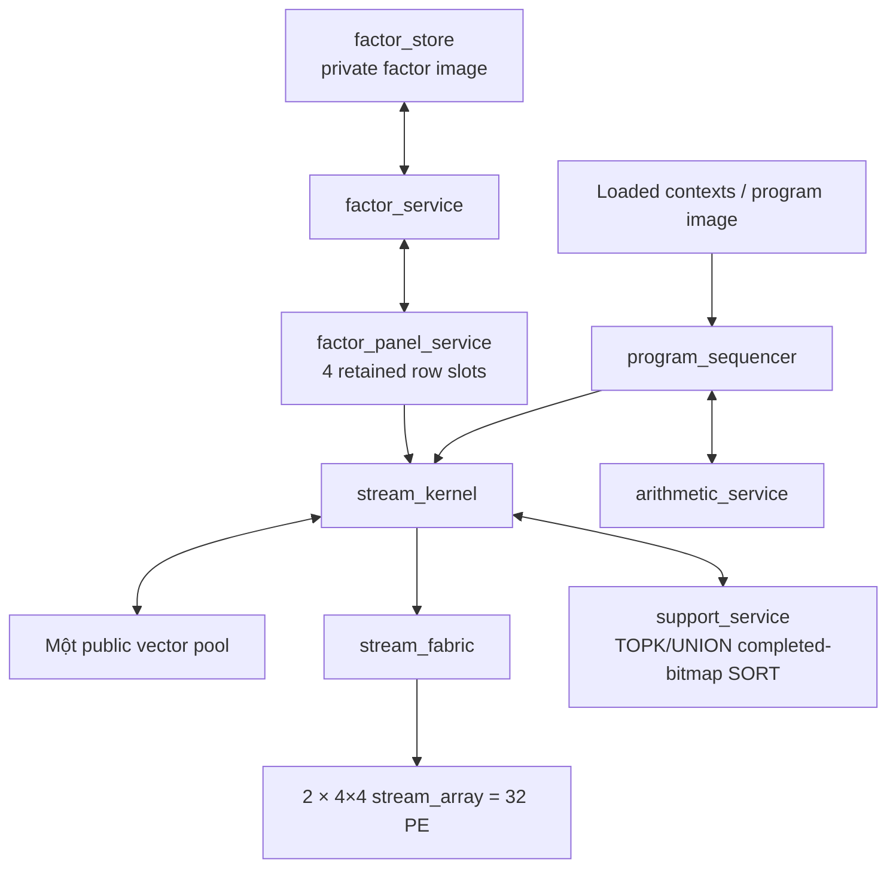

# Operand flow optimization — ordered execution

Status: steps 1–4 are source-qualified and selected. Step 5 was measured and
rejected because both strict whole-program pairs had an exact zero-cycle delta;
its experimental RTL is archived, not installed. Việc cài nguồn được ghi tại
[manifest](D:/vivado_pj/reports/v4/operand_flow_promotion_20260910/before_after_manifest.json)
và [báo cáo cuối](D:/vivado_pj/reports/v4/operand_flow_final_20260910/). The
reviewed sections below retain scope and ordering only; they do not assert
physical results, bit lock, or host integration.

## Baseline and invariants

The baseline is reports/v4/context_stream_final_20260910 with explicit view profile, kernel feature 7 and panel threshold 1. Fresh source staging is work/op8; origin_manifest.json records the initial source identities. Existing live changes, including v2/v3, are preserved.

Keep exactly two 4x4 PE arrays, one public vector pool, loaded algorithm programs and Householder QR. Preserve fixed-point round points, ties, overflow handling, source validity, tags, cancellation and per-command publication. Preserve logical LS, physical INIT/EXTEND, refinement and stored-X certificates. No iteration or quality-policy relaxation.

## Ordered gates

1. Measure R1/R4 on the installed datapath. Qualify identical legal results and faults, then use measured selection only for supported shapes; keep explicit overrides and document fallback. Dynamic restricted support must not be mistaken for full N.
2. Reuse operands between loaded contexts. First specify coherence and command-failure behavior. Prior commands remain published when a later command fails. Any fusion requires explicit semantics and preserves intermediate numerical boundaries.
3. Extend reuse to QTy and triangular backsolve through generic factor/range primitives. No QR-specific hardware controller or implicit solver change.
4. Enumerate completed `selected`/`seen` bitmaps in SORT for sorted TOPK and unordered UNION only when the bounded 32-bit path beats the dense scan. Preserve exclusion, ordering and lowest-index ties; retain the exact dense fallback. Producer fusion remains deferred because it can add backpressure and has no measured end-to-end benefit.
5. Profile and overlap independent factor-panel transactions using bounded ownership. Preserve DOT, SCALE and RANK round boundaries and complete all acknowledged writes before DONE.

Implementation proceeds in this order; independent read-only design review may happen earlier. An experiment with no measured total-program benefit is recorded and not installed merely to claim five changes.

## Nguồn runtime đã chọn và kiểm chứng

[Sơ đồ tổng hợp](../diagrams/operand_flow.mmd) mô tả luồng của nguồn đã chọn.
`config/v4_modules.json` vẫn là catalog nguồn cho tên và hierarchy; sơ đồ chỉ
diễn tả ownership và không tạo thêm module.

`program_sequencer` chỉ phát lệnh và context đã nạp; `stream_kernel` sở hữu pool
public, giao dịch scratch/remap và quyền dùng fabric. Hai `stream_array` 4×4 là
32 PE tính toán duy nhất trong đường này. `factor_store` là ảnh factor riêng;
`factor_panel_service` giữ tối đa bốn slot hàng có owner cho đọc, feed, kết quả và
write acknowledgement. `arithmetic_service` giữ các scalar như DIV/SQRT/RESCALE.

### Vai trò opcode 23 và 24

`ROUNDED_AFFINE` (opcode 23, feature 8) là vector chain tường minh:
`C ± round_S27(X*Y)`. Cascade16 làm MUL trước, round/range-check product, rồi
ADD hoặc SUB; vì vậy điểm round và lỗi product không bị phép cộng/trừ che đi. Nó
chỉ dùng buffer lệnh/scratch hiện có trước remap cuối, không thêm PE hoặc RAM
vector public.

`FACTOR_RANGE_TEMPLATE` (opcode 24, feature 9) lấy một dải public đã kiểm, ghép
với một hàng/cột factor riêng, có thể patch lane đầu, rồi đưa từng frame tới
SUM_ACC. Panel trả ACC64 thô độc lập với tap candidate; không có round từng frame.
Tap head hoặc full chỉ được drain sau khi raw completion hợp lệ. Factor image,
slot và candidate vẫn là private cho tới commit hiện có.

### Mapping và trạng thái bước

- **Bước 1 — source-qualified.** Bảng chọn R1/R4 dùng shape đã đo và chỉ áp dụng
  cho shape hợp lệ. Shape động ngoài bảng dùng fallback schedule hiện có; đây
  không phải một mapper động mới. Bằng chứng calibration nằm tại
  [`work/gemv_mapping_calibration_s0zn2tcq`](D:/vivado_pj/work/op8/work/gemv_mapping_calibration_s0zn2tcq).
- **Bước 2 — source-qualified.** ROUNDED_AFFINE có evidence focused tại
  [`reports/v4/operand_flow_affine_rtl_20260910/qualification.json`](D:/vivado_pj/work/op8/reports/v4/operand_flow_affine_rtl_20260910/qualification.json).
- **Bước 3 — source-qualified.** FACTOR_RANGE_TEMPLATE được đóng source bằng
  [`work/step3_completed_source_manifest.json`](D:/vivado_pj/work/op8/work/step3_completed_source_manifest.json);
  các gate focused nằm trong `reports/v4/factor_range_*_20260910_candidate/`.
- **Bước 4 — source-qualified, selected.** Bitmap 32-bit enum bitmap `selected`/`seen` đã hoàn thành cho TOPK sắp xếp và UNION không thứ tự; tie, exclusion, UNION có thứ tự, `PACK`/`WRITE` và fallback dense giữ đường cũ. `BITMAP_ENUM_ENABLE` mặc định bật.
- **Bước 5 — reviewed, measured, rejected.** Slot reuse sau RANK write acknowledgement đã được A/B trên hai strict whole-program pair và có delta đúng 0 cycle. `ACK_SLOT_RECYCLE` không được giữ trong runtime; byte thử nghiệm nằm trong archive g11.

Các trạng thái trên mô tả nguồn đã chọn và evidence đã kiểm chứng. Chúng không
là claim về PPA, timing, production bitstream, AXI/MMIO/CPU interface, hoặc kết
quả physical implementation.
## Step 2 reviewed direction

Use an explicit generic rounded affine command, proposed opcode 23 / kernel feature 8: `z[i] = c[i] +/- round_S27(x[i]*y[i])`. The order for subtraction is c minus the rounded product. A scalar y may use a validated low-array binding. Low16 PEs execute loaded MUL and high16 execute loaded ADD/SUB through the existing cascade, preserving the product round and causal arithmetic fault. A logical 32-element block takes two 16-element cascade frames. Reuse bounded existing block holds and publish only the final scratch result through the existing remap.

This is a new explicit command with an internal rounded intermediate, not an implicit rewrite of ordinary CALL publication. The compiler may replace two operations only where the intermediate is dead after the consumer and all required input ranges are legal. Legacy images remain compatible. Broad GEMV-to-SUB fusion is deferred because extra operand/context traffic may interfere with the now-prefetched GEMV path; this round first measures the smaller shared vector chain.

### ROUNDED_AFFINE contract (opcode 23, feature 8)

`ROUNDED_AFFINE` computes `Z[i] = C[i] + round_S27(X[i] * Y[i])` or `C[i] - round_S27(X[i] * Y[i])` for `1 <= length <= 1024`. It uses descriptor 7 and one or two Cascade16 frames per logical 32-lane block; a tail of at most 16 lanes uses one frame. Low lanes 0..15 are `MUL mode1 A/B`; high lanes 16..31 are a uniform `ADD` or `SUB mode1 A/B`. Every context reserves bits 63:10 as zero. Cascade rounds and range-checks the product before high-lane addition/subtraction, so a C operand cannot conceal a low multiply overflow; a high operation fault is reported separately after a valid product.

`src_a` names X. Vector Y names `src_b` with `scalar_bind_b=0`; scalar Y has raw `src_b=0` and `scalar_bind_b=32'h0000ffff`. `aux_base` names C, while `aux_length=0` is canonical and C’s required span is `length`. `src_a`, vector Y when used, and C are prevalidated over the full command before configuration. All support, index, k, flag, shift, matrix controls, scalar A and unused raw operand fields are canonical zero. X, Y, C and destination may alias because reads complete into bounded existing command-local block holds before the final resident remap publication.

The kernel validates each cascade output’s selected lower-half mask, zero upper mask, exact output-last position and duplicate status. It validates job/tag/fmt on the held terminal completion. Results enter existing private scratch blocks; only a successful held terminal completion in `AFFINE_WAIT` permits the normal invalidation/remap commit. An early terminal completion during `RUN`, a malformed response or an arithmetic/fabric fault enters FAIL. Cancellation aborts the active transaction and invalidates its destination. Neither path permits partial public publication. A completed preceding command stays published; this command owns only its own transactional destination.

Focused RTL qualification is archived in `reports/v4/operand_flow_affine_rtl_20260910/qualification.json` and `work/op23_affine_qualified_source/`. It covers vector/scalar Y, ADD/SUB, L1/L17/L32/L33/L1024, aliases, source preflight, ties, low-product overflow despite C cancellation and high ADD/SUB overflow. Full-program and injected terminal/cancel gates are separate promotion requirements.
## Step 3 dependency review

Direct factor-to-DOT streaming must retain downstream operands. In QTy, the patched reflector V is still consumed when forming P; removing FACTOR_READ/SCALAR_INSERT without publishing V would use stale data. A generic factor source tap can publish the validated patched operand while returning the DOT's raw ACC64 scalar. Backsolve can tap the diagonal while taking its row DOT. Final command fields, candidate masks and fault/commit semantics must be fixed before coding.

## Step 4 review: select the part that dominates

The existing block-winner TOPK tree takes five registered levels. Connecting the producer directly to that tree with one held block can stall the producer; removing a separate scan does not automatically reduce total latency. Adding a complete score-vector copy is outside the intended design. Producer seeding is therefore deferred pending a demonstrated end-to-end scheduling benefit.

The selected TOPK improvement is ascending bitmap enumeration in SORT, shared with unordered UNION. Current SORT scans one index per clock even where most selected/seen bits are zero. A bounded 32-bit word and lowest-set-bit encoder can skip empty words and enumerate selected indices without a 1024-way priority network or new vector storage. Winner comparisons, exclusion, ties, ordered-union behavior and output publication remain unchanged. This is a SORT optimization, not producer fusion. At M64/N256, the existing eight IHT/HTP sorted calls each scan 256 entries; 2048 clocks is an upper bound on the removable scan work, before new enumeration costs.

## Step 5 reviewed experiment — measured and rejected

RANK slot reuse on a fully validated write acknowledgement was measured with `ACK_SLOT_RECYCLE` ON/OFF. The strict M32 and M64 whole-program pairs both reported an exact zero-cycle delta, so the experiment was restored out of the runtime. The archived evidence is [M32](D:/vivado_pj/reports/v4/operand_flow_slot_experiment_m32_20260910/evidence.json), [M64](D:/vivado_pj/reports/v4/operand_flow_slot_experiment_m64_20260910/evidence.json), and [paired records](D:/vivado_pj/work/g11a/work/pair_slot_m32.json).

Measure RANK slot reuse on a fully validated write acknowledgement. The existing four-slot ring otherwise waits a clock for WRITE_PENDING to become EMPTY. A simultaneous acknowledgement and next read can reuse that slot using the existing two factor-store credits. Keep existing write priority and held-request behavior. Bypass eligibility must include good reply identity/mask/tag/generation, active ownership and absence of metadata/fabric/cancel failure. New read ownership must win over the old slot clear on the same edge.

Profile accepted reads/writes/acknowledgements, successful slot reuse, no-empty-slot cycles, store stalls and fabric stalls. Do not infer total-program savings from the presence of a local bubble. DOT feed-slot reuse and next-phase preload are excluded from this first experiment because they have different dependency and assignment ordering requirements.

## Verification and promotion

Only Vivado xvlog/xelab/xsim for RTL. Python is allowed for integer oracles, fixture generation and evidence checks. Meaningful focused tests include nonzero arithmetic, tails/unaligned ranges, aliases, stalls, malformed input, cancel/reset, recovery and unchanged state outside the destination.

Each accepted increment has source-bound before/after measurements. Final active10 runs at M32/N64/K8 and M64/N256/K8 must execute actual eight iterations with identical raw Phi/Y, policy, raw X/R/support/status and numerical diagnostics. Include per-algorithm regressions and service profiles. V2/V3 remain documented historical anchors unless all fairness conditions match.

Cycle correctness is distinct from application quality: float/fixed below 20 dB remains a failure. No production bit lock or held-out qualification is implied. No synthesis/implementation, timing/resource improvement or ZCU106 fit claim is made by these simulation gates. CPU AXI/MMIO/DMA remain separate integration work.
