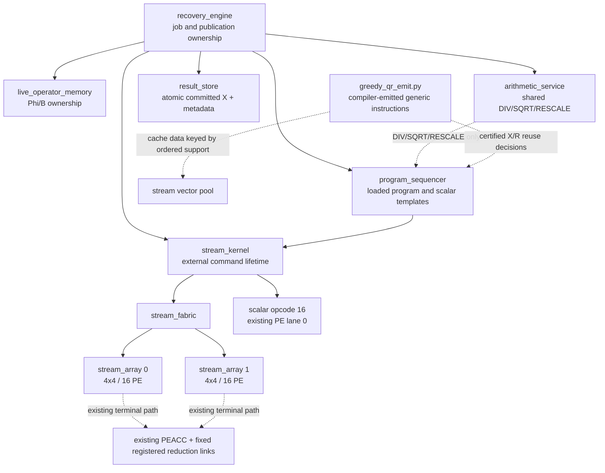

# Optimization finalization

The current source-bound streaming target is the 40-path core promoted with
`APPLY_PASS` in
[`unified_core_promotion_20260909`](../../../reports/v4/unified_core_promotion_20260909/before_after_manifest.json).
This document records its architecture roles and the fair fixed-eight reporting
boundary. It does not change RTL, establish a new physical implementation, or
make an area or Fmax claim.

`stream_fabric` owns the existing two 4x4 arrays, for 32 PEs total. Terminal
reduction uses the existing PE accumulator and fixed registered reduction
links; it does not instantiate a terminal arithmetic block, another PE array,
general programmable mesh routing, or a full mesh. `scalar opcode 16` is
dispatched by `program_sequencer` through
`stream_kernel` to existing fabric lane 0. It uses no dedicated RAM.

The QR reuse behavior is compiler-emitted generic program/vector-pool storage
in `compiler/v4/greedy_qr_emit.py`; it is not a new `stream_kernel` cache
module. The compiler keys cache entries by immutable Phi/Y and exact ordered
support. It records the ordered support, certified packed X, exact residual,
and count/step data only after QR certificate success, then may reuse that
certified X/R result. It does not cache a QR factorization. `result_store`
publishes committed X plus result metadata; residual values remain in the
vector pool and are not claimed as a result-store cache payload.

| File | Final target responsibility |
| --- | --- |
| `compiler/v4/greedy_qr_emit.py` | Emits generic QR instructions and compiler-level exact ordered-support/vector-pool reuse decisions. |
| `rtl/v4/compute/stream_kernel.sv` | External command lifetime and the shared vector-pool interface. |
| `rtl/v4/compute/stream_fabric.sv` | Issues work to exactly two existing 4x4 arrays and connects their existing terminal-ACC paths. |
| `rtl/v4/compute/stream_array.sv` | One 4x4 / 16-PE slice; there are exactly two instances. |
| `rtl/v4/control/program_sequencer.sv` | Loaded service program and scalar-template dispatch, including opcode 16. |
| `rtl/v4/memory/result_store.sv` | Committed X and result metadata publication. |
| `rtl/v4/services/arithmetic_service.sv` | Separate shared DIV/SQRT/RESCALE service path. |

The architecture description is source-bound by the core-promotion manifest
and the integrated watchdog archives. Historical reference roots remain
independently elaborated. Numerical quality, FPGA implementation timing, and
area remain separate evidence tracks.
