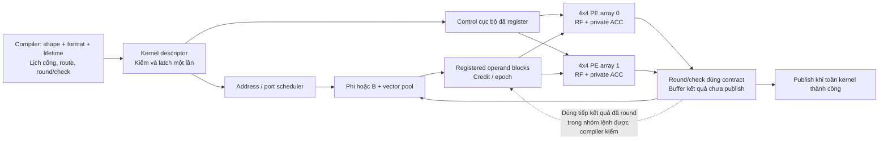

# Kiến trúc dùng chung: giảm cycle, tăng timing margin và giảm tài nguyên

Ngày 2026-09-09. Phương án thiết kế theo yêu cầu người dùng, tiếp nối
[STREAMING_REDESIGN.md](STREAMING_REDESIGN.md). **Chưa thay RTL, chưa chạy
synth/impl; mọi lợi ích PPA dưới đây là mục tiêu cần đo.** Correctness và quality
của từng thuật toán là điều kiện bắt buộc trước khi so hiệu năng/tài nguyên.

## 1. Hướng chọn

Giữ đúng hai array 4×4, 32 PE dùng chung. Tổ chức lại **control, giao tiếp giữa
PE và memory, lịch tích lũy/reduction và lifetime của vector**. Ưu tiên cơ chế
có ích cho nhiều kernel; tối ưu solver riêng phải dùng cùng hạ tầng này.

Ba nhóm thay đổi chính:

1. **Thực thi theo nhóm PE với context giữ ổn định trong kernel:** đường dữ
   liệu streaming, control/operand được register gần nơi dùng, giảm điều phối
   toàn array cho từng frame. Chỉ dùng những đường giao tiếp mà lịch kernel cần.
2. **Lập lịch memory và giữ kết quả tạm theo dataflow:** B một bản ghép cổng;
   workspace toàn N cấp theo lifetime; compiler biết số cổng thật và giữ kết
   quả đã round trong local RF/block buffer khi có thể dùng tiếp.
3. **Tích lũy cục bộ, giảm tổng cuối vector:** tận dụng PE đang có cho dot/norm,
   R1/R4 và partial ACC. Giảm chờ bộ reduction trung tâm mà giữ raw arithmetic.

DIV 27 vòng là cải tiến leaf phụ trợ. QR là lựa chọn solver cần so riêng.
QR hiện là solver đích theo [quyết định mới](QR_SOLVER.md); các phép so với
LSQR chỉ giữ làm đối chứng. Lợi ích PPA của QR vẫn phải đo, không suy ra từ
việc đổi tên solver.
Chúng không quyết định topology hoặc memory của cả 11 thuật toán.

| Cơ chế | Cycle dự kiến | Timing dự kiến | Tài nguyên và chi phí phải tính |
|---|---|---|---|
| Context cục bộ + stream trong kernel | Bỏ decode/retire lặp theo từng frame | Chia các đường decode→mux→ALU, giảm fanout control | Thêm register; chỉ giảm logic nếu thật sự gỡ mux/control dư, không giữ hai bản đầy đủ |
| ACC interleave tối thiểu + reduction cuối vector | Giảm bubble feedback và số lần fold trung tâm | Cho phép register feedback/reduction | P2 thêm 2.048 bit ACC so P1; P4 thêm 6.144 bit, chưa tính tag/mux |
| B: 16 RAM TDP, 32 bank logic | Giữ 32 hệ số/frame khi không stall | Địa chỉ/cổng cố định, vẫn cần pipeline đọc | Target 16 RAMB18; allocation thực chưa đo |
| Workspace có lịch cổng + local forwarding | Bớt ghi/đọc vector tạm và copy | Hạn chế mux lớn theo toàn vector, phân phối block cục bộ | Buffer/metadata tăng; RAM và traffic có thể giảm nhờ lifetime/reuse |
| DIV chính xác 27 vòng | Giảm latency scalar nơi có DIV | Không tự rút ngắn comparator/subtractor 65 bit | Quotient/counter có thể nhỏ hơn; setup/range và pipeline vẫn tốn logic |

Không có quy luật rằng thêm pipeline sẽ đồng thời giảm mọi loại tài nguyên.
Mục tiêu là giảm LUT/BRAM/control dư trong khi chi phí FF cần thiết được tính
riêng. Một phương án tăng FF để tăng margin phải được báo cáo đúng tradeoff.

## 2. Tận dụng ý tưởng từ các kiến trúc mới

Ba nguồn primary phù hợp đã đọc trong lần khảo sát này:

| Nguồn | Cơ chế đã có trong prior art | Cách áp dụng dự kiến cho project |
|---|---|---|
| [Plaid, bản thảo 12/2024](https://arxiv.org/pdf/2412.08137) | Gom các mẫu phụ thuộc nhỏ để phối hợp compute và routing cục bộ; compiler ánh xạ theo nhóm | Tìm các mẫu broadcast, reduction và vector update lặp trong 11 thuật toán, rồi chọn đường giao tiếp/điều khiển theo nhóm PE |
| [STRELA, 2024](https://arxiv.org/html/2404.12503v1) | Streaming memory nodes, elastic buffers và sửa logic handshake/reduction của PE | Đặt buffer ở ranh giới đọc/compute/publish để cắt đường ready dài; tránh lặp handshake toàn array cho từng MAC |
| [Lake, LATTE 2024](https://capra.cs.cornell.edu/latte24/paper/2.pdf) | Compiler nhận mô tả storage, ports, address/schedule generators và giới hạn tài nguyên | Sinh context cùng lịch cổng và lifetime; không giả định behavioral 2R+1W được thực hiện miễn phí bằng TDP |

Đây là các hướng tham khảo, không phải con số PPA có thể chuyển sang ZCU106.
Plaid không có cùng topology hai array 4×4 của project; STRELA báo cáo trên
ASIC 65 nm; Lake có các memory implementation khác BRAM FPGA. Chỉ chuyển cơ
chế phù hợp, rồi đo implementation của project bằng Vivado trên đúng part.

**Đóng góp kiến trúc dự kiến của paper:** phối hợp lựa chọn cách chia PE, lịch
cổng memory và giữ kết quả tạm theo shape/format/lifetime của các kernel CS,
trong khi giữ nguyên các ranh giới round/check và publish. Chứng minh trên cả
greedy, hard-threshold, proximal và inner-CG, với cùng 32 PE.

Từng ý tưởng streaming, grouping, bank-aware scheduling hoặc R1/R4 đã có prior
art. Điểm đóng góp cần chứng minh nằm ở cơ chế phối hợp cụ thể và hiệu quả toàn
chương trình. Chưa được tuyên bố "first", "optimal" hay novelty đã xác nhận.
[Khảo sát trước](../NOVELTY_POSITIONING.md) giữ các đối chứng CS/CGRA gần nhất;
phạm vi support-LS của khảo sát đó được mở rộng thành toàn bộ kernel ở đây.

## 3. Compute: giảm điều phối và giao tiếp dư

Trong một kernel có mode/shape ổn định, latch opcode, operand selection,
rounding, mask rule và loop bounds một lần. Phân phối bản control đã decode
đến hai array/nhóm PE qua register. Chỉ counter/valid/tag cần chạy theo frame.
Không phát lại toàn bộ decode và route transaction nếu frame chỉ là MAC tiếp
theo của cùng kernel. Các kernel cần mesh routing vẫn có lịch routing thật.



Diagram mô tả đường chung, không tạo thêm multiplier ngoài hai array. Buffer
ở ranh giới cần tính từ latency/credit, không đặt FIFO sâu ở mọi cổng PE theo
mặc định. Giữ handshake chống mất/nhân đôi dữ liệu; không tạo vòng combinational
ready xuyên nhiều nhóm. Trong nhóm lịch đều, ưu tiên pipeline lockstep có
valid/mask thay cho full token scheduler riêng cho từng phép toán.

Các đường cần khảo sát từ source, **chưa phải critical path do STA đo**:

- `context_decode` → `pe_context` → `pe_operand` → `pe_alu`: decode/operand mux
  và arithmetic cùng đường; có thể tách ở ranh giới kernel/operand.
- `kernel_fabric`: global ready/valid và fault retirement hai array; cần
  staging/tag đồng bộ, không cho một nửa frame tự commit.
- `kernel_engine`: các trạng thái read/execute/wait và central candidate indexing;
  không nhân staging 128 phần tử bằng FF lên 1.024 phần tử một cách máy móc.

Chi tiết file/line trong [audit compute](../../../reports/v4/architecture_redesign_20260909/ppa_compute.md)
và [audit memory](../../../reports/v4/architecture_redesign_20260909/ppa_memory.md).

### ACC feedback và timing

Multiplier pipeline nhận liên tiếp không bảo đảm accumulator nhận liên tiếp.
Nếu feedback ACC cần L clock và có P partial accumulators độc lập, điều kiện
phụ thuộc tối thiểu là `II >= ceil(L/P)`, ngoài giới hạn multiplier/memory.
Bắt đầu so P1 với P2; chỉ thêm P4 khi latency đo/lịch yêu cầu.

P2 thêm `32*64 = 2048` bit ACC so P1. P4 thêm `32*3*64 = 6144` bit, cộng tag,
valid và mux. Chọn P nhỏ nhất đạt mục tiêu; không gọi những register này là
miễn phí. Chỉ số partial tăng theo **frame được nhận**, không theo wall clock
để stall không làm đổi chuỗi tích lũy. Các partial được cộng raw trước round.

DSP48E2 có multiplier 27×18 và phần post-adder 48 bit; ACC64 không tự nằm
trọn trong một DSP. Phải tính carry/logic hoặc cấu trúc cascade đúng. Một phép
S27×S27 vẫn cần hai lượt multiplier nếu giữ một multiplier 27×18/PE.
[AMD UG579](https://docs.amd.com/api/khub/documents/pTysoma4TYgNH95BrY1Sbw/content).

### Dot/norm: tích lũy theo lane đến cuối vector

Thay vì đẩy 32 tích về bộ cộng trung tâm sau **mỗi block**, mỗi PE tích lũy
chuỗi của lane mình qua tất cả block, rồi fold 32 tổng lane ở cuối.

- Với length=128, giảm lượng đầu vào fold trung tâm từ 128 tích xuống 32 tổng.
- Nếu mở lịch cũ lên length=1024, con số là 1024 xuống 32; vẫn tính đủ 1024
  tích và các phép cộng, nhưng phần cộng nội bộ chạy song song trên PE.
- Có thể giảm tổng theo hàng 4 PE rồi fold các nhóm, hoặc reuse bộ reducer
  tuần tự cuối kernel. Chưa cần thêm cây 32-input combinational riêng.

Đây là lợi ích cho dot/norm trong LS, ADMM-CG, GP và các kiểm hội tụ, không chỉ
GEMV nhỏ. Với zero-init và tối đa 1024 phần tử, bound raw cho S27×C18 là 2^53,
S27×S27/dot/energy là 2^62, nằm trong signed ACC64. Chỉ đổi thứ tự tổng khi
bound/range contract này áp dụng; generic ACC đã chứa giá trị tùy ý hoặc shape
lớn hơn phải giữ kiểm overflow/order gốc.

## 4. Memory và forwarding: cân bằng resource với bandwidth

**B giữ lựa chọn 16 RAMB18 TDP**, phục vụ 32 bank logic, S≤96. Đã có
[kiểm ánh xạ](../../../reports/v4/architecture_redesign_20260909/paired_bank_proof.json),
chưa có primitive allocation/timing. Đây là memory dành riêng cho B; Phi và
vector dùng layout/port budget khác.

Workspace toàn N có hai phương án cần so theo cùng chương trình:

| Phương án S27 | Tổ chức dự kiến | Binary add/sub: memory grants cho N1024 | Dot hai vector: memory grants |
|---|---|---:|---:|
| Compact | 16 TDP RAMB36, hai lane logic/cặp cổng | 96: đọc a, đọc b, ghi đích theo block | 64 |
| Nhiều bandwidth | 32 TDP RAMB36, một lane logic/bank | 64 với lịch hai lượt đọc cùng lúc, rồi ghi | 32 |

Đây là **lượt phục vụ memory**, không phải cycle kernel hoàn chỉnh. Synchronous
read latency, compute, setup/drain và stalls tính riêng. Binary 32-bank có thể
overlap giữa block nhưng phải có lịch chống hazard. Unary 32-bank có thể
pipeline 1R+1W; compact cần hai lượt cho mỗi block. Không công bố cùng throughput
cho hai lựa chọn này chỉ vì cùng có 32 PE.

Các con số RAM là geometry target, không phải kết quả infer. Pool 16-bank có
thể chứa 16.384 word 27-bit trong 1024×36 primitives, nhưng capacity chọn cuối
phải có bảng live ranges của cả 11 chương trình, gồm candidate/rollback và
Phi/Psi intermediate. ADMM là workload cần kiểm live set kỹ; không cấp memory
theo riêng LSQR. Primitive TDP và cấu hình width phải theo
[UG573](https://docs.amd.com/r/en-US/ug573-ultrascale-memory-resources/Block-RAM-Library-Primitives).

**Forwarding có giữ rounding** là hướng giảm traffic trước khi thêm ports.
Ví dụ `t=round_S(a*x); z=checked_add(t,y)`:

```text
Hai lệnh tách: đọc x, ghi t, đọc t, đọc y, ghi z  -> 5 vector transfers
Forwarding:   đọc x, giữ t đã round/check, đọc y, ghi z -> 3 transfers
```

Bớt hai transfers tức 40% traffic của chuỗi ví dụ, **không phải 40% cycle toàn
thuật toán**. Vẫn có hai phép toán phụ thuộc trên cùng PE; không sinh FMA bỏ
round/check. Chỉ làm khi t không có consumer khác hoặc quan sát public cần
giữ, dữ liệu alias được snapshot đúng, và late fault không sửa kết quả đã
commit. Compiler phải đánh dấu nhóm lệnh an toàn, không tự fuse mọi SCALE+ADD.

Ưu tiên compact + forwarding làm ứng viên tiết kiệm memory; giữ phương án
bandwidth để so. Chưa khóa compact nếu các lượt đọc thêm làm chậm FISTA/ADMM/
PDHG hoặc các chương trình khác quá ngân sách. Không nhân bản workspace để
giả lập 2R+1W trước khi chứng minh nhu cầu.

## 5. Compiler và context là phần của kiến trúc

[Mô hình nạp và thực thi](CONTEXT_EXECUTION.md) quy định hai tầng: algorithm
program và kernel contexts/templates đều nạp được. Đường LSQR hiện tại mới
nạp program service128; PE words còn tạo cố định trong RTL. Giữ context trong
register để giảm overhead không đồng nghĩa bỏ khả năng nạp/đổi context.

Mỗi nhóm kernel cần mang cùng một contract gồm:

- Shape M/N/S, kiểu operator và định danh Phi/Psi/support; format/range.
- Mapping R1/R4/vector, đường route, số partial ACC và tail mask.
- Lịch memory với số port/grants thật, latency đọc và credit tối thiểu.
- Lifetime/base của mỗi vector và scratch; alias/consumer của kết quả tạm.
- Các điểm round/check, quyền publish, cách flush khi fault/cancel.

Compiler chọn trong một tập nhỏ các schedule đã kiểm, theo tổng cycle có
setup/drain và traffic, trong giới hạn memory/routes. Không tìm một schedule
riêng biết trước nghiệm của từng testcase. Dự trù timing theo độ sâu/fanout là
heuristic thiết kế; chỉ STA routed mới xác nhận margin. Context giữ mode theo
kernel và loop counters chạy theo stream, không nạp một image dài theo từng MAC.

## 6. Đo và quyết định trên cả 11 thuật toán

Correctness trước: cùng integer output, rounding/range, stored-X certificate,
iteration đầu tiên được chấp nhận và fault/status khi chỉ đổi lịch. Đổi solver,
bit hoặc stopping policy phải mang policy mới và requalify riêng. Vẫn yêu cầu
SNR≥20 dB, loss≤0,5 dB và NMSE ratio≤1,10 trên từng application case đã freeze.
Certificate LS không thay thế sai số hệ số/quality ở ma trận gần suy biến.

Sau correctness, so đúng part `xczu7ev-ffvc1156-2-e`, cùng Vivado version,
constraints, clock 10 ns và cùng scope module/interfaces:

| Trục | Báo cáo bắt buộc | Không suy ra từ |
|---|---|---|
| Cycle | Toàn recovery/job, cold/warm, số vòng, từng algorithm/case, worst regression | Một GEMV/LS nhanh hơn hoặc tổng MAC/32 |
| Timing margin | Routed WNS tại cùng 100 MHz; TNS, hold, pulse-width và unconstrained checks | Xsim PASS, thêm pipeline hoặc ít cycle hơn |
| Resource | LUT logic/LUTRAM, FF, DSP, RAMB18/RAMB36, buffer/control và tổng cùng scope | Payload bytes, số PE hoặc sơ đồ khối |

Mục tiêu khảo sát là WNS dương với khoảng dự phòng rõ ràng; **+1 ns tại period
10 ns là mốc thiết kế đề xuất**, chưa phải kết quả đo hoặc yêu cầu người dùng
đã khóa. Không nới clock/false paths để đạt margin. AMD định nghĩa riêng setup,
hold và các đường chưa được timing vì thiếu constraints.
[UG906 setup](https://docs.amd.com/r/en-US/ug906-vivado-design-analysis/Setup-Area-Max-Delay-Analysis),
[UG906 unconstrained](https://docs.amd.com/r/en-US/ug906-vivado-design-analysis/Unconstrained-Paths-Section).

Chọn theo Pareto: quality/correctness phải qua, cycle thấp hơn, margin lớn hơn,
resource từng loại được công bố. Báo geometric mean ratio với trọng số đều
giữa thuật toán cùng worst-case slowdown; không để nhiều ca CoSaMP che một
regression ở FISTA. Chưa có baseline đầy đủ của thuật toán thì báo số tuyệt đối,
không tự tạo speedup. Muốn claim giảm cycle cho mọi thuật toán phải có evidence
từng thuật toán; muốn claim đồng thời giảm mọi resource thì FF/DSP/BRAM cũng
không được tăng rồi bị giấu trong một điểm "area" tổng hợp.

## 7. Phép so cần làm và thứ tự triển khai

| So sánh | Câu hỏi cần trả lời |
|---|---|
| Serial reference ↔ streaming, cùng memory/arithmetic | Lợi ích do giảm điều phối là bao nhiêu? |
| R1, R4 cố định ↔ chọn theo shape, cùng pipeline | Adaptation có lợi sau reduction/tail/context cost không? |
| P1 ↔ P2; P4 chỉ nếu cần | Bao nhiêu ACC state đủ để hết feedback bubble? |
| Reduction mỗi block ↔ cuối vector | Dot/norm nhanh hơn bao nhiêu với cùng raw sum? |
| Ghi/đọc temporary ↔ forwarding đã round | Giảm traffic và state có bù buffer/control không? |
| B 32 bank riêng ↔ 16 TDP | Allocation/routing thật có giảm, II có giữ không? |
| Vector pool compact ↔ bandwidth | Thuật toán nào bị chậm và BRAM tiết kiệm được bao nhiêu? |
| DIV cũ ↔ DIV 27 vòng | Chi phí scalar toàn chương trình đổi bao nhiêu? |

Đo từng thay đổi và tổ hợp quan trọng; lợi ích kết hợp không nhất thiết bằng
tổng lợi ích riêng. Giữ một baseline streaming tĩnh mạnh, vì chỉ thắng RTL
serial chưa đủ chứng minh đóng góp so với CGRA khác.

Trước RTL tích hợp tiếp: hoàn tất port/lifetime/cycle ledger cho các kernel
chung và chương trình, rồi chọn candidate. Khi triển khai, Astra Medium viết
module nhỏ; trước tiên kiểm một lát cắt **memory thật → hai array → memory**
với GEMV và dot/vector, tails, stall/cancel/fault bằng **Vivado xsim**. Sau đó
ghép program và full regression; phần đang PASS được giữ/kiểm lại đúng scope.

Chỉ sau các gate correctness cần thiết mới synth rồi impl theo yêu cầu đã có.
Baseline 210 tests vẫn là evidence cũ; lượt 227 bị ngắt không trở thành PASS mới. Chưa có toàn bộ
11 recovery programs RTL, timing closure hoặc board-throughput evidence.

[Contract đánh giá chi tiết](../../../reports/v4/architecture_redesign_20260909/ppa_evaluation.md)
ghi provenance, cách tính score, timing/resource checks và chứng minh DIV.

Lát RTL streaming đầu tiên đã tách thành [contract revision 1](STREAM_RTL_CONTRACT.md)
và [kết quả triển khai](STREAM_IMPLEMENTATION.md): program/template nạp thật,
32 PEs, RAM vector ghép bank, dot/vector và publication theo CALL. Nó dùng
operand frame được nạp trực tiếp; chưa có live Phi/B/GEMV frontend hay full
recovery. Số cycle ví dụ và fabric II trong đó không thay thế phép so PPA/toàn
thuật toán yêu cầu ở trên.
