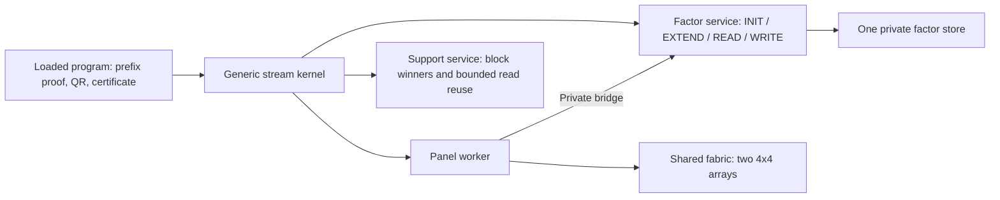

# Incremental QR and shared operand reuse

Status: source-qualified feature4 implementation. All20 active fixed8 XSim cases
passed against the factor-panel baseline. Source installation is tracked in
[the promotion manifest](../../../reports/v4/qr_reuse_promotion_20260910/before_after_manifest.json).
See [whole-program comparison](../../../reports/v4/qr_reuse_comparison_20260910/qr_reuse_comparison_vi.md)
and [leaf qualification](../../../reports/v4/qr_reuse_rtl_20260909/qualification.json).
No timing, resource, board-fit or production precision claim follows from these gates.

## Architecture and ownership

The loaded program remains responsible for algorithm order, support membership,
Householder reflectors, triangular solve, corrections and the stored-X certificate.
The kernel remains generic and uses the same two 4x4 arrays, 32 PEs and one private
factor store. No second factor image or arithmetic engine is introduced.

`qr_profile='reuse'` inherits the panel schedule for all active algorithms and adds
incremental factorization only for OMP/GOMP with a proven ordered support prefix.
ADMM remains historical reference-only. The baseline profile remains selectable.

## Incremental factor transaction

Kernel feature revision 4 adds generic opcode 19, `FACTOR_EXTEND`. Program-image
revision stays 2. The request carries M in length, new S in support_length, old S
in index, aux_length=0, dense format 1 and flags=0. The backend verifies a valid
owned factor, matching key/job/format/rows and live-B new shape, and
0 < old S < new S <= 96 with index equal to owned columns. Phi is immutable
within the job, but every BUILD_B advances the separate B generation. EXTEND
requires exactly the next B generation (old+1 modulo 2^32); matching dimensions
alone or an arbitrary generation jump does not authorize reuse. The loaded
OMP/GOMP program emits exactly one BUILD_B immediately before each extension.

EXTEND uses a loaded template with descriptor, contexts and scalar bindings all
zero; its template-table index may be any valid entry. Unused vector operands,
scalar/result controls and shift are canonical zero. Its completion count is
the total published new S, matching INIT; it returns no public vector payload.
Kernel feature 4 admits an exactly zero context word only under exactly zero
template metadata at load time. EXTEND requires the whole inert template;
ordinary arithmetic execution retains its context opcode validation. Merely
admitting a zero template does not permit a zero arithmetic instruction.

The store preserves old columns and fills only the new columns through the
existing B import path (C18 to S27). Its fixed column stride remains unchanged
at the 32/64 column boundaries. Publication is invalid during loading; the new
shape and B generation become usable only after the final validated fill. Old
generation reads are then rejected. Fault or cancellation
invalidates the transaction. Structural readiness must not suppress a response
to a malformed request. Held responses and outstanding credits retain their
existing rules. INIT keeps its original semantics.

The backend does not infer support-prefix or RHS equality from matching dimensions.
The loaded program proves the exact ordered prefix and scopes reuse to an immutable
Phi/RHS within one job. Shrink, reorder, mismatch or invalid cache uses INIT.
Changing job/reset starts with invalid cache. A numerical or certificate failure
must not publish reusable state.

## Numerical order and resident operands

The program retains ordered support, tau and the initial transformed RHS Q^T y;
it does not copy the factor matrix. For appended columns it applies all old
reflectors in increasing order, then constructs the new reflectors and updates
their trailing columns. Every fixed-point rounding point follows the full QR
schedule. Group append must preserve this ordering for each new column.

The initial RHS solve may reuse Q^T y and apply only new reflectors. A correction
solve has a different residual RHS and must apply every reflector from zero.
Saved initial Q^T y must survive correction work. Backsolve and stored-X
certificate remain authoritative; the full-QR numerical oracle is unchanged.

The shared support service may retain one winner record per 32-word source block
for multiblock TOPK with k>1. Initial scan populates the records. Each further
selection refreshes only the winning block and reuses the existing registered
comparison tree for local/global reduction. It preserves ties, exclusions, zero
handling and output ordering. The k=1 path remains available. A bounded range
read cache is a separate candidate: command-scoped, valid-mask checked, cleared
on reset/cancel, and usable only while public source vectors remain immutable.

Microbenchmark selection keeps the legacy path for a single block, k=1, and
N<=64 with k=2; the latter regressed from 70 to 72 leaf cycles with unconditional
caching. Range prefetch may request the union of lanes required elsewhere in
the same command, never replaced or unused lanes. Cached masks must prove every
subsequent use. Aligned ranges and short replacements with no boundary reuse
keep the legacy schedule. Final source-bound measurements remain required.

## Acceptance gates

Baseline M64/N256/K8, actual eight outer iterations:

| Algorithm | START-to-DONE cycles | Transfer service cycles | Panel service cycles |
|---|---:|---:|---:|
| OMP | 68110 | 18652 | 0 |
| GOMP | 127892 | 37308 | 7256 |
| CoSaMP | 252684 | 64948 | 36704 |
| SP | 110341 | 25080 | 5728 |

Transfer here groups PICK, SLICE, REPLACE_RANGE and factor reads/writes. The
complete source-bound service records are retained in the baseline reports.
Incremental QR removes repeated construction of old reflectors for prefix
growth. CoSaMP/SP change support membership and keep full QR/result-cache
semantics; their candidates reduce support selection and operand transport.
The existing panel path remains the reflector rectangle implementation, while
range reuse also serves the slices/replacements in reflector and triangular
solve sequences. This table identifies costs, not predicted speedups. Time
outside service intervals includes program/control/publication work and is not
automatically idle time.

1. Focused XSim verifies append prefix preservation, maximum M128/S96, column
   boundaries, malformed requests, stalls, held responses, partial fill faults,
   cancellation and reset. Existing INIT/read/write behavior is rerun.
2. Independent integer VMs agree with full QR for prefix/group append, fallback,
   reset, correction RHS and failure paths. No certificate or numerical limit
   is relaxed. RTL simulation uses Vivado xvlog/xelab/xsim only.
3. Selection/range tests verify exact outputs and transactions under tails,
   ties, exclusions, masks, aliases, faults and stalls, with per-case cycles.
4. Freeze final source closures before whole-program runs. Compare all ten active
   algorithms at M64/N256/K8 and M32/N64/K8 against the factor-panel baseline,
   with the same raw Phi/Y, policy and actual eight outer iterations. Report
   whole-program cycles individually, including regressions; preserve X,
   residual, support, status, numerical events and logical LS/correction counts.
   Physical INIT and EXTEND counts are reported separately from logical solves.
5. Fixed-eight quality remains separate from application acceptance: fixed and
   float SNR >=20 dB, loss <=0.5 dB, NMSE ratio <=1.1, no numeric events. A
   bit-exact low-quality fixed-eight case is diagnostic, not a held-out PASS.
6. Promote only source-qualified changed files with before/after hash guards.
   Keep V2/V3 and failed runs intact. Synthesis/implementation follows separately.

The comparison anchors are
`reports/v4/factor_panel_final_fixed8_m64_20260909` (scale 8192) and
`reports/v4/factor_panel_final_matched_m32_20260909` (scale 11585).
V2/V3 remain historical anchors with their actual iteration and solver differences;
they cannot be substituted for a matched before/after experiment.
