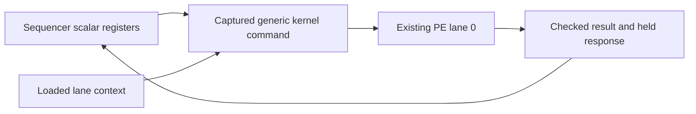

# Scalar-template opcode16 through the existing PE array

Candidate kernel interface revision 2 adds `SCALAR_TEMPLATE = 16`. The loaded
program container remains revision 2. Existing opcodes retain their meaning;
older hardware rejects the new opcode. A compiler must select a compatible
kernel target before emitting it.

## Purpose and ownership

QR repeatedly computes scalar differences and products. Previously these
operations copied scalar registers into vector memory, executed a vector
template and reduced or picked the result back into a register. The new command
uses lane 0 of the existing array and returns its result to the sequencer's
scalar register file. It adds no separate arithmetic array, RAM, vector
scratch, cache request boundary, or algorithm-specific RTL. The compiler still
loads the arithmetic context; hardware does not recognize a QR algorithm.

## Exact command contract

- Length and frame count are 1; tail mask is 1. Only lane 0 executes.
- Lane 0 selects S27 mode and MOV, ADD, SUB or MUL. Every used operand must
  select a bound scalar input, a signed immediate, or zero. MOV ignores B.
- Descriptor output is EACH with shift zero. Descriptor bits 31:3 are zero;
  address-increment bits 2:0 have no effect on this command.
- Matrix-dense, transpose, R4, store mode, flags, K, support length, auxiliary
  length, index and external shift are zero. Address fields are ignored;
  valid loaded vector descriptors may point to nonzero addresses.
- The command performs no vector-memory request or write and does not change
  vector publication metadata. It therefore needs no initialized vector data.
- ADD/SUB and MOV check S27 range. MUL rounds its signed product right by 22
  once, with ties away from zero, then checks S27 range. Overflow faults;
  it never wraps or saturates silently.
- The response contains the sign-extended result, its nonzero flag, and count
  zero. Job/tag/format validation, response backpressure and cancel use the
  existing service protocol. No partial result is committed on a fault.

## Compiler use and acceptance

`Program.scalar_template(op, dst, left, right)` reuses loaded scalar templates.
QR can replace a scalar subtraction's memory round trip with one command and
replace tau-times-dot's memory round trip with one MUL command. The numerical
rounding point is unchanged.

Controller tests with a mock service prove request validation and register
commit only. VM tests prove the integer oracle only. Real-kernel tests must
also prove arithmetic, zero memory traffic, tails, held response and cancel.
Whole-program xsim must compare X, residual, support, status and counters to
the unchanged fixed model before promotion. Cycle reduction alone does not
prove improved resource use or timing on ZCU106.
