# Thiết kế lại đường tính: support thực, cấp dữ liệu liên tục, dùng đủ 32 PE

Ngày 2026-09-09. **Đây là phương án kiến trúc tổng thể; lát compute/memory/context
đầu tiên đã có RTL riêng, chưa phải toàn bộ phương án đã triển khai.**
**Cập nhật solver đích: [QR](QR_SOLVER.md)**. Các so sánh LSQR bên dưới là
baseline lịch sử. QR cần numerical và RTL qualification riêng, không có
fallback LSQR trong chương trình recovery mới.
Xem [kết quả streaming](STREAM_IMPLEMENTATION.md) và [contract revision 1](STREAM_RTL_CONTRACT.md).
Luồng LSQR giữ làm reference; lượt regression 227 tests trước đó đã dừng.
Gate streaming riêng không thay thế [baseline 210 tests](../../../reports/v4/rtl_vivado_audit_20260909/manifest.json)
hoặc xác nhận full LSQR/recovery trên source mới.

Bước tiếp theo đã được cụ thể hóa trong [phương án cycle/timing/resource](PPA_OPTIMIZATION.md):
control/routing theo nhóm, tích lũy cục bộ, lịch cổng thật và forwarding giữ
rounding, kèm prior art và ablation trên cả 11 thuật toán.

## Nguyên tắc chọn: cân bằng toàn bộ thuật toán

Theo yêu cầu bổ sung của người dùng, **đơn vị tối ưu là kernel dùng chung và
toàn bộ chương trình**, không phải chỉ LSQR. Một thuật toán không dùng LS vẫn
phải có đường thực thi tốt. Không yêu cầu mọi thuật toán dùng mọi khối; các khối
ít dùng phải được bypass và không tạo thêm bubble trên đường chung.

| Chương trình trong project | Công việc chính | Phần kiến trúc phải phục vụ tốt |
|---|---|---|
| MP | Correlation, argmax, cập nhật hệ số/residual | Aᵀ, chọn một phần tử, vector update; không bị bắt qua LS |
| OMP / GOMP | Correlation, chọn cột, LS với support tăng | Aᵀ + selection + B update + solver; reuse factor chỉ là phương án cần kiểm |
| CoSaMP / SP | Correlation, top-K, union/prune, LS | Operator toàn N và gather/scatter phải nhanh cùng với LS |
| IHT | Gradient, hard threshold | A/Aᵀ + AXPY + top-K; không cần LS |
| HTP | Gradient, hard threshold, LS trên K | Cùng đường IHT, thêm chương trình solver |
| GP | Gradient trên tập đang hoạt động, dot/ratio và update | A/Aᵀ hoặc restricted operator, reduction, vector arithmetic |
| FISTA | A/Aᵀ, soft threshold, momentum | Vector dài N và các kernel scale/add/compare streaming |
| ADMM | Shifted-CG toàn N, soft threshold, cập nhật dual | A/Aᵀ, dot/norm, DIV và nhiều vector N; không dùng B96 thay hệ N |
| PDHG-LASSO | Forward/adjoint, primal/dual update, soft threshold | Operator hai hướng + vector streaming; không cần restricted LS |

Đây là 11 tên chương trình đang có numerical model/target, không phải 11
chương trình RTL đã hoàn thiện. PDHG-TV/stencil và AMP vẫn là phần mở rộng;
không tính chúng thành workload đã được chứng nhận. Cùng một kernel có thể dùng
format khác theo profile; không tự ép D18 của proximal thành S27 rồi gọi là
bit-exact. Xem [phạm vi mô hình](../ALGORITHM_EXPANSION.md).

Thứ tự ưu tiên kiến trúc:

1. **Operator thuận/chuyển vị + vector workspace + streaming PE**: giúp cả 11
   chương trình; phải khảo sát chiều M và N thật, không chỉ B nhỏ.
2. **Reduction/dot/norm, AXPY, compare/threshold và selection**: dùng lại ALU,
   local RF và mạng trong array. Top-K/argmax là service dùng chung có index và
   tie-break xác định; soft threshold chạy theo lane, không cần sorter. Chưa
   chọn vi kiến trúc selection trước khi có cost/cổng cho N1024.
3. **LS và các tối ưu chuyên biệt**: QR dùng các kernel trên; factor reuse là
   tối ưu phải kiểm riêng. Không thêm PE riêng hoặc giữ RAM scratch độc
   quyền khiến FISTA/ADMM thiếu state. Scalar DIV/SQRT là service dùng chung,
   không được ép thuật toán không cần scalar phải chờ nó.

Mỗi phương án cần một bảng **lợi ích / chi phí cho từng thuật toán**. Đánh giá
trên cùng input, operator, policy và quality gate trước–sau; ghi cycle toàn
chương trình, cold/warm, memory traffic, số vòng và workspace peak. Hiện chưa
có cycle toàn 11 chương trình nên bảng cycle LS ở dưới chỉ là một phần quyết
định, không đủ để tuyên bố kiến trúc cân bằng.

Không lấy trung bình theo 583 lần LS làm trọng số chọn kiến trúc: hai ca ECG
CoSaMP sẽ lấn át các thuật toán còn lại. Báo cáo per-algorithm trước; có thể
thêm geometric mean speedup với trọng số bằng nhau và bảng theo họ thuật toán
để tránh nhiều biến thể greedy lấn át FISTA/ADMM/PDHG. Luôn kèm thuật toán bị
chậm nhất và bộ nhớ tăng thêm. Không bỏ case fail để tăng speedup trung bình.
[Audit từng thuật toán](../../../reports/v4/architecture_redesign_20260909/shared_algorithms.md)
và [ràng buộc memory dùng chung](../../../reports/v4/architecture_redesign_20260909/balanced_memory.md)
ghi chi tiết lợi ích, phần chưa có và các tradeoff.

**Ràng buộc workspace cần sửa ở kiến trúc:** 16×128 S27 hiện có chỉ là 2.048
word cho LS. Các thuật toán toàn N cần nhiều vector 1.024 phần tử sống cùng
lúc, nên cần allocator theo base/length/format và lịch lifetime, stream từng
block 32 phần tử. Không cấp riêng 16 slot dài N cho mọi thuật toán một cách
cứng nhắc; reuse vùng khi hết lifetime và giữ vùng scratch theo job.

Hai nguồn + một đích đồng thời là ba truy cập/bank, vượt hai cổng của một RAM
TDP. Vì vậy **không áp dụng máy móc ghép bank B cho vector workspace**. Cần
operand/result buffers và lịch đọc/ghi theo kernel, hoặc các memory plane đã
được chứng minh cần thiết. Kernel unary có thể dùng 1R+1W; kernel binary phải
tính chi phí 2R+1W thật. Lợi ích R1/R4 của GEMV không được che việc AXPY/threshold
bị nghẽn cổng. Reduction qua các tile phải giữ tổng raw đến hết vector, không
round ở mỗi tile. Transform strides cần chứng minh bank conflict riêng.

Với A=Phi×Psi: thuận là Psi rồi Phi, adjoint là Phiᵀ rồi Psiᵀ. Full operator
feeder từ cache dấu phải nối được tới cùng PE stream như B; kernel LS hiện tại
chỉ nhận dense B chưa thực hiện đường này. B phải chứa cột thật của A, không
lấy cột Phi thay thế khi Psi khác I. Đây là gate chung cho mọi thuật toán dùng
operator, không phải tính năng phụ sau tối ưu LS.

## Quyết định đề xuất

Thiết kế theo **kích thước công việc thực tế**, ưu tiên S=8/16/32, đồng thời giữ
khả năng chứa S≤96 nếu cần cho profile CoSaMP. Dung lượng này không buộc mỗi
phép tính chạy 96 cột. Giảm cycle bằng thay lịch cấp dữ liệu, vòng lặp trong
array và cách chia phép cộng; giảm RAM bằng ghép cổng, không chỉ cắt độ sâu.

| Thành phần | Hướng chọn | Điều kiện trước khi khóa |
|---|---|---|
| Compute | Đúng hai array 4×4; một kernel chạy thành dòng frame liên tục | Chứng minh interval nhận frame, ACC feedback, backpressure và cancel |
| B trên support | Một bản, 32 bank logic ghép thành **16 RAM hai cổng thật**, mỗi RAM 1024×18 | Kiểm ánh xạ/cổng, xsim, sau correctness mới kiểm allocation bằng synth |
| Kích thước | Descriptor chứa M, N, K của policy và S thực; S không tự đặt bằng 3K | Kiểm support union đủ và tail mask, không cắt support âm thầm |
| Mapping | R1 cho nhiều đầu ra; R4 chia một phép cộng cho bốn PE khi ít đầu ra | Chọn theo số frame + chi phí reduction, không theo tên thuật toán |
| Context | Nạp mode một lần/kernel; bộ đếm địa chỉ phát frame | Không nạp lại context hoặc chờ PC cho từng MAC frame |
| Scalar | DIV chính xác theo 27 bit thương thay cho 86 vòng numerator | Giữ nguyên rounding, signed range, MODE/ZERO/fault |
| Solver | LSQR streaming là baseline đầu tiên; so QR ở S≤32 trước khi khóa | Đo cả traffic, scalar, nghiệm X24 và chất lượng ứng dụng |

Không thêm PE/matrix multiplier riêng cho solver. Không mở rộng mọi vector lên
96 phần tử đang hoạt động. Các kernel full-N của FISTA/ADMM và các chương trình
khác vẫn có shape riêng; S chỉ là kích thước của bài toán LS trên support.

## Vì sao không lấy 128×96 làm cấu hình chạy mặc định?

M=128 là số measurement; N≤1024 là chiều tín hiệu; K là độ thưa/policy; S là số
cột đang chọn để giải LS. Ma trận LS là B=A[:,support], kích thước M×S.

| Thuật toán/policy đang có | Support làm việc của LS |
|---|---|
| OMP, HTP | Tối đa K |
| SP | Union tối đa 2K, rồi solve lại trên K sau prune |
| CoSaMP | Union tối đa 3K, có loại trùng; không luôn bằng 3K |
| GOMP hiện tại | K vòng, mỗi vòng thêm group_size cột; group=2 có thể đến 2K |
| IHT, MP, GP, FISTA, ADMM | Không đồng nhất với bài toán LSQR trên support này; có kernel/lịch riêng |

Từ 65 ca calibration đã chọn, có 583 lần LS:

| S thực | Số lần | Tỷ lệ |
|---:|---:|---:|
| 1–32 | 380 | 65,18% |
| 33–64 | 77 | 13,21% |
| 65–96 | 126 | 21,61% |

Toàn bộ 126 lần S>64 thuộc ECG–CoSaMP K=32. Chỉ một lần đúng S=96, nhưng đa số
các lần LS của profile này có S khoảng 87–89. Chúng chiếm 78,38% tổng S×số-vòng
LS trong corpus; đây là proxy công việc, **không phải cycle RTL hoặc tần suất
triển khai thực tế**. [Histogram và hash nguồn](../../../reports/v4/architecture_redesign_20260909/support_counts.json).

CoSaMP trên ảnh đã có K=16, S≤48. Có thể chọn đây làm ứng dụng chính phù hợp
của CoSaMP trong paper, nhưng phải ghi phạm vi và giữ báo cáo các ca ECG lớn.
Không được dùng thay đổi benchmark để tuyên bố vẫn bao phủ profile cũ.

Đối với ECG, giảm CoSaMP xuống K=16 cho SNR float 17,12/15,64 dB trên hai cửa
sổ, không đạt ≥20 dB. K=24 có 21,71/20,12 dB ở float nhưng cần S≤72 và chưa
requalify fixed theo policy đó; K=21 chưa có bằng chứng. Vì vậy chưa có cơ sở
cắt cứng S≤64 mà vẫn tuyên bố giữ toàn bộ chất lượng/profile đã chọn.

## Tổ chức memory và hai array

```mermaid
flowchart LR
    L["LFSR + một cache dấu Phi"] --> BLD["Dựng B từ support thực"]
    L --> OP["Feeder Phi / Phi transpose\nOperator toàn N"]
    BLD --> B["Một B resident\n32 bank logic / 16 RAM TDP dự kiến"]
    CT["Program recovery / solver / transform\nKernel descriptor + epoch"] --> AG["Bộ đếm địa chỉ + credit"]
    AG --> B
    AG --> OP
    OP --> F
    B --> F["Pipeline đọc + đổi thứ tự lane\nFIFO frame có tag và mask"]
    V["Vector store theo base / length / format\nState M, N hoặc S + scratch theo lifetime"] --> F
    F --> P0["Array 0: 4x4 PE\nACC riêng của kernel"]
    F --> P1["Array 1: 4x4 PE\nACC riêng của kernel"]
    P0 --> R["Kết quả kernel GEMV / reduction / vector\nGiữ round/check của từng phép toán"]
    P1 --> R
    R --> V
    R --> SEL["Argmax / top-K / index\nService theo lịch, bypass khi không dùng"]
    SEL --> V
    SC["Scalar DIV/SQRT dùng chung"] <--> CT
    V --> CERT["Certificate theo chương trình\nLS kiểm nghiệm đã lưu X24"]
    CERT --> PUB["Commit nguyên job"]
```



LFSR/cache dấu giữ một bản. Với Psi=I, builder lấy đúng các cột cần để dựng B;
reuse B trong toàn bộ lần LS, không DMA hoặc tái sinh lại B cho mỗi vòng.
Nếu A=Phi×Psi với Psi khác I, builder cần transform/composition đúng contract;
RTL hiện tại chưa thực hiện raw-signal transform tổng quát. Dense-B reference
vẫn cần dữ liệu nạp và không thể tái tạo tùy ý bằng seed.

**Ghép bank đề xuất:** giữ mapping logic hiện tại:

```text
b = (row + slot) mod 32
a = row * ceil(S/32) + floor(slot/32)
physical_bank = b mod 16
physical_port = floor(b/16)              # A hoặc B của true-dual-port RAM
physical_address = 512 * floor(b/16) + a
```

Với M≤128, S≤96, a≤383. Hai bank logic dùng hai vùng 0..383 và 512..895,
vừa một RAM 1024×18. Một frame hợp lệ có nhiều nhất một truy cập/bank logic,
nên mỗi RAM vật lý có nhiều nhất hai truy cập và mỗi cổng nhiều nhất một.
Đủ 32 hệ số C18, tức 576 bit/frame; không cần clock RAM gấp đôi clock PE.
AMD mô tả RAMB18 hỗ trợ true-dual-port 1024×18; RAMB36 có thể chia thành hai
RAMB18. [UG573](https://docs.amd.com/r/en-US/ug573-ultrascale-memory-resources/Block-RAM-Summary).

Mục tiêu này tương ứng 16 RAMB18 cho **riêng B** (36 KiB dung lượng primitive,
27 KiB payload tối đa), hay 8 BRAM36-equivalent theo dung lượng. Chưa phải số
primitive đã infer/place; không cộng nhầm thành tổng FPGA. Bản RTL hiện tại
chưa ghép bank như vậy. Cache Phi, vector workspace, context và buffer tính riêng.

[Kiểm tra ánh xạ](../../../reports/v4/architecture_redesign_20260909/paired_bank_proof.md)
đã qua 43.115 frame ánh xạ, 4.164 frame từ compiler hiện có, 1.031 fill frame
và 119.712 hệ số đọc. Kết quả là `PASS_MAPPING_ONLY`, không phải xsim, synth
hoặc chứng nhận bank controller đã đúng. Script và JSON được lưu cùng report.

Fill/build và compute giữ quyền sở hữu loại trừ nhau, nên hai cổng được dành
trọn cho đọc khi tính. Muốn vừa ghi vừa đọc phải thêm lịch/port budget; thiết kế
này không tự có overlap đó. Reset chỉ metadata/valid, không dùng reset xóa
toàn mảng RAM. Đọc/ghi C18 phải giữ đủ cả 18 bit và response phải có tag/epoch.

Giảm S96 xuống S64 hoặc S32 vẫn cần cùng 16 RAM hai cổng nếu giữ bandwidth
này. Paging 64→96 gây reload trong nhiều GEMV ECG nhưng chưa giảm số bank;
vì vậy không chọn paging cho dung lượng hiện tại. S thực nhỏ vẫn chỉ đọc đúng
các cột đang hoạt động, và phần bank/PE không dùng được disable.

## Giảm cycle ở gốc: lịch nhận frame và phân việc

RTL hiện tại tuần tự hóa read → feed → chờ array trả kết quả → read tiếp.
PE còn giữ pending và cập nhật ACC khi response được nhận; array chạy qua
EXEC/ROUTE/WAIT_LINK/DONE cho từng frame. **Thêm FIFO bên ngoài không đủ.**

Đường mới phải cho phép nhiều frame đang bay, mode không-routing được giữ
suốt kernel và ACC được cập nhật trong pipeline. Chỉ drain/publish khi kết
thúc toàn bộ kernel. PC không tham gia từng frame. Các context khác vẫn có
thể dùng ALU/route của cùng PE; đây không phải một cụm multiplier phụ.

Mục tiêu là nhận một frame C18×S27 mỗi clock (II=1). Phải chứng minh riêng:
RAM nhận địa chỉ liên tiếp, permutation có pipeline, multiplier nhận liên tiếp,
và ACC feedback không tạo bubble. Nếu feedback mất hai clock, cần ít nhất
hai ACC context độc lập/lane hoặc raw partial sums, rồi cộng chính xác cuối
kernel. II=2 là phương án dự phòng có ngân sách riêng; chưa phương án nào được
xsim/timing chứng nhận. S27×S27 vẫn dự kiến hai pha khi dùng một DSP27×18/PE.

Độ sâu credit/FIFO phải lấy từ latency đọc→frame và khả năng backpressure;
không mặc định FIFO bốn phần tử là đủ. Credit operand được trả khi frame
được nhận vào pipeline; track retirement/fault riêng. Tag epoch theo đến cuối,
fault/cancel flush toàn kernel và không publish một phần array.

**Ví dụ M128, S8:** Bᵀu có tám đầu ra. R1 chỉ dùng tám PE hữu ích. R4 cho
bốn PE tính bốn phần của mỗi đầu ra, dùng đủ 32 PE. Số frame nhân giảm từ
128 còn 32, cộng thêm reduction cuối. S16 giảm từ 128 còn 64 frame. Đây là
hiệu quả trong pha nhân, không phải tuyên bố hiệu suất PE toàn chương trình.

R4 dùng output offsets 0..7 và row offsets 0,8,16,24 để giữ 32 bank logic khác
nhau; mỗi nhóm bốn PE nằm trong một hàng array. Cộng các raw partial bằng PE
rồi round một lần. Với S32/S64, R1 thường ít overhead hơn; với S48 hoặc tail
khác, compiler so tổng chi phí R1/R4. Không cần thêm mode R2 trước khi có lợi
ích đo được. Mask xử lý M/S không chia hết block.

Tại giới hạn đang khảo sát, 128×2^26×2^17=2^50 cho tổng GEMV và
128×(2^26)^2=2^59 cho ENERGY, nằm trong ACC64. Nhờ bound này có thể chia/cộng
lại tổng raw mà không làm đổi overflow của phép tổng này. Vẫn giữ mọi bước
round/range của S27 và X24; không tự áp dụng bound cho shape/bit khác. Với
vector dài N1024, ENERGY bound S27 là 2^62 còn nằm trong ACC64, nhưng mọi dot,
shift và certificate phải được kiểm theo format thực của chương trình đó.

## LS và scalar: chọn theo dữ liệu, không mặc định một solver

Ở kiến trúc cũ, DIV/SQRT của ca 47 vòng chiếm khoảng 29.427 clock, chỉ 3,28%
của 897.561 clock. Sửa scalar riêng không chữa được bottleneck chính. Khi
GEMV đã pipeline, scalar trở thành phần đáng kể nên cần xử lý cùng thiết kế.

DIV hiện nhận a,b signed64 với source_frac=0 và trả S27F22. Có thể rút số
vòng chia mà **giữ phép chia chính xác**:

```text
N = abs(a) << 22; D = abs(b)
H = N >> 27 = abs(a) >> 5
L = N mod 2^27 = (abs(a) & 31) << 22
Nếu H >= D: chắc chắn thương vượt range S27.
Nếu H < D: đặt remainder=H, chia tiếp đúng 27 bit của L.
Cuối cùng: round ties-away, kiểm signed range như cũ.
```

Giữ MODE/ZERO priority, magnitude unsigned của -2^63, trial remainder 65 bit,
thương sau round 28 bit và giới hạn âm/dương khác nhau. Lịch khoảng 28–30 clock
là mục tiêu chưa đo, thay cho 87 clock hiện tại. Không đổi sang reciprocal
xấp xỉ. Ngân sách bên dưới chưa tính lợi ích này để tránh cộng một tối ưu chưa
được xác nhận vào tất cả các con số.

**Solver gate trước khi freeze:**

- So LSQR streaming với Householder QR ở S8/16/32. QR có công việc factorization
  tỷ lệ M×S², LSQR có GEMV tỷ lệ I×M×S; crossover phụ thuộc I thực và dataflow.
- OMP/GOMP có support chỉ tăng: khảo sát QR cập nhật khi thêm cột thay vì giải
  lại từ đầu. SP/CoSaMP có prune/thay cột thì cần rebuild hoặc downdate đã kiểm;
  không dùng lại factor chỉ vì S không đổi.
- QR cần scratch chứa cột đã biến đổi S27 (M128,S32: 13,5 KiB payload), cùng
  B gốc C18 (9 KiB) cho certificate, tau và RHS. Workspace 16×128 hiện tại không
  tự đủ cho factor S32. Không cần lưu Q đầy đủ: có thể lưu R và reflector trong
  cùng matrix scratch. [LAPACK DGEQRF](https://netlib.org/lapack/explore-html/d0/da1/group__geqrf_gade26961283814bb4e62183d9133d8bf5.html).
- QR dùng nhiều S27×S27, đọc–sửa–ghi cột, norm/divide và backsolve phụ thuộc.
  Không lấy số MAC/32 làm cycle hoàn chỉnh. Cần kiểm orthogonality, rank/tiny
  diagonal, range và chất lượng X24; S27 phù hợp LSQR chưa chứng minh phù hợp QR.

Giữ LSQR làm baseline đầu tiên vì đã có integer oracle và các khối được kiểm
riêng. Không khóa LSQR làm solver nhanh nhất cho mọi workload trước phép so này.

LSQR hiện thực hiện hai GEMV recurrence và hai GEMV certificate mỗi vòng.
Paper LSQR có residual estimates rẻ từ recurrence; có thể khảo sát dùng estimate
để kích hoạt certificate ít hơn. Nhưng kết quả/iteration đầu tiên được nhận
có thể đổi. Chỉ exact certificate trên X đã lưu mới được commit; phải requalify
policy riêng, không coi đây là tối ưu bit-exact. [Paige–Saunders](https://web.stanford.edu/group/SOL/software/lsqr/lsqr-toms82a.pdf).

## Ngân sách chu kỳ: mục tiêu có điều kiện

897.561 là một **đo đạc exploratory** cho LS M128,S96,47 vòng của kiến trúc cũ,
không phải upper bound đã chứng nhận hay latency toàn thuật toán. Chi tiết
[phạm vi trace](../../../reports/v4/lsqr_exploratory_pre_csr/scope.json).

Dưới đây là ước lượng lịch mới với **certificate vẫn mỗi vòng**, DIV/SQRT cũ,
S27 full multiply hai pha, ENERGY cộng tuần tự, chi phí setup/drain dự trù,
builder cũ không stall. Bao gồm startup/build/solve/commit; chưa gồm Phi preload,
host gap, transform, backpressure hoặc các vòng sparse recovery bên ngoài.

| S thực | I giả định | Nếu matrix II=1 | Nếu matrix II=2 |
|---:|---:|---:|---:|
| 8 | 10 | 14.819 | 16.163 |
| 16 | 10 | 16.731 | 19.419 |
| 32 | 10 | 19.675 | 25.051 |
| 64 | 20 | 51.152 | 72.144 |
| 96 | 47 | 147.066 | 220.026 |

I=10/20 là kịch bản lập ngân sách, không phải bằng chứng mọi ca sẽ hội tụ trong
ngần ấy vòng. Dòng S96,I47 giữ cùng số vòng với trace cũ để so dataflow; khoảng
147k vẫn là ước lượng, **chưa phải kết quả giảm từ 897k xuống 147k**. Không lấy
số clock chia 100 MHz để tuyên bố latency board trước khi timing đạt.

Đặt b=ceil(S/32), g=ceil(S/8), q=matrix II; với M128 và S chia hết 8:

```text
F = 4*S*q + 44
T = min(128*b*q + 9*b + 8, 4*S*q + 12*g + 8 + b)
C_iter = 2*(F+T) + 1097 + 26*b + 2*S
C_start = 2*T + 480 + 9*b + S
C_publish = 100 + 8*b
C_build = 17*S + 2
C_LS = C_start + I*C_iter + C_publish + C_build + C_stalls
```

Các hằng số là dự trù kiến trúc: tám clock setup/drain mỗi vector command,
overhead nhóm R1/R4, hai clock PC cho khoảng 52 lệnh/vòng. Cần thay bằng cycle
xsim của pipeline thật; công thức không phải timing contract cho RTL hiện tại.
[Bảng gốc và giả định chi tiết](../../../reports/v4/architecture_redesign_20260909/compute_proposal.md).
[Bảng kịch bản có build](../../../reports/v4/architecture_redesign_20260909/planning_budget.json)
giữ riêng estimate khỏi số đo RTL.

**Ngân sách toàn thuật toán phải tính riêng:**

```text
C_recovery = C_input/operator + sum_outer_iterations(
    C_correlation_or_gradient + C_select/support + C_B_update
    + C_solve_without_double_counting_B_build + C_residual/proximal
) + C_output
```

Một thuật toán gọi LS nhiều lần không có latency bằng một hàng bảng trên.
Cần ghi cả sum và max, warm/cold matrix, phân bố I/S và số outer iterations.
Vì vậy cập nhật factor/support ở OMP và giảm việc dựng lại B có thể quan trọng
hơn tối ưu riêng một ca LS. Không hứa latency toàn recovery khi chưa có các
program và operator/transform tương ứng.

## Thứ tự chốt thiết kế trước khi viết tiếp RTL tích hợp

1. Chốt profile matrix/operator, M/N/K, S thực và chất lượng từng ứng dụng;
   tách calibration/held-out. Giữ SNR≥20 dB, loss≤0,5 dB, NMSE ratio≤1,10.
2. Hoàn tất lịch từng kernel: map bank/cổng, frame count, ACC dependency,
   setup/drain, scalar, publish. Lập bảng chi phí/lifetime cho cả 11 chương
   trình, so solver nhỏ và chi phí toàn recovery trước khi khóa đường solver.
3. Khi quay lại RTL, chứng minh một vertical slice B→hai array→workspace bằng
   Vivado xsim: no-stall II, R1/R4/tails, stalls/cancel/reset, exact raw outputs.
   Không cần viết toàn bộ top mới để phát hiện một ACC feedback không đạt II.
4. Sau slice mới ghép sequencer/solver và re-run correctness với source hashes.
   Đổi lịch phải giữ X/certificate/first-pass/status; đổi policy/solver phải
   chạy lại numerical và chất lượng ứng dụng, gồm ca gần suy biến.
5. Chỉ sau correctness mới synth/impl trên xczu7ev-ffvc1156-2-e; xác nhận memory
   allocation, DSP/logic, timing và throughput. Hiện chưa có claim fit/PPA.

Counter cần có ngay từ thiết kế: accepted/retired frame, useful lane MAC,
RAM wait, FIFO empty/full, ACC wait, route/reduction, scalar wait, certificate,
B build và total accepted-job cycles. Báo cáo active-lane ratio và wall-cycle
utilization riêng; đủ 32 PE không tự chứng minh 32 MAC mỗi clock toàn job.

Hướng đóng góp kiến trúc có thể nghiên cứu là phối hợp bank hai cổng, mapping
theo support thực, streaming context và certificate chính xác trên cùng hai
array. Mỗi kỹ thuật riêng đều cần đối chiếu prior art; chưa đủ cơ sở gọi đây
là novelty đã được chứng minh. Ablation phải giữ cùng quality/profile và đo
R1→R1/R4, serialized→streaming, bank organization, solver/policy riêng.
