# Sơ đồ v4

Generated from the `.mmd` sources in this directory; edit those sources and run
`py -3 scripts/v4/project.py generate`. Each diagram identifies implemented, planned or reference scope.
These are logical architecture/dataflow diagrams, not placed-and-routed layouts.

Source references: [system contract](../ARCHITECTURE_SPEC.md),
[module catalog](../architecture/MODULES.md), [status](../STATUS.md).

## Current recovery target: shared stream kernel, live operator and loaded programs

[Mermaid source](recovery.mmd)

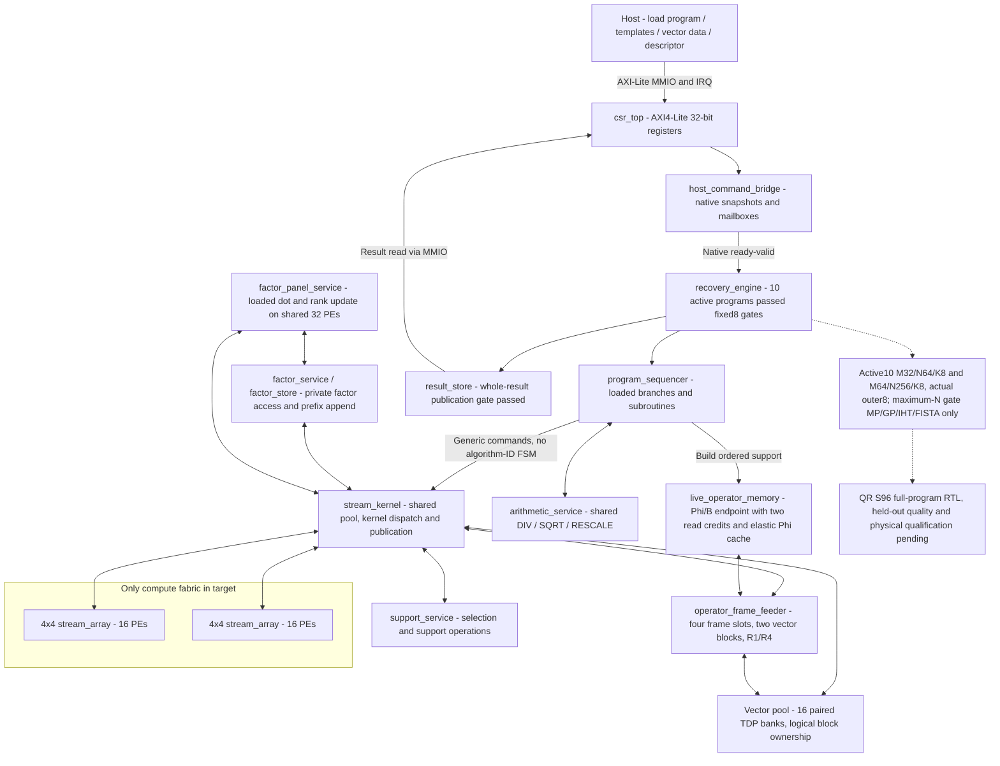

## Queued Phi/B transport: four frames, shared cache and paired memory

[Mermaid source](operator_pipeline.mmd)

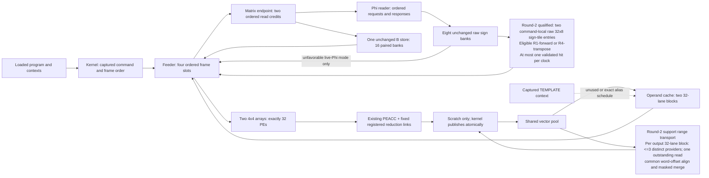

## QR target: shared PEs, implicit reflectors and stored-X certificate

[Mermaid source](qr.mmd)

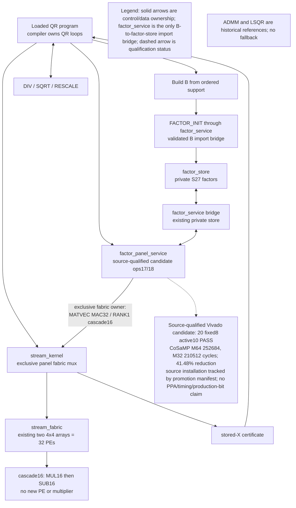

## Separately elaborated stream first slice: loadable programs and per-PE contexts

[Mermaid source](stream.mmd)

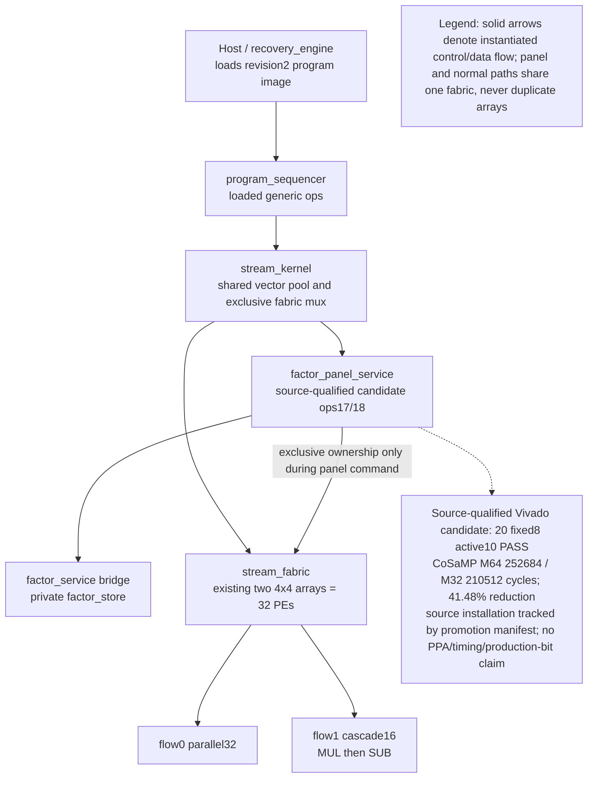

## Historical LSQR reference: shared operator, 32 PEs and certified commit

[Mermaid source](lsqr.mmd)

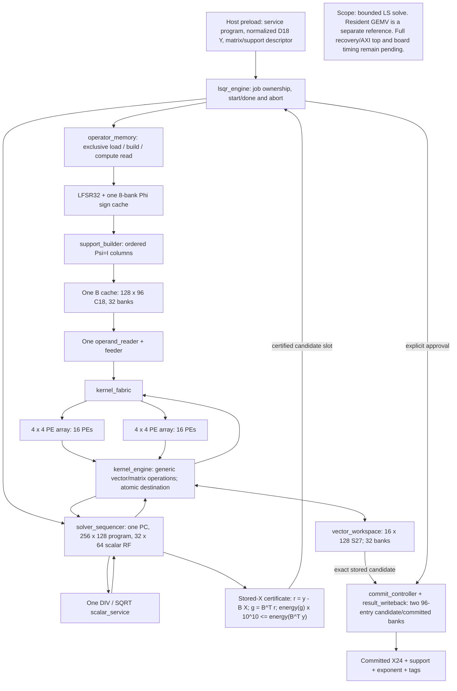

## Separately elaborated resident GEMV reference

[Mermaid source](resident.mmd)

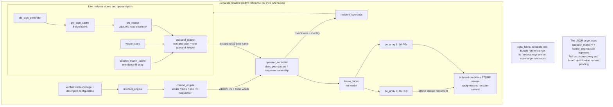

## Historical baseline: generated cache và LSQR

[Mermaid source](baseline.mmd)

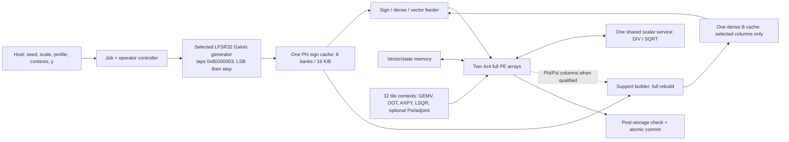

## Numerical: chuẩn hóa và nghiệm lưu X

[Mermaid source](numeric_contract.mmd)

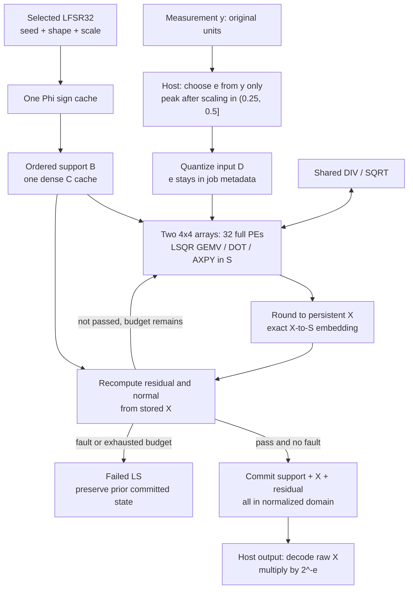

## ZCU106: CPU, DDR và accelerator

[Mermaid source](zcu106.mmd)

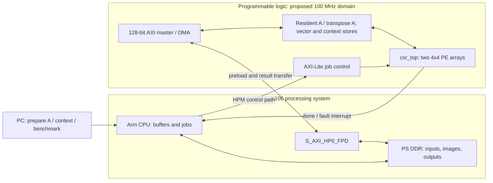

## System reference và đường dữ liệu

[Mermaid source](system.mmd)

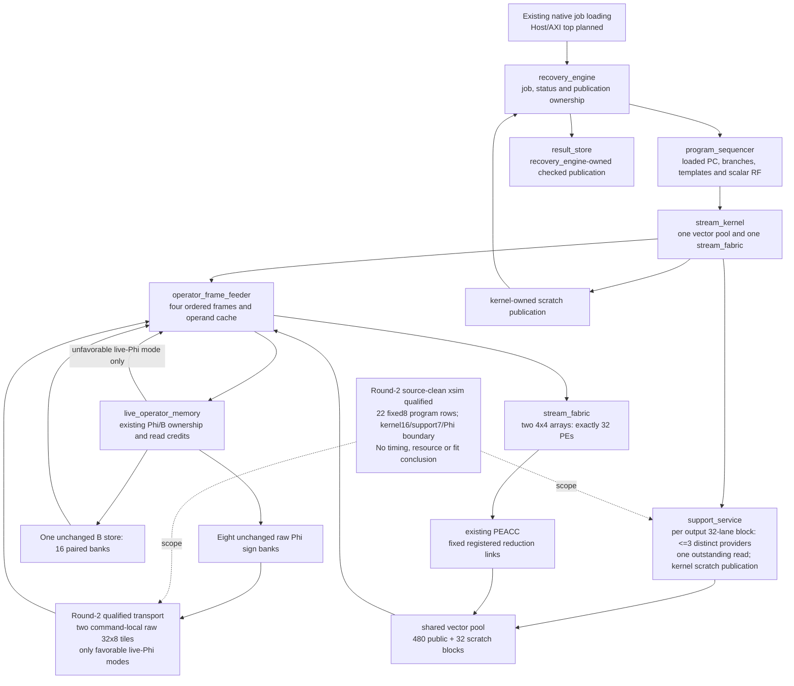

## Matrix image reference hai orientation

[Mermaid source](matrix.mmd)

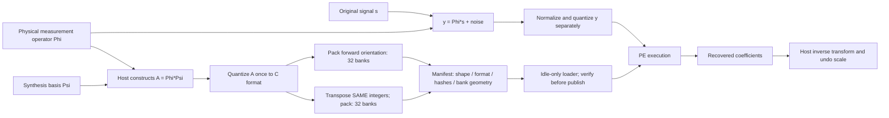

## Candidate một-copy đọc hai hướng

[Mermaid source](matrix_single.mmd)

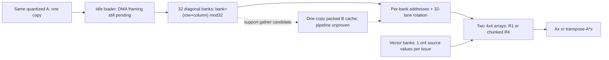

## Candidate tự sinh: cache dấu, transform và LS

[Mermaid source](generated_operator.mmd)

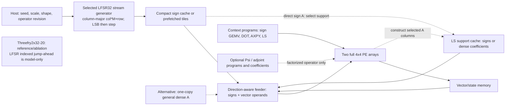

## Compiler, context image và PE execution

[Mermaid source](context.mmd)

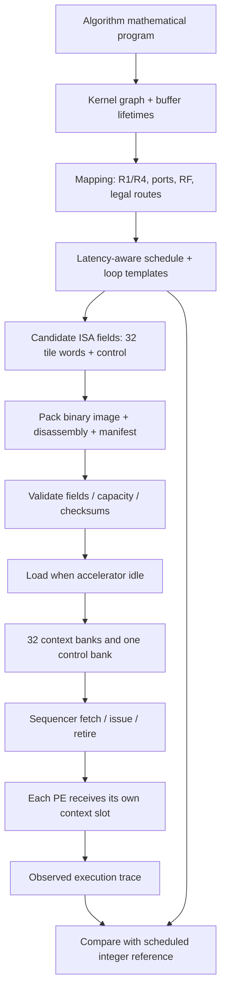

## CGLS reference và post-storage certificate

[Mermaid source](solver.mmd)

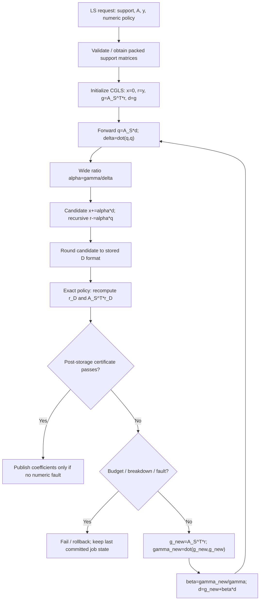

## Context-stream execution: loaded QR commands, range transport and scalar insertion

[Mermaid source](context_stream_execution.mmd)

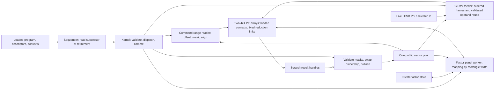

## Factor-panel mapping: shared 32 PEs and private factor transport

[Mermaid source](panel_mapping.mmd)

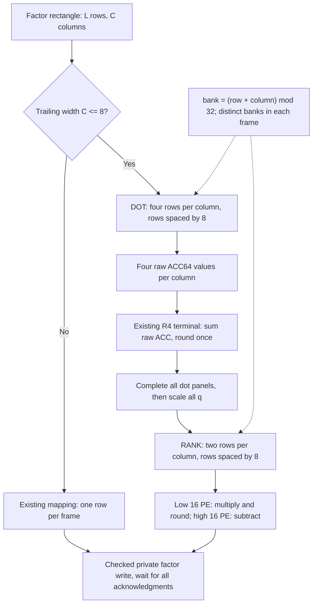
